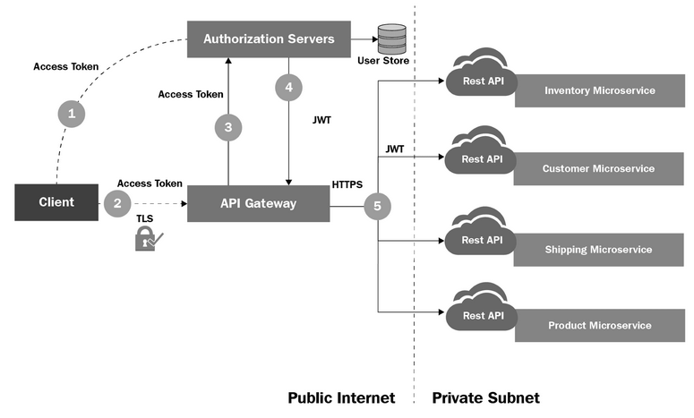
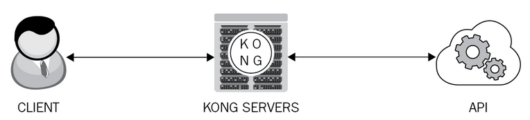
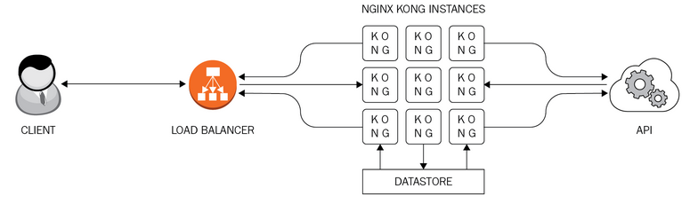

# Chapter 5: Microservice API Gateways

- we will discuss the role and responsibility of API gateways in the microservice era.

Source code for the microservices: https://github.com/PacktPublishing/Hands-On-RESTful-API-Design-Patterns-and-Best-Practices

**Microservice architecture (MSA)** is all about achieving speed and safety at scale, and the MSA ecosystem is continuously growing to provide scores of competent technologies, tools, and frameworks for efficiently implementing a range of business applications and IT services.

RESTful interfacing is the most popular and lightweight entrance for services to find, bind, and use one another.

**_Ross might find this relevant for his analysis of microservices vs. monolithic architecture_**: page 209.

API gateway infrastructure is paramount for achieving the intended success of microservices architecture.

## The prominent infrastructure modules in microservice-centric applications

Key hallmarks of microservices:

- Horizontal scaling
- Independent deployment

It is clear that MSA is the prime architectural pattern and style for next-generation software applications.

Key components of MSA-compliant systems:

### Service registry

A centralized service registry/repository mechanism is needed for enabling service discovery and leveraging microservices.

The registry:

- is a sort of database for accurately containing and maintaining the network locations of the service instances
- should have a cluster of the service registry module to meet the high-availability requirement.
- should not cache the network location details at the API gateway or the registry-aware client (it may degrade performance).

The API gateway, on getting requests from client microservices, connects and tries to procure the location details of the serving microservices.

Every microservice must register with the centralized service registry on startup and de-register upon shutdown.

## Service discovery

In the traditional legacy (monolithic) IT environment, applications run at fixed and well-known locations.

- applications can be easily found and used.

However, in the agile and adept microservices era, the number of microservices and their instances are changing frequently.

They are also being redeployed in other locations.

An advanced service discovery mechanism is thus needed.

Two main service discovery patterns: **client-side** and **server-side discovery**

### Composition/orchestration

Microservices must be linked together.

For ensuring composition there are two methods: **orchestration** and **choreography**.

There are also static and dynamic compositions.

### Transformation

Since their are so many different client-side devices, like IoT devices, browsers for resource constrained devices, web and mobile applications, etc., the client side of any application and service has to be worked out separately.

There are synchronous and asynchronous communication protocols.

The API gateway facilitates translation and other transformation needs quite comfortably.

### Monitoring

Every service request/response gets routed through API gateways.

Monitoring is indispensable for ensuring service reliability and stability.

The essential metrics to be faithfully considered include:

- the total number of requests being sent out for an API for a period of time
- the performance/throughput value
- the number of successful and exception messages received
- the number of blocked messages by API gateway

Request categorization is also important to anticipate any kind of spike or surge with greater accuracy and prediction.

### Load balancing and scaling

The goal of achieving application scalability (horizontal) through infrastructure elasticity is accomplished by leveraging a **load balancer (LB)** (software or hardware).

Traffic information is important to have for a load balancer.

We do not want an API gateway to be a single point of failure.

To have a clustered API gateway setup, we can have a load balancer in front of the API gateway.

This means that multiple instances of an API gateway solution can be leveraged to ensure continuity.

They have the same configuration, which helps in virtualizing the same APIs and to excute the same policies.

API gateways are stateless to not be weighed down by state information.

Using multiple instances of an API gateway ensures zero downtime. While one is being updated, it cannot accept requests, but the remaining instances can.

The **key role of the load balancer** here is to ensure all the incoming requests are pushed to the correct API gateway instances that are receiving and processing fresh requests.

API gateway clustering is important for continuously receiving and responding to service messages and the **Load Balancer** plays a vital role in fulfilling this:

### High availability and failover

API gateways are the only entry point for microservices to find and talk with one another to fulfill business tasks.

To achieve high availability and stability, the recommended action and approach is to deploy the API gateway in **high availability (HA)** mode.

As stated before, API gateway instances are clustered behind a load balancer. The load balancer continuously probes the API gateway instances to understand whether they are alive or not.

If the load balancer determines a gateway is failing, it redirects and routes inbound traffic to the next instance that is functioning properly.

Generally, API gateways are stateless. But they can maintain cached data, which can be replicated across a cluster of API gateways. This arrangement helps maintain the peer-to-peer relationship among API gateway instances.

#### High availability and failover guidelines

Guidelines developed by experts:

- In order to guarantee maximum availability, an API gateway has to be used in proven active/active mode.
- There is a need for deeper and decisive analysis on traffic data. The insights from this analysis help operators and others manning production environments to plan and protect against message flooding.
- Tool-supported automated network infrastructure monitoring and management are essential for ensuring the highest availability. Not only collecting operational and log data, but also subjecting them to a variety of investigations unravels a lot of useful and usable information. All the knowledge thus discovered and disseminated goes a long way in empowering the network infrastructure to work in prime and pristine condition. The analytics feature intrinsically embedded in an API gateway solution comes in handy in analyzing and articulating what to do to prevent any kind of failure and faltering. There are specific as well as agnostic monitoring tools, which can be integrated with knowledge visualization/report generation tools.

### Governance

Established policies are vital for monitoring and managing an increasing set of APIs.

They can be broadly categorized as **design-time** and **runtime** governance.

## About API gateway solutions

In a nutshell, an API gateway is a multifaceted proxy that accomplishes a variety of integration, intermediation, and enrichment tasks.

Its responsibilities are performed after the initial request verification, content filtering, authentication, and authorization.

Common features of any API gateway solution:

- authentication and authorization
- message enrichment
- mediation
- process-based composition
- traffic routing and management
- service monitoring

It is bound to provide a single and unified API entry point across one or more internal APIs.

There can be a variety of clients requesting it and expect appropriate responses.

The gateway is supposed to do a variety of tasks including:

- initiation
- intermediation
- implementation

In short, an API gateway can help provide a **unified entry point for external consumers.**

## API gateways for microservice-centric applications

Main features of an API gateway:

1. **Adds flexibility**
   1. decouples internal concerns from external clients
2. **Adds an additional layer**
   1. As microservices are not contacted directly, the security of services is greatly strengthened.
   2. Through rate limiting/throttling offered by API gateways, distributed DoS attacks can be thwarted easily.
3. **Enables support for data and protocol translation**
   1. There are synchronous and asynchronous communications and their corresponding protocols.
   2. All the common capabilities of microservices are safely abstracted and incorporated into API gateways.

Further on, API gateway solutions simplify and standardize API design, implementation, and management.

## The issues with microservice API gateways

- This adds an additional abstraction layer
  - possibility of performance degradation
- It is also a single point of failure
- Service mesh systems provide the must-needed service resiliency that results in reliable applications
- API gateways provide the capability of doing **content attack protection (CAP)**.
- Content attacks are primarily done by inserting malicious data into service request messages.
  - usually with special characters
- other prominent attack methods:
  - text patterns
  - SQL and XPATH injections
- The client sends a message request to the microservice via an API gateway. An inbound CAP policy scans the service request message for any possible content-based attacks. If successful, it passes verified and validated messages to the service mediation layer for identity verification and authentication, authorization. The outbound CAP policy scans the reply message for any content-based attacks. Then if successful, the response is delivered to the client.

## Security features of API gateways

- For microservice-centric applications running on cloud infrastructures, the security aspect starts with **identification**, **authentication**, and **authorization**.
- Security policies are also widely used in public cloud environments.
- A lot of API gateways are being embedded with a bevy of unique security characteristics.
- **Federated identity** is the widely preferred way for service authentication and authorization.
- Microservices exclusively focus on business functionality.
- The proven technique of divide and conquer is still working wonders in the IT world.
- Each microservice does not need to obtain and store user credentials in order to authenticate them during subsequent requests.
- Authorization servers' role in the authentication and authorization processes:
  

- attached database stores all the user credentials in clustered mode.
- third-party authentication and authorization management systems are closely coupled with API gateways
- Three key protocols enabling the federated identity:
  - OpenID
  - SAML
  - OAuth
- Primary data protection is done by the API gateway.
- Other option is that the database server is totally insulated from other servers.
- Data servers are not allowed to be accessed by clients directly. Every data access request is routed through a frontend service.
- API gateways ensure the integrity of message data.
- API gateways are the first defense against hackers' attempts to bring down services.
  - Load balancers ensure continuity.
  - Clustered and cloud servers help guarantee the high availability of services.
  - **Distributed denial of service (DDoS)** attacks on services can be thwarted through the application of the throttling/rate limiting pattern.
- Communication has to be secured through the SSL/TLS mechanism.
  - Microservices are **mandated to be SSL/TLS-compliant**.
  - It easily safeguards against man-in-the-middle attacks.

## Prominent API gateway solutions

- **Kong** is an open source API gateway solution.
  - can run in front of any RESTful API
  - can be deployed in on-demand, online, and off-premises clouds.
  - core engines of it are OpenResty and Nginx
  - uses either Cassandra or PostgreSQL
- Typical request workflow of an API that uses Kong:
  

- Another open source software solution: **Red Hat 3scale APIcast gateway**
  - configured through the Admin Portal
  - is emerging as the perfect solution for low or medium volume APIs.
- Another OSS API gateway: **Tyk**
  - intrinsically takes care of management activities
  - consists of an API gateway and an API management dashboard.
  - under load, it can do the full key validation, security verification, quota management, and data analytics, without any hitch or hurdle.
  - also has a cool feature: the developer portal
- **Moesif**:
  - an API analytics solution
  - helps developers understand how developers use APIs and understanding certain error occurring and repeating sometimes.
  - **The first and foremost requirement to build a great API (whether it is REST, GraphQL, or JSON-RPC API) is to precisely and concisely measure how developers use the APIs.**
- **Ambassador** is a popular open source and Kubernetes-native API gateway for the microservice world:
  - container-centric solution
  - can authenticate all kinds of incoming requests before intelligently routing them to backend services.
- **Envoy** was originally built by Lyft.
  - a high performance C++ distributed proxy designed for single services and applications.
  - for microservice-centric applications, this contributes as the universal data plane.
  - core engine for service mesh solutions.
- **Tree gateway** is a free and open source solution:
  - creates a complete and customizable pipeline to handle service requests.
  - makes it easy to create and sustain big clusters.
  - it supports the ready formation of Redis clusters to share:
    - configurations
    - circuit-breaker states
    - cached content
  - comes with an advanced circuit breaker module that can *fast fail* responses when any API fails, falls, and falters.
  - innately supports real-time monitoring and analytics.
- **Gravitee.io** is a flexible, lightweight, blazingly fast, and open source API management solution:
  - finely grained management of who, when, and how users connect.
- **API Umbrella** is a proxy solution that sits in front of any API:
  - can seamlessly add API gateway and analytics functionalities, such as:
    - API keys
    - rate limiting
- **Express gateway** is a microservice API gateway, which is built on **Express.js**.
  - fast, flexible, and community driven.
- The well-intended approach is to have a dynamic pool of modular (loosely and lightly coupled and highly cohesive) API gateway services instead of a monolithic API gateway solution, which is difficult to manage, inflexible, and closed.

## Service mesh versus API gateway

Key differences between **API gateways** and **service meshes**.

- API gateways are intended to fuse multiple downstream services into something that is useful for the requesting services.
- They also come with observability capability for capturing various metrics.
- Service meshes are important for making a microservice-based application resilient.
- The IT industry is leaning towards embracing the new concept of a service mesh, **which is a kind of network to ensure service resiliency.**
- Service mesh implementations have embedded resiliency patterns such as:
  - resiliency-enablement patterns such as:
    - circuit breaker
    - retry
    - timeout
    - throttling/rate limiting
  - Some solutions include:
    - Istio
    - Linkered
    - Conduit
- **The functionalities of API gateways and service mesh solutions are clearly distinguished.**
- It is possible to use both. Service meshes are usually added on the side.
- **API gateways facilitate API communication between a client application and a server application.**
  - Operates mainly at layer 7 (HTTP)
- **Service mesh solutions are for enabling service communication resiliency.**
  - They mainly focus on **routing internal communications**
  - Operates primarily at layer 4 (TCP)
  - Come with resiliency and reliability design patterns like those mentioned before

