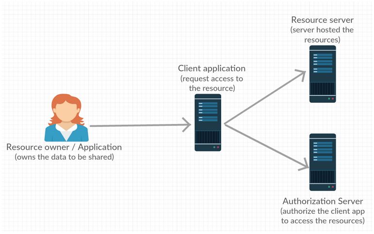
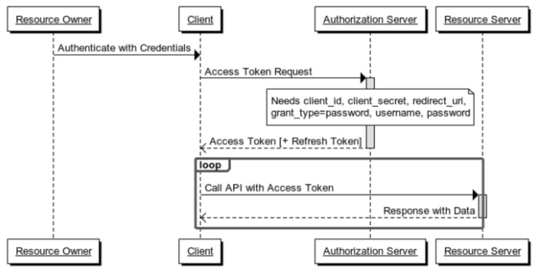
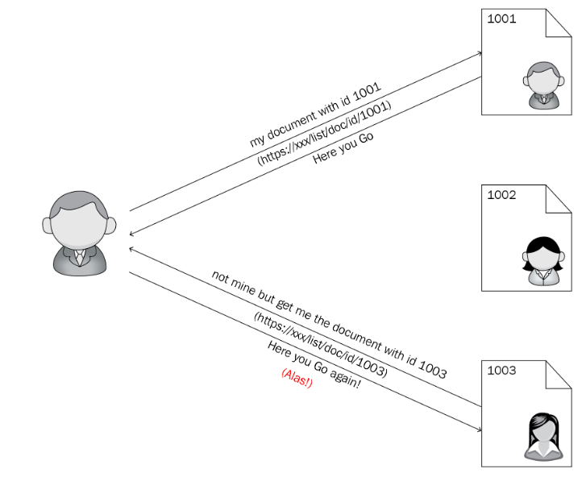
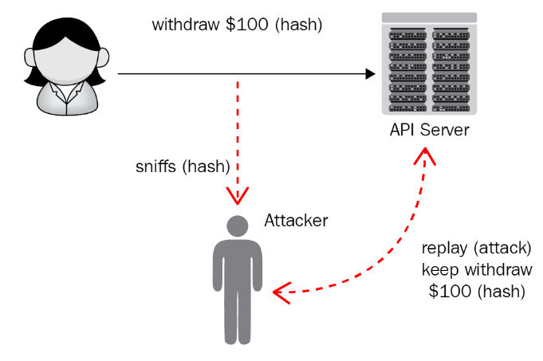
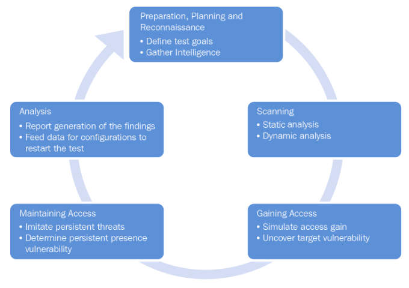
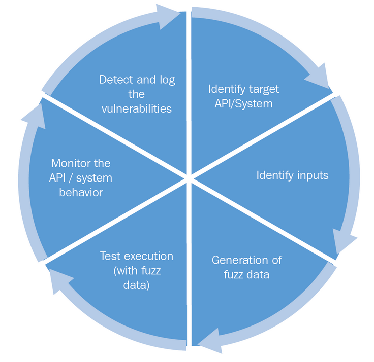
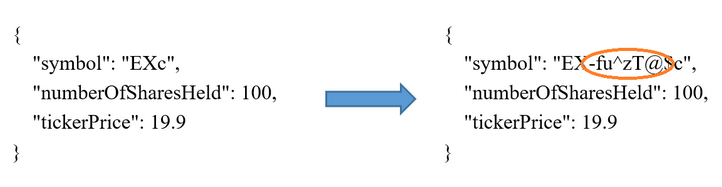
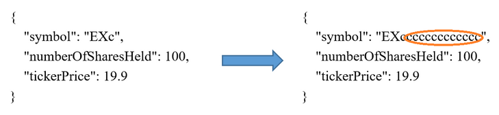

# Chapter 6: RESTful Services API Testing and Security

- Enterprise-level software requires rigorous testing

Topics that will be covered:

- Types of API tests
- Challenges in API testing
- Security in API testing
- A glimpse at API testing tools, API security tools and frameworks

## An overview of software testing

Primary focus of any software product or application:

- **verification**: checks for consistency and alignment according to the documented requirements
- **validation**: checks the accuracy of the system and validates the end user's needs versus the actual outcome

## RESTful APIs and testing

### Basics of API testing

**API testing** and certification primarily focuses on data integration tests on the **Business layer**.

### API testing types

#### Unit tests

**Unit tests**: involve the validation of individual operations are unit tests.

#### API validation tests

All software needs quick evaluation and to assert its purpose of creation.

The validation tests need to be run for every function that is developed, at the end of the development process.

They are unlike unit tests as validation tests are a higher-level consideration.

They answer a set of questions so that the development can move on to the next phase.

Set of questions for validation tests:

1. A product-specific question, such as, is it the necessary function that is asked for?
2. A behavioral question, such as, is the developed function doing what is intended?
3. An efficiency-related question, such as, is the intended function using the necessary code, in an independent and optimized manner?

#### Functional tests

**Functional tests**: involve specific functions of the APIs and their code base.

Some examples:

- validating the count of active users through the API
- regression tests
- test case execution

#### UI or end-to-end tests

**End-to-end** tests: involve and assert end-to-end scenarios, including GUI functions and API functions, which in most of the cases, validate every transaction of an application.

#### Load testing

**Load tests**: ensure that an increase in the number of end users does not affect the performance of the functions of an application.

#### Runtime error detection tests

**Runtime error detection tests**: help monitor the application and detect problems such as race conditions, exceptions, and resource leaks.

#### Monitoring APIs

Tests for implementation errors, handler failures, and other inherent concerns inside the API and ensures it does not have any holes that would lead to application insecurity.

#### Execution errors

**Execution errors**: assert invalid requests for expected failures.

Example from Chapter 3:

- the end user gave an ID that is not present on the system.

#### Resource Leaks

**Resource leak tests**: validate the underlying API resource malfunctions by submitting invalid requests to the API. These resources include, in this case:

- memory
- data
- insecurities
- timeout operations
- etc.

#### Error detection

Detect network communication failures, like authentication failures from the wrong credentials.

Chapter 4 example of this:

- authentication error that returns a code of `401`, as it should

### REST API security vulnerabilities

Some potential API security vulnerability examples:

- man-in-the-middle-attacks (MITM)
- lack of XML encryptions
- insecure endpoints
- API URL parameters

We will present the most common API attacks and vulnerabilities in the following sections.

### Exposing sensitive data

**The first and foremost essential secuirty aspect of testing a REST API (or any appilcation)**: evaluate and determine the categories of data and teh need for data protection when they are in transit or in a persisted state.

Examples:

- personal information
- credit card information
- health records
- financial information
- business information
- many other categories...

Data is fundamentally protected through encryption, as without it, hackers could easily obtain the sensitive information.

Some protection measures:

- Do not store sensitive information unless necessary. Use tokenization and truncation methods to prevent the exposure of sensitive data.
- Encryption is necessary and essential
- Do not implement a cache for sensitive information (or disable caches for sensitive data transactions)
- Use salts and adaptive (with a configurable number of iterations) hashing methodologies for passwords.

### Understanding authentication and authentication attacks

Authentication: a process to determine the identity of an entity (a process, a machine, or a human user) to either disallow or allow that entity to access underlying application functionalities.

### Understanding authorization and OAuth2 schemes

**OAuth IETF OAuth Working Group**: https://tools.ietf.org/wg/oauth/

Why OAuth is better than traditional cookie-based authorization:

- server has to maintain session state for cookie-based, other things also make it difficult to decouple state from the server
- cookie-based involve domains, as application may interact with multiple domains, so additional security overhead
- OAuth has capability of integration with Google and Facebook while cookie-based does not
- cookie-based is considered a maintenance nightmare, especially when relying on mobile-based authentication

OAuth allows arbitrary clients (for example, first-party iOS application or a third-party web application) to access user's (resource owner's) resources on resource servers via authorization servers with secure, reliable, and effective methods:

- OAuth authorization stakeholders and their roles picture here

| Schemes/Flow                        | Client type                                                  | Brief description                                            |
| ----------------------------------- | ------------------------------------------------------------ | ------------------------------------------------------------ |
| Implicit                            | **Single-page application (SPA)** such as Google Fonts.      | Application requests access tokens from the gateway and the user grants permission. |
| Client-credentials                  | Machine-to-machine non-interactive programs such as services, daemons, and so on | The application passes the client credentials and gets the access token from the gateway server. |
| Authorization code                  | Less trusted apps (third-party apps requesting access to your application) | The application sends a temporary authorization code it receives from the gateway and gets it validated (by the same gateway) |
| Resource owner password credentials | Highly trusted apps (first-party apps)                       | The client will ask the user for their authorization credentials (usually a username and password), then the client sends a few parameters (`grant_type`, `client_id`, `client_secret`) to the authorization server. |

Typical sequence of a resource owner password credential OAuth scheme:

Code on GitHub: `Chapter06/oauth2-sample`

1. Run `mvn clean install`
2. Run application: `java -jar target/oauth2-sample-0.0.1-SNAPSHOT.jar`
3. Open Postman and test URLs (in `Chapter06` folder of Postman collections).

## Cross-site scripting

**Cross-site scripting attack (XSS)**: the process of injecting malicious code as part of the input to web services, usually through a browser.

Once injected, the malicious script can access any:

- cookies,
- session tokens
- sensitive information by the browser
- can masquerade as the content of the rendered pages

Two categories: **client-side XSS** and **server-side XSS**

XSS is traditionally one of three types:

- Reflected XSS
- Stored XSS
- DOM XSS

### Reflected XSS

**Reflected XSS**: happens when an application allows an attacker to inject browser-executable code (such as JavaScript, Applets, Action Scripts, Flash) within a single HTTP response.

### Stored XSS

**Stored XSS** (also known as **persistent XSS**): often considered harmful and high risk, occurs when a malicious script is injected into a vulnerable application as input and is viewed by another user or an administrator at a later time.

### DOM XSS

**DOM XSS**: developed by Amit Klein and available since 2005, occurs when client-side code uses insecure references to DOM objects that are not entirely controlled by server-provided pages.

- Single-page applications are vulnerable to DOM XSS
- Generally, but not limited to, APIs that dynamically inject attacker-controllable data to a page and JavaScript frameworks.

*XSS protection needs to filter malicious content from user input and also needs encoding (escape).*

## Cross-site request forgery

**Cross-site request forgery (CSRF)**: Sea Surf, or XSRF, as it's known, is a one-click attack vulnerability that web applications exposes the possibility of the end user being forced (by forged links, emails, and HTML pages) to execute unwanted actions on a currently authenticated session.

*The synchronize token pattern, cookie-to-header token, double submit cookie, and client-side safequards are common CSRF prevention methodologies.*

## Denial-of-service attack

**Denial-of-service (DoS)** attack: intended to make the targeted machine reach its maximum load (capacity to serve requests) quickly by sending numerous false requests so the target system denies further genuine requests.

Two categories: **Flood attacks** and **buffer overflow attacks**

Flood attacks: the attacker saturates the target server by generating enormous traffic to the server, causing the target server to end up in DoS.

Buffer overflow attacks: intended to target a machine and make that machine consume all available memory or hard disk space, or cause high usage of the CPU.

### Distributed denial of service

**Distributed denial of service (DDoS)** attacks: DoS attacks on distribution systems.

### Injection attacks

One of the most harmful and dangerous attacks.

### Insecure direct object references

**Insecure direct object references (IDOR)**: equally as harmful as the other top API vulnerabilities

- occur when an application exposes direct access to internal objects based on user inputs such as ID and filename
- Example:
  

- not having a validation mechanism allows Bob (the attacker) to manipulate these references to access unauthorized data, called an IDOR vulnerability

### Missing function-level access control

- anyone with network access is able to send a request if the application is missing implementing function-level access rights
- admin-level URLs should not be accessible to anyone with network access

### Man-in-the-middle attacks (MITM)

- an attacker accesses the information between the client and the server

#### Common types of MITM attacks and protection measures

- **Sniffing**: attackers use widely/freely available packet capture tools (i.e. Wireshark)
- **Packet Injection**: injecting packets of data so they blend in with normal communication.
- **SSL stripping**: altering HTTPS network communication to HTTP on the fly, making it insecure (user may not even realize it)
- **Email hijacking**: very common type of MITM attack
  - attackers mimic a trusted site, ask for an email, and in the email instruct to put sensitive information
- **Wi-Fi eavesdropping**: setting up exclusive Wi-Fi access points to lure users to get connected and make them use the network.
- **Session hijacking**: caching a session token where an attack can sniff and pick it up
- **Protection measures**:
  - **Secure/Multipurpose Internet Mail Extensions (S/MIME)**
  - **Public key infrastructure (PKI)** based authentication certificates
  - SSL/TLS certificates
  - System and server configurations
  - **HTTP Strict Transport Security (HSTS)**

### Replay attacks and spoofing

- also known as playback attacks, are network attacks which valid data transmissions (supposed to be once only) are repeated many times (maliciously) by the attacker who spoofed the valid transaction.
- The server sees valid transactions, however these are a masqueraded request and lead to catastrophic effects for clients
- Diagram:
  

- As RESTful APIs are stateless, the chances of getting those APIs into replay attacks are high (they're and easy target).
- **Protection measures**:
  - one-time password with session identifiers
  - **time-to-live (TTL)** measures
  - MAC implementation on the client side
  - including timestamps in requests
  - secure protocol such as Kerberos protocol prevention
  - secure routing
  - **challenge-handshake authentication protocol (CHAP)**

### Causes of vulnerabilities

#### API design and development flaws

- keep APIs as simple as possible as complexity may lead to less coverage and vulnerability
- few other causes: input validation, SQL injection loopholes, and buffer overflows
- Various aspects of design strategies and RESTful API design practices were discussed in *Chapter 2, Design Strategy, Guidelines, and Best Practices*. Understand and implement these design principles and practices to reduce design and development flaws.

#### Poor system configuration

#### Human error

#### Internal and external connectivity

#### Security tests

Security tests ensure APIs are secure from external threats and protected from the vulnerabilities that we have discussed in earlier sections.

Two categories of security tests: **security functional testing** and **security vulnerability testing**

Functional test: executes manual tests and manually checks for the presence of security mechanisms within API's implementation

Security vulnerability tests: execute automated test cases that may expose vulnerabilities.

Ultimate goal is to understand the system behavior by studying error messages and exposing any security vulnerability such as gaining unauthorized access, IDOR, MITM, and replay attacks.

Penetration and fuzz tests can fulfill security test goals along with various manual tests.

#### Penetration tests or pen tests

- Penetration tests are imperative in API testing
- **Pen tests**: the process of simulating cyber attack against a system or API to expose/determine exploitable vulnerabilities such as intra-network loopholes, XSS attacks, SQL injections, and code-injection attacks
- they assess the threat vector from an external standpoint, such as supported functions, available resources, and the API's internal components as well.

#### Importance of penetration tests

- No compromise to data privacy
- Guaranteed and secured financial transactions and financial data over the network
- Discover security vulnerabilities and loopholes in APIs and in underlying systems
- Simulate, forecast, and understand and assess the impacts of attacks
- Make APIs fully information security compliant

#### Pen testing lifecycle

5 stages to the pen test lifecycle:

5 phases of activities:

- **Preparation**
- **Scanning**
- **Gaining Access**
- **Maintaining Access**
- **Reporting**

#### 1. Preparation, planning, and reconnaissance

Involves two parts:

- Scope, scope definitions, defining the goals of the tests to be carried out, and defining the testing methods and systems to be addressed
- Gathering intelligence such as the domain and endpoints, and understanding how the target API works, along with its exposure to vulnerabilities

#### 2. Scanning

**Scanning**: understanding the target application's response to various intrusion attempts with static and dynamic analysis

#### 3. Gaining access

Involves attempting to uncover API vulnerabilities with application attacks such as XSS, SQL injections, code injections, and backdoors.

Once those vulnerabilities are uncovered, exploiting them with privilege escalations, data stealing methods, and traffic interceptions are part of the **Gaining Access** scope, as well as assessing the damage that API vulnerability could cause.

#### 4. Maintaining Access

**Maintaining Access** phase: assessing the long-term presence abilities, and the chances of them gaining in-depth access to systems/APIs

#### 5. Analysis

- compiling and presenting the results of penetration tests as a report
- these reports generally contain:
  - a specific vulnerability that was exploited as part of pen tests
  - details of compromised/accessed sensitive data as part of the pen test exercise
  - most importantly, the duration of the time that you were able to remain in the system undetected

These results and reports will act as a feed/input security configurations across the organization to prevent any future attacks.

### Pen testing types for API testing

3 categories of pen tests:

- **black-box**
  - testers have limited understanding about the underlying API
- **grey-box**
- **white-box**
  - preferred for API penetration tests

#### White-box penetration testing

- also known as **structure-testing**, open-box, clear-box, glass-box testing
- comprehensive testing methodology with a range of information about the schema, source code, models and such
- intended to **scrutinize the code and catch any design and development errors**
- simulate internal security attacks
- why use white-box testing:
  - the tests run on all of the independent paths of a module
  - tests confirm and verify all logical decisions (`true/false`) inside
  - tests check syntax checking and so find typographical errors that are critical to finding code injections and SQL injection attacks
  - tests find design errors by a mismatch of the logical flow of the program and the actual execution (design for intent)

Open source tools that scan code, check for malicious code, find security loopholes using data encryption techniques, and find hardcoded username and passwords:

| Tool       | Type          | Providers       |
| ---------- | ------------- | --------------- |
| Nmap       | OpenSSL       | Pure Hacking    |
| Nessus     | Cain and Abel | Torrid Networks |
| Metasploit | THC Hydra     | SecPoint        |
| Wireshark  | w3af          | Veracode        |

- in summation, pen tests for APIs should expose API vulnerabilities before attackers find them

#### Fuzz tests

- one of the most widely used testing practice in QA industry
- massive amounts of data (fuzz or noise)
- trying to exhibit buffer overflow
- primary purpose is to **explore and test the undefined region**

#### The life cycle of fuzz tests

- first, identify the target APIs and define the inputs for the test
- end with generation of logs showing vulnerabilities detected in the API

#### Fuzz testing strategy

Two primary classifications: **mutation based** and **generation based**.

#### Mutation-based fuzz tests

- aka dumb fuzz tests, a simple approach: create new test data by altering existing data samples.

Two ways of going about mutation:

1. Bit flipping, where inputs are flipped in a sequence or in a random manner:

   

2. Append a random string, where the end of the input has random strings appended:

   

#### Generation-based fuzz tests

- aka, intelligent fuzzing, are tests based on an understanding of known formats, known protocols, and generation of inputs from scratch according to the system/API specifications (RFC) and formats (for instance, the format from the API documentation).
- examples of test data consisting of intelligent cases:
  - regular expressions in the request body
  - having hostnames in the header
  - changing intended response types to different types