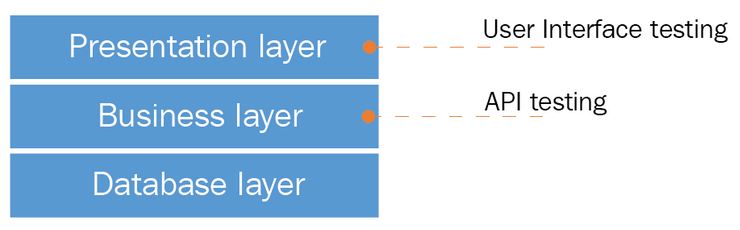
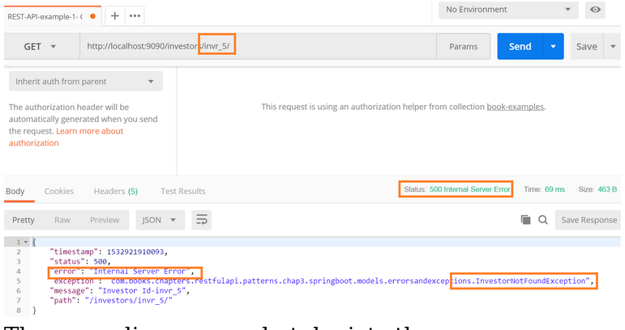
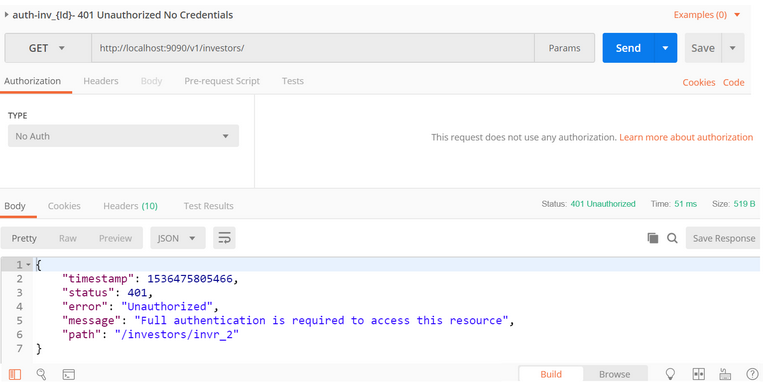

# Chapter 6: RESTful Services API Testing and Security

- Enterprise-level software requires rigorous testing

Topics that will be covered:

- Types of API tests
- Challenges in API testing
- Security in API testing
- A glimpse at API testing tools, API security tools and frameworks

## An overview of software testing

Primary focus of any software product or application:

- **verification**: checks for consistency and alignment according to the documented requirements
- **validation**: checks the accuracy of the system and validates the end user's needs versus the actual outcome

## RESTful APIs and testing

### Basics of API testing

**API testing** and certification primarily focuses on data integration tests on the **Business layer**.

### API testing types

#### Unit tests

**Unit tests**: involve the validation of individual operations are unit tests.

#### API validation tests

All software needs quick evaluation and to assert its purpose of creation.

The validation tests need to be run for every function that is developed, at the end of the development process.

They are unlike unit tests as validation tests are a higher-level consideration.

They answer a set of questions so that the development can move on to the next phase.

Set of questions for validation tests:

1. A product-specific question, such as, is it the necessary function that is asked for?
2. A behavioral question, such as, is the developed function doing what is intended?
3. An efficiency-related question, such as, is the intended function using the necessary code, in an independent and optimized manner?

#### Functional tests

**Functional tests**: involve specific functions of the APIs and their code base.

Some examples:

- validating the count of active users through the API
- regression tests
- test case execution

#### UI or end-to-end tests

**End-to-end** tests: involve and assert end-to-end scenarios, including GUI functions and API functions, which in most of the cases, validate every transaction of an application.

#### Load testing

**Load tests**: ensure that an increase in the number of end users does not affect the performance of the functions of an application.

#### Runtime error detection tests

**Runtime error detection tests**: help monitor the application and detect problems such as race conditions, exceptions, and resource leaks.

#### Monitoring APIs

Tests for implementation errors, handler failures, and other inherent concerns inside the API and ensures it does not have any holes that would lead to application insecurity.

#### Execution errors

**Execution errors**: assert invalid requests for expected failures.

Example from Chapter 3:

- the end user gave an ID that is not present on the system.

#### Resource Leaks

**Resource leak tests**: validate the underlying API resource malfunctions by submitting invalid requests to the API. These resources include, in this case:

- memory
- data
- insecurities
- timeout operations
- etc.

#### Error detection

Detect network communication failures, like authentication failures from the wrong credentials.

Chapter 4 example of this:

- authentication error that returns a code of `401`, as it should

### REST API security vulnerabilities

Some potential API security vulnerability examples:

- man-in-the-middle-attacks (MITM)
- lack of XML encryptions
- insecure endpoints
- API URL parameters

We will present the most common API attacks and vulnerabilities in the following sections.

### Exposing sensitive data

**The first and foremost essential secuirty aspect of testing a REST API (or any appilcation)**: evaluate and determine the categories of data and teh need for data protection when they are in transit or in a persisted state.

Examples:

- personal information
- credit card information
- health records
- financial information
- business information
- many other categories...

Data is fundamentally protected through encryption, as without it, hackers could easily obtain the sensitive information.

Some protection measures:

- Do not store sensitive information unless necessary. Use tokenization and truncation methods to prevent the exposure of sensitive data.
- Encryption is necessary and essential
- Do not implement a cache for sensitive information (or disable caches for sensitive data transactions)
- Use salts and adaptive (with a configurable number of iterations) hashing methodologies for passwords.

### Understanding authentication and authentication attacks

Authentication: a process to determine the identity of an entity (a process, a machine, or a human user) to either disallow or allow that entity to access underlying application functionalities.