# Chapter 7: RESTful Service Composition for Smart Applications

There are a number of integration and brokerage platforms, adapters, connectors, drivers, and plug-ins that enable **device-to-device (D2D)** and **device-to-cloud (D2C)** integration.

Topics that will be discussed:

- The need for service composition
- That various composition methods (orchestration and choreography)
- The orchestration method
- The choreography method
- The hybrid version of orchestration and choreography towards smarter applications

## Briefing RESTful microservices

The emergence of the **microservices architecture (MSA)** is being touted as the most interesting and inspiring thing for business and IT organizations across the globe.

Every digitized and connected device is being presented as microservices to the outside world.

Since every microservice is built with RESTful APIs, there's a separation between interfacing and implementation, which is technology-agnostic.

### Demystifying the Microservice Architecture style

There are agile programming models and techniques to speed up the process of writing code for software applications, but designing and delineating application components in an elegant and extensible manner is vital to the intended success of software applications in the long run.

There should not be any vendor lock-in.

Microservices are:

- fine-grained
- horizontally-scalable
- independently-deployable
- API-driven
- usable and reusable
- portable
- technology-agnostic

### The advantages of microservices

- They follow the single responsibility principle
  - do one thing at a time but do it well
- different responsibilities in different services
- cost of developing, changing, and advancing is cheap
- time to market is minimal
- each service runs in its own process space and with its own data store
- **every service needs to have an easy-to-understand and should use APIs**.
  - RESTful APIs are the most popular for API-enabled microservices.
  - this is how the services talk to one another
- they are modular (loosely coupled and highly cohesive)
  - remove dependency related risks while keeping closely-related responsibilities together
- **they emerge as the best fit for modernizing and migrating large, monolithic applications**

### The emergence of cloud-native applications

- MSA is most efficient tool for creating and sustaining software applications.
- the msa-based software design is faster than the traditional, agile programming models, and methods are made available in plenty to speed up the process of software construction.

### The growing ecosystem of IoT device services

Leading market analysis and research reports forecast that there will be billions of connected devices in another one to two years.

The various functionalities of connected devices are being exposed via service interfaces.

### The changing application ecosystem

### Tending toward the API-driven world

**Internet of Services (IoS)**: everything is expressed and exposed as a service for the outside world.

RESTful service paradigm simplifies and streamlines API creation and usage for systems integration and collaboration.

### The Representational State Transfer service paradigm

RESTful services assist in establishing a beneficial relationship between computers and other I/O devices with internet-based systems, applications, and data sources.

### API design best practices

The most important **non-functional requirements (NFRs)** and **quality of service (QoS)** attributes to develop flexible APIs:

- **Client-server architecture**:
  - client and server applications should be able to evolve independent of one another
  - a client only needs to know resource URIs
  - the same API can be leveraged across multiple backend server and database systems
- **Cache-ability**:
  - if a client asks for a resource representation, the request typically goes first to the nearest cache to get the data. If it is not there, the next destination for the client request is the proxy cache or the reverse cache of the requested resource.
  - If none of the caches have the latest data/fresh copy, there is no other option but to knock the resource itself
  - optimizing the network using caching reduces latency, optimizes bandwidth usage, reduces the load on servers, and hides any network failure

### Learning about service-composition methods

**Orchestration** and **choreography** are the well-known and widely-used ways of accomplishing composite services.

Composite applications are being realized at the service level and at the container level.

As mentioned before, every microservice has its own data source.

Every microservice is enabled with its own one or many interfaces.

The majority of APIs are RESTful APIs.

For the idea of microservices to flourish, services need to be dynamically integrated in order to facilitate service interactions purposefully:

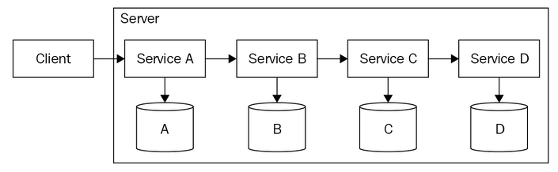

- the calling service doesn't know whether the serving services are doing well
  - they could be overburdened by an unprecedented number of service requests
- also, no failure-handling and compensation mechanisms
- the root of the problem has to be identified in order to streamline troubleshooting
- tight coupling is used, but can lead to dependency issues, which is why lighty- and loosely-coupled services are preferred: so that the development and deployment can be done independently
- any change on one service has cascading implications
- operational complexity increase is inevitable as more services join

### Service orchestration and choreography

- orchestration microservices have to be composed through an orchestration engine
- use predefined patterns with an orchestration language to do this
- orchestration is more suitable and relevant for implementing **business process flows**
- an orchestration engine is the "central brain" to guide and guarantee the control flows and their execution
  - it operates in a centralized manner
- the service and operational-level agreements (SLAs/OLA) are estimated and codified through the centralized engine
- **all of the centrally-managed and commonly-used functionalities are being abstracted out of participating services and are being incorporated in the orchestration engine**, which also has a business process flow and management engine
- **service chaining** and **workflows**, widely termed as service orchestration, help with legacy and enterprise application integrations:
  - **Short-running orchestrations**:
    - stateless and synchronous besides dealing with momentary data and sessions
    - talk to multiple services in a sequenced manner
    - the orchestrator bases its message on the output of the previous service, and so on
  - **Long-running orchestrations**
    - stateful and asynchronous
    - involve human involvement, interpretation, and instruction
    - made to run for longer by leveraging persistent data storage
- drawbacks:
  - tight coupling between the orchestrator and all of the associated application components/services
  - adding new services and states mandates an update in the central business logic
  - sometimes the central coordinator is a single point of failure (SPOF)
- choreography, on the other hand, implements a data flow between multiple decoupled services
  - each service knows what sort of data it can expect and provide
  - no need for a centralized conductor the run the flows
  - peer-to-peer service composition
  - each service has the required intelligence to act and react
    - self-defined and contained service
    - each communicate and complete the assignment via messages and events
- **Event-driven architecture (EDA)** is emerging as the core architectural style and pattern for the increasingly event-driven world.
- **choreography is more suitable for implementing event-driven applications**
- since they are decoupled by nature, microservices can be replaced and substituted easily
- adding new services won't affect the system
- new technologies and algorithms can be leveraged easily
- there is no SPOF
- drawbacks:
  - without a central conductor or coordinator, the monitoring, measuring, and management of service interactions and collaborations remain a challenge, looking at a sequenced view of services that talk to one another is problematic.
  - making each microservice intelligent and self-reliant is difficult

### Beginning with service orchestration

Typically, a business process indicates the sequence of services to be leveraged.

Orchestration uses loosely coupled microservices and acts as the central coordinator between them.

The communication can be mainly synchronous, the requesting services should wait until they get the response from the requested services.

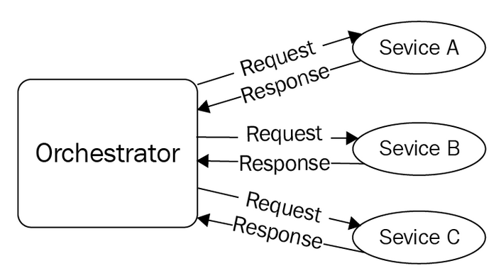

### The shortcomings of service orchestration

- if the first service isn't responding, the other services cannot be called
- the orchestrator becomes a SPOF
  - recommended to go for clustered orchestration to resolve this

Orchestration through disparate and geographically-distributed microservices:

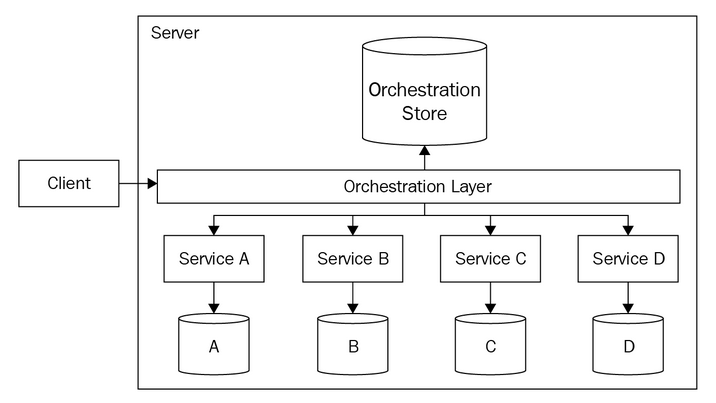

- this model typically doesn't address failure cases
- the failure rate is mostly one percent, pretty small
- if there is a failure, one or other viable counter measures, such as compensation, has to be initiated immediately in order to wriggle out of the chaos.

Considering the drawbacks of service orchestration, the service choreography is gaining a lot of attention.

### Applying orchestration-based composition

If most of the works have to be done sequentially, orchestration is the way to go.

If there's a need to keep the control flow logic centralized, orchestration is the solution.

Hundreds of microservices participating with different control flows, centralization is preferred.

### Beginning with service choreography

For microservices-centric applications, the service dependencies must be nipped in the budding stage itself.

All kinds of dependencies have to be avoided to fulfil the strategic vision of self-defined and autonomous microservices.

- experts contend that event-driven architecture is the way forward to solve this

In EDA:

- the controlling logic is inside the orchestrator, whereas in this case, the logic is inscribed in each of the participating services; **the logic is distributed and these empowered services (smart services) <u>know beforehand how to react to various events</u>**
- communication is asynchronous
- event bus (dumb pipe) is being leveraged to route events
  - multiple services can consume the same events and then initiate their ordained tasks
  - the results are packaged and then transmitted as events to the event bus at the same time
- these microservices are called **smart entities** and the event bus is just a dumb pipe
- no intelligence is on the event bus, which is the primary communication infrastructure for event-driven microservices
- the asynchronous nature removes the blocking or waiting, which is the main drawback of orchestration.

How the event-driven architecture pattern functions:

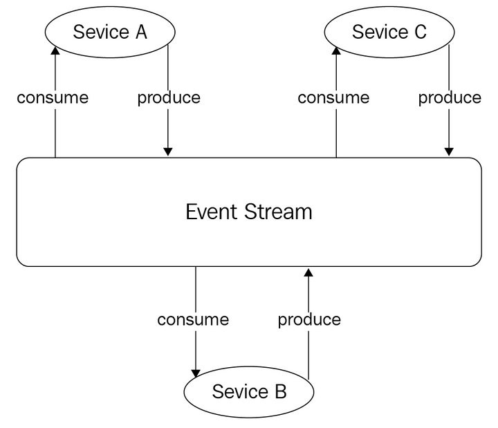

- hence, event producers and consumers, without knowing anything about others, collaborate in a purpose-driven manner
- due to parallel processing, faster processing is ensured
- new services can be added easily without concern of disrupting the existing services
- **the new normal is easily manipulating existing services to accommodate business, technology, and user changes**
- microservices can be independently deployed and developed, empowering different and distributed development teams to focus on their core activities toward the faster realization and deployment of microservice-centric applications
- an event stream stores all of the events
  - if a service goes down, once it comes back, it can access the event stream and act upon them
- due to the event driven architecture, we can separate out read and write activities
  - benefit: can be individually scaled based on the evolving requirements
    - if read-heavy, that can be scaled alone and not the write aspects

With choreography, services behave like dancers - performing their assigned movements to appropriately react to other dancers, so as to finish the process in an organized way.

The choreography concept **depends on the EDA**.

- the choreographed services typically react to events and put their output onto the queue of the event bus, and from there, other authorized services pick up and start to showcase their unique capabilities.

**Event Bus** is the primary intermediary and communication infrastructure.

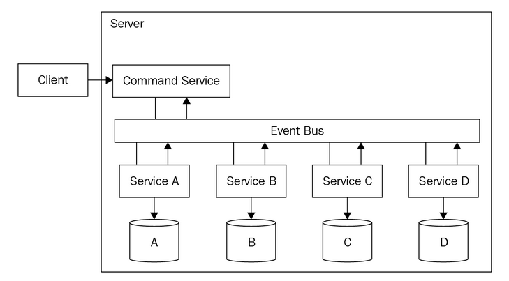

- services don't need to talk to other services in order to initiate and implement an action
- services are waiting for some events to get initiated somewhere and get forwarded to them through the event bus, which is the primary messaging middleware/broker/bus

### The shortcomings of service choreography

Choreographed systems are loosely coupled, highly flexible, and easily amenable to changes (internal as well as external).

Consider an order application using choreographed architecture:

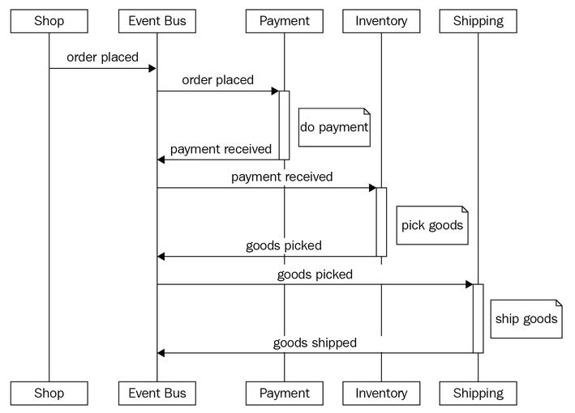

- the issue is that the payment service needs to know its consumer to process the payment
- if other services need to use the payment service, we need to make changes in the payment service
- adding a new business requirement can affect multiple services and require changes to them as well

**Event-command-transformation pattern**:

- a clear separation between services and its users
- helps realize decoupled event-based systems

**The blending of orchestration and choreography is the best way for pitching in highly flexible architecture for composite applications.**

### Applying choreography-based composition

Choreography helps to accomplish business processes in a parallel manner.

### The hybridization of orchestration and choreography

There does not exist an architectural styles that is a perfect fit in all situations.

This is where hybrid systems of orchestration and choreography come into play.

The first hybrid pattern uses reactive (event-driven) between services (choreography for inter-service communication) and orchestration within a service (intra-service communication).

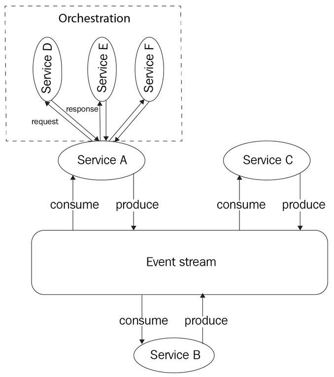

- A, B, and C services are decoupled.
- However, the D, E, and F services within **Service A** are coupled.
  - if these services are doing synchronous processing, the blocking surfaces here.
- the event bus facilitates asynchronous processing among the A, B, and C services.
  - each has the intelligent logic to exhibit an independent behavior
  - the logic is typically distributed across multiple services, whereas the control, flow, and other horizontal capabilities are being centralized in the case of the orchestrator

The second hybrid pattern:

- uses reactive (event-driven) between services and a coordinator (reactive orchestrator) to assist the flow
- it leverages the concepts of commands and events
- the coordinator produces commands to the event stream, and the microservices that are empowered to act for the particular commands receive the command, do the desired processing, and then create and pass on the events to the event stream.

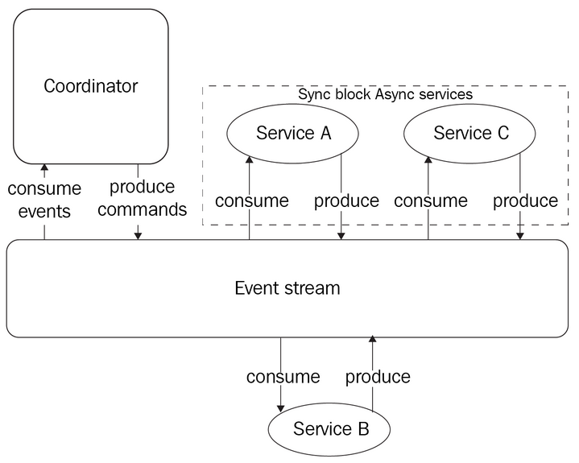

- services A and C start at the same time, and the coordinator consumes the generated events from the event stream and reacts to the events

- services are generally decoupled, yet still a kind of coupling between the services and the coordinator
  - the coordinator has to know what commands a service needs to get in order to react correctly
- events between services lead to asynchronous processing
- overall flow logic is in the reactive coordinator (a SPOF)

### Another example of hybridization of orchestration and choreography

Here: https://dzone.com/articles/event-driven-orchestration-an-effective-microservi

### Choreography

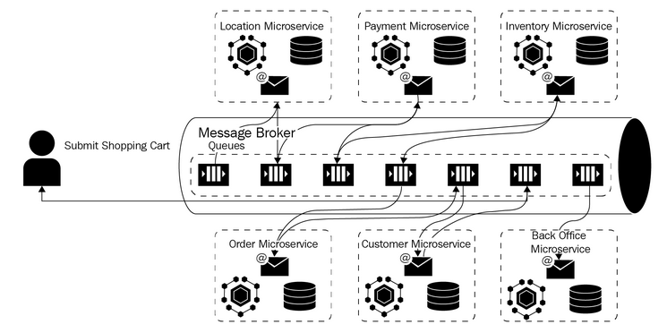

- a process is getting initiated by an event from a user
- it is then accomplished by the respective microservices collectively in a choreography mode
- this method ensures light coupling and high cohesiveness

### Service choreography using the message broker

- some important drawbacks
  - since choreography enables a decentralized approach, the services must have the relevant logic embedded in them
  - any business- and communication-logic changes have to be shared across all the microservices, and the state information of the process has to be stored separately.
  - no centralized service
  - implementation of the ACID properties isn't possible because of multiple distributed services 

### Service orchestration

This is to implement a centralized service orchestration through by integrating the **business process model and notation (BPMN)** workflow and REST.

A Shopping Cart Microservice depiction and realization:

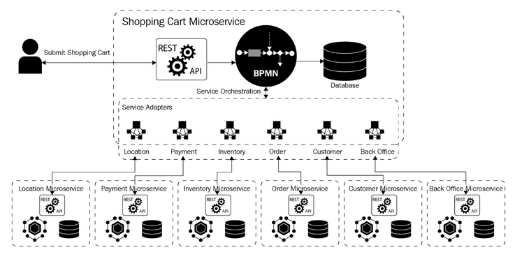

### Service orchestration using BPMN and REST

### The hybridization - event-driven service orchestration

Shopping cart service implemented as an orchestration service using the BPMN workflow:

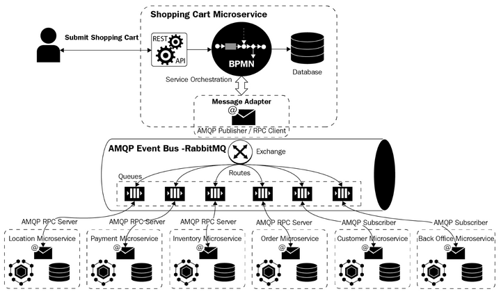

### Data management

**The core philosophy of MSA is the decentralization of software design and development.**

In previous era, with monolithic architecture, data are traditionally centralized. One of the SQL databases, such as SQL server, is used as a single database with multiple tables.

Some portions of the application logic even get delegated to the SQL server database in the form of stored procedures, complex joins, and so on.

### Thinking in REST

To organize data in a decentralized fashion, the REST service paradigm comes in handy.

REST gives each participating resource a URL.

Sample API for a small social messaging application:

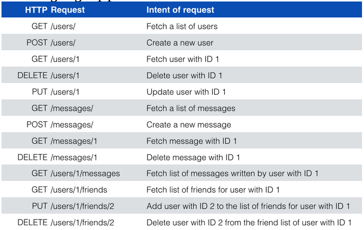

- three primitive resource types: user, message, and friend

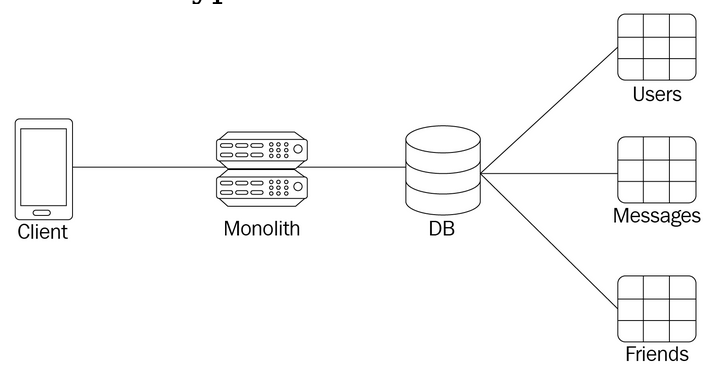

- the central server would would handle requests for all of the resource paths and there is a single database that stores all of the resource types as tables

- for a microservices-centric application
  - ensures tighter security for data
    - every data request, access, and manipulation has to go through a microservice API
  - there is a one-to-one mapping between microservices and resource types
  - 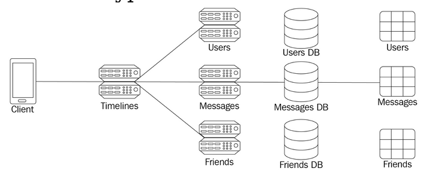
  - many advantages to having a database for each microservice

### Discarding SQL join

- avoid SQL join

  - very time consuming in a MSA where databases are logically separated

- however, there can be different application requirements

  - suppose the messaging application mandates for timeline view

    - the timeline view has to show the most recent message from each friend of the authenticated user as well as show the friend's name and other details along with the message sent

  - a typical REST architecture would require 5 requests, a major drag to performance

  - a workaround is to bring forth a new route to the API:

    | HTTP Request            | Intent of request                                         |
    | ----------------------- | --------------------------------------------------------- |
    | `GET /users/1/timeline` | Fetch timeline of messages from friends of user with ID 1 |

  - the **Client** can get all the necessary data in one request

    - it creates an additional timeline microservice that lives on top of the three data microservices
      - this top-level microservice joins the data from the underlying microservices and exposes the joined result to the client

  - diagram depicting this:

    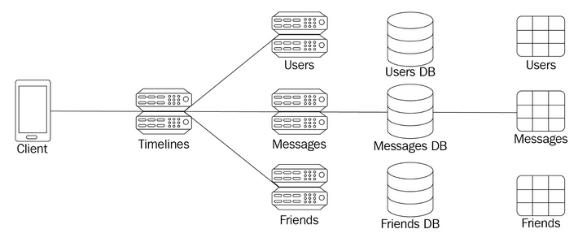

    - this drastically improves performance as the timeline service is predominantly hosted in containers along with the other three services, in the same physical machine or within nearby machines
    - could also use *bulk fetch* endpoints to further reduce round-trip network penalties
    - the newly-craved-out timeline service only has to make one request to the friends service, one request to the user service, and one request to the message service.

### Eventual consistency

- well-known characteristic of NoSQL databases
- not an issue for transactional databases
- consistency feature is difficult to attain when data gets separated into many logical or physical databases

