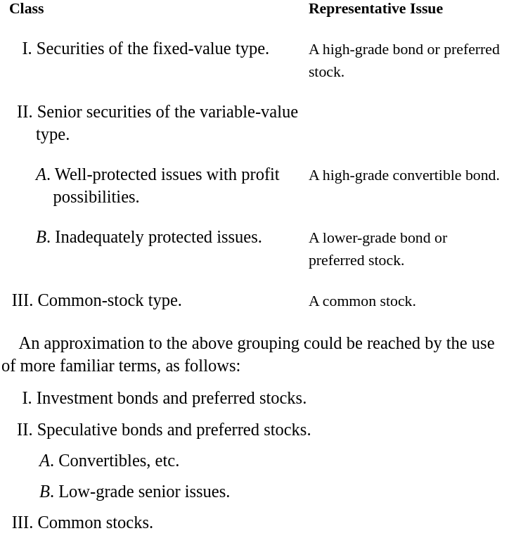

# Chapter 5: Classification of Securities

Securities are customarily divided into the two main groups of **bonds** and **stocks**, with stocks subdivided into **preferred stocks** and **common stocks**.

Main differences:

- of legal status, the bondholder has a fixed and prior claim for principal and interest
- the stockholder assumes the major risks and shares in the profits of ownership

### Objections to the Conventional Grouping:

#### 1. Preferred Stock Grouped with Common

Placing preferred stocks with common stocks: undoubtedly, preferred stocks belong with bonds as the typical or standard preferred stock is bought for fixed income and safety of principal.

The owners of these stocks consider themselves not as partners in the business but as **a holder of a claim ranking ahead of the interest of the partners**, *i.e.*, the common stockholders.

#### 2. Bond Form Identified with Safety

Investors are mistakenly led to assign safety with just the name of "bond."

*Safety depends upon and is measured entirely by the ability of the debtor corporation to meet its obligations*.

Because of the traditional association of the bond form with superior safety, **the investor has often been persuaded that by the mere act of limiting his return he obtained an assurance against loss.**

#### 3. Failure of Titles to Describe Issues with Accuracy

The standard patterns:

1. The bond pattern comprises:
   1. The unqualified right to a fixed interest payment on fixed dates.
   2. The unqualified right to repayment of a fixed principal amount on a fixed date.
   3. No further interest in assets or profits, and no voice in the management.
2. The preferred-stock pattern comprises:
   1. A stated rate of dividend in priority to any payment on the common. (Hence full preferred dividends are mandatory if the common receives any dividend; but if nothing is paid on the common, the preferred dividend is subject to the discretion of the directors).
   2. The right to a stated principal amount in the event of dissolution, in priority to any payments to the common stock.
   3. Either no voting rights, or voting power shared with the common.
3. The common-stock pattern comprises:
   1. A pro rata ownership of the company's assets in excess of its debts and preferred stock issues.
   2. A pro rata interest in all profits in excess of prior deductions.
   3. A pro rata vote for the election of directors and for other purposes.

*Numerous Deviations from the Standard Patterns*:

- *income* bonds
- *convertible* bonds and preferred stocks
- bonds and preferred stocks with *stock-purchase warrants* attached
- *participating* preferred stocks
- common stocks with *preferential features*
- *nonvoting* common stock

### New Classification Suggested.

They suggest that securities be classified under these three headings:

Although, just because an issue has one of these titles in their name does not signify they qualify into the class typically associated with their title.

The opposite situation: a preferred stock selling at 10 cents on the dollar, for example, should be viewed not as a preferred stock at all, but as a common stock.

The dividing lines between each adjacent class is hardly definite.

**In summary, the basis for classification is not the title of the issue, but the practical significance of its specific terms and status to the owner. Nor is the primary emphasis placed upon what the owner is legally entitled to demand, but upon what he is likely to get, or is justified in expecting, under conditions which appear to be probable at the time of purchase or analysis.**

