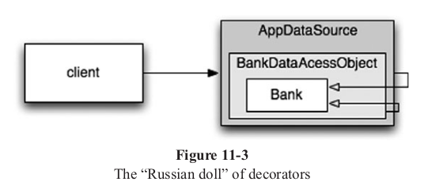

# Chapter 9: Unit Tests

Example of a Bad Test:
```java
@Test
public void turnOnLoTempAlarmAtThreshold() throws Exception {
    hw.setTemp(WAY_TOO_COLD);
    controller.tic();
    assertTrue(hw.heaterState());
    assertTrue(hw.blowerState());
    assertFalse(hw.coolerState());
    assertFalse(hw.hiTempAlarm());
    assertTrue(hw.loTempAlarm());
}
```
This does not read well as you have to move your eyes back and forth between the name of the state being checked, and the *sense* of the state being checked.

This greatly improves the readability of the previous test:
```java
@Test
public void turnOnLoTempAlarmAtThreshold() throws Exception {
    wayTooCold();
    assertEquals("HBchL", hw.getState());
}
```
This does hide the detail of the `tic` function. Upper case means "on", lower case means "off," and the letters are always in the following order: `{heater, blower, cooler, hi-temp-alarm, lo-temp-alarm}`.

This greatly improves the ease of reading tests.

There are things that you might never do in a production environment that are perfectly fine in a test environment. Usually they involve issues of memory or CPU efficiency. But they *never* involve issues of cleanliness.

### One Assert per Test
There is a school of thought that says that every test function in a JUnit test should have one and only one assert statement. 
```java
public void testGetPageHierarchyAsXml() throws Exception {
    givenPages("PageOne", "PageOne.ChildOne", "PageTwo");

    whenRequestIsIssued("root", "type:pages");

    thenResponseShouldBeXML();
}

public void testGetPageHierarchyHasRightTags() throws Exception {
    givenPages("PageOne", "PageOne.ChildOne", "PageTwo");

    whenRequestIsIssued("root", "type:pages");

    thenResponseShouldContain(
        "<name>PageOne</name>", "<name>PageTwo</name>", "<name>ChildOne</name>"
    );
}
```
Also note the `given-when-then` convention. This makes the tests even easier to read. This could lead to a lot of duplicate code though.

You do not have to follow the one assert per test rule strictly. The best thing we can say is that the number of asserts in a test ought to be minimized.

### Single Concept per Test
A better rule could be that we want a single concept in each test function.
Do not want long test functions that test one miscellaneous thing after another.

### F.I.R.S.T.
**Fast**  
**Independent**: tests should not set up conditions for following tests.  
**Repeatable**: tests should be repeatable in **any environment**. You should be able to run the tests in the production environment, in the QA environment, and on your laptop while riding home on the train without a network.  
**Self-Validating**: the tests should have a boolean output. Either they pass or fail. You should not have to read through a log file to tell whether the tests pass. If the tests aren't self-validating, then failure can become subjective and running the tests can require a long manual evaluation.  
**Timely**: tests need to be written in a timely fashion. Unit tests should be written *just before* the production code that makes them pass. If you write tests after the production code, then you may find the production code to be hard to test.

### Conclusion
Tests are just as important to the health of the project as the production code is. Perhaps they are even more important, because tests preserve and enhance the flexibility, maintainability, and reusability of the production code. So keep your tests constantly clean. Work to make them expressive and succinct. Invent testing APIs that act as domain-specific language that helps you write the tests.  
If you let the tests rot, then your code will rot too. Keep your tests clean.

## Chapter 10: Classes
### Class Organization
Following the standard Java convention, a class should begin with a list of variables. Public static constants, if any, should come first. Then private static variables, followed by private instance variables. There is seldom a good reason to have a public variable.

### Classes Should Be Small!
The first rule of classes is that they should be small. The second rule of classes is that they should be smaller than that.

We measure the size of classes not by the number of lines, but by *responsibilities*.

The name of a class should describe what responsibilities a class fulfills.

### The Single Responsibility Principle
The Single Responsibility Principle states that a class or module should have one and only one, *reason to change*.

Classes should have one responsibility - one reason to change.

An example of a single responsibility class:
```java
public class Version {
    public int getMajorVersionNumber();
    public int getMinorVersionNumber();
    public int getBuildNumber();
}
```

Do you want your tools organized into toolboxes with many small drawers each containing well-defined and well-labeled components? Or do you want a few drawers that you just toss everything into?

### Cohesion
Classes should have a small number of instance variables. 

Each of the methods of a class should manipulate one or more of those variables.

In general the more variables a method manipulates the more cohesive that method is to its class.

A class in which each variable is used by each method is maximally cohesive.

In general it is neither advisable nor possible to create such maximally cohesive classes; on the other hand, we would like cohesion to be high.

**When cohesion is high, it means that the methods and variables of the class are co-dependent and hang together as a logical whole**.

A cohesive class example:
```java
public class Stack {
    private int topOfStack = 0;
    List<Integer> elements = new LinkedList<Integer>();

    public int size() {
        return topOfStack;
    }

    public void push(int element) {
        topOfStack++;
        elements.add(element);
    }

    public int pop() throws PoppedWhenEmpty {
        if (topOfStack == 0) {
            throw new PoppedWhenEmpty();
        }
        int element = elements.get(--topOfStack);
        elements.remove(topOfStack);
        return element;
    }
}
```
#### Maintaining Cohesion Results in Many Small Classes
If a function is large with many variables, split it up into smaller functions and classes with instance variables to be used by many of the created and smaller functions.

#### Organizing for Change
As soon as we find ourselves opening up a class, we should consider fixing our design.
A solution:
```java
abstract public class Sql {
    public Sql(String table, Column[] columns);
    abstract public String generate();
}

public class CreateSql extends Sql {
    public CreateSql (String table, Column[] columns);
    @Override public String generate();
}

public class SelectSql extends Sql {
    public SelectSql (String table, Column[] columns);
    @Override public String generate();
}

public class InsertSql extends Sql {
    public InsertSql(String table, Column[] columns, Object[], fields);
    @Override public String generate();
    private String valuesList(Object[] fields, final Column[] columns);
}

public class SelectWithCriteriaSql extends Sql {
    public SelectWithCriteriaSql(
        String table, Column[] columns, Criteria criteria)
        @Override public String generate()
    )
}

public class SelectWithMatchSql extends Sql {
    public SelectWithMatchSql(
        String table, Column[] columns, Column column, String pattern)
        @Override public String generate()
}

public class FindByKeySql extends Sql {
    public FindByKeySql(
        String table, Column[] columns, String keyColumn, String keyValue)
    @Override public String generate()
}

public class PreparedInsertSql extends Sql {
    public PreparedInsertSql(String table, Column[] columns)
    @Override public String generate() {
        private String placeholderList(Column[] columns)
    }
}

public class Where {
    public Where(String criteria)
    public String generate()
}

public class ColumnList {
    public ColumnList(Column[] columns)
    public String generate()
}
```

The code in each class becomes incredibly simple. Our required comprehension time to understand any class decreases to almost nothing.

The risk that one function could break another becomes vanishingly small.

Tests also get easier, as the classes are all isolated from one another.

Equally important, when it's time to add the `update` statements, none of the existing classes need change. We code the logic to build `update` statements in a new subclass of `Sql` named `UpdateSql`. No other code in the system will break because of this change.

This restructured `Sql` logic represents the best of all worlds. It supports the SRP (Single Responsibility Principle).

It also supports an Object Oriented class design principle known as the Open-Closed Principle, or OCP.

**Classes should be open for extension but closed for modification**.

**In an ideal system, we incorporate new features by extending the system, not by making modifications to existing code**.

#### Isolating From Change
We learned in Object Oriented 101 that there are concrete classes, which contain implementation details (code), and abstract classes, which represent concepts only.

A client class depending upon concrete details is at risk when those details change. Interfaces and abstract classes help isolate the impact of those details.

Dependencies upon concrete details create challenges for testing our system. If we're building a `Portfolio` class and it depends upon an external `TokyoStockExchange` API to derive the portfolio's value, our test cases are impacted by the volatility of such a lookup. It's hard to write a test when we get a different answer every five minutes!

We create an interface `StockExchange`, that declares a single method:
```java
public interface StockExchange {
    Money currentPrice(String symbol);
}
```

We design `TokyoStockExchange` to implement this interface. We also make sure that the constructor of `Portfolio` takes a `StockExchange` reference as an argument:
```java
public Portfolio {
    private StockExchange exchange;
    public Portfolio(StockExchange exchange) {
        this.exchange = exchange;
    }
    // ...
}
```

We then write a test:
```java
public class PortfolioTest {
    private FixedStockExchangeStub exchange;
    private Portfolio portfolio;

    @Before
    protected void setUp() throws Exception {
        exchange = new FixedStockExchangeStub();
        exchange.fix("MSFT", 100);
        portfolio = new Portfolio(exchange);
    }

    @Test
    public void GivenFiveMSFTTotalShouldBe500() throws Exception {
        portfolio.add(5, "MSFT");
        Assert.assertEquals(500, portfolio.value());
    }
}
```

The lack of coupling means that the elements of our system are better isolated from each other and from change. This isolation makes it easier to understand each element of the system.

By minimizing coupling in this way, our classes adhere to another class design principle known as the Dependency Inversion Principle (DIP). In essence, the DIP says that our classes should depend upon abstractions, not on concrete details.

Instead of being dependent upon the implementation details of the `TokyoStockExchange` class, our `Portfolio` class is now dependent upon the `StockExchange` interface. The `StockExchange` interface represents the abstract concept of asking for the current price of a symbol. This abstraction isolates all of the specific details of obtaining such a price, including from where that price is obtained.

## Chapter 11: Systems
It is a myth that we can get systems "right the first time." Instead, we should implement only today's *stories*, then refactor and expand the system to implmenet new stories tomorrow.

*Software systems are unique compared to physical systems. Their architectures can grow incrementally ,if we maintain the proper separation of concerns*.

The ephemeral nature of software systems makes this possible, as we will see. Let's consider a counterexample of an architecture that doesn't separate concerns adequately.

The original EJB1 AND EJB2 architectures did not separate concerns appropriately and thereby imposed unnecessary barriers to organic growth. Consider an *Entity Bean* for a persistent `Bank` class. An entity bean is an in-memory representation of relational data, in other words, a table row.

First, you had to define a local (in process) or remote (separate JVM) interface, which clients would use:

**Listing 11-1**:
```java
package com.example.banking;
import java.util.Collections;
import javax.ejb.*;

public interface BankLocal extends java.ejb.EJBLocalObject {
  String getStreetAddr1() throws EJBException;
  String getStreetAddr2() throws EJBException;
  String getCity() throws EJBException;
  String getState() throws EJBException;
  String getZipCode() throws EJBException;
  void setStreetAddr1(String street1) throws EJBException;
  void setStreetAddr2(String street2) throws EJBException;
  void setCity(String city) throws EJBException;
  void setState(String state) throws EJBException;
  void setZipCode(String zip) throws EJBException;
  Collection getAccounts() throws EJBException;
  void setAccounts(Collection accounts) throws EJBException;
  void addAccount(AccountDTO accountDTO) throws EJBException;
}
```
This shows several attributes for the `Bank`'s address and a collection of accounts the bank owns, each of which would have its data handled by a separate `Account` EJB.

Listing 11-2 shows the corresponding implementation class for the `Bank` bean.

**Listing 11-2**:
```java
package com.example.banking;
import java.util.Collections;
import javax.ejb.*;

public abstract class Bank implements javax.ejb.EntityBean {
  // Business logic...
  public abstract String getStreetAddr1();
  public abstract String getStreetAddr2();
  public abstract String getCity();
  public abstract String getState();
  public abstract String getZipCode();
  public abstract void setStreetAddr1(String street1);
  public abstract void setStreetAddr2(String street2);
  public abstract void setCity(String city);
  public abstract void setState(String state);
  public abstract void setZipCode(String zip);
  public abstract Collection getAccounts();
  public abstract void setAccounts(Collection accounts);
  public void addAccount(AccountDTO accountDTO) {
    InitialContext context = new InitialContext();
    AccountHomeLocal accountHome = context.lookup("AccountHomeLocal");
    AccountLocal account = accountHome.create(accountDTO);
    Collection accounts = getAccounts();
    accounts.add(account);
  }

  // EJB container logic
  public abstract void setId(Integer id);
  public abstract Integer getId();
  public Integer ejbCreate(Integer id) { ... }
  public void ejbPostCreate(Integer id) { ... }

  // The rest had to be implemented but were usually empty:
  public void setEntityContext(EntityContext ctx) {}
  public void unsetEntityContext() {}
  public void ejbActivate() {}
  public void ejbPassivate() {}
  public void ejbLoad() {}
  public void ejbStore() {}
  public void ejbRemove() {}
}
```
The corresponding *LocalHome* interface is not shown, essentially being a factory used to create objects, nor any of the possible `Bank` finder (query) methods you might add.

Finally, you had to write one or more XML deployment descriptors that specify the object-relational mapping details to a persistence store, the desired transactional behavior, security constraints, and so on.

The business logic is thightly coupled to the EJB2 application "container." You must subclass container types and you must provide many lifecycle methods that are required by the container.

Because of this coupling to the heavyweight container, **isolated unit-testing is difficult**. 

It is necessary to mock out the container, which is hard, or wastes a lot of time deploying EJBs and tests to a real server. 

Reuse outside of the EJB2 architecture is effectively impossible, due to the tight coupling.

Finally, even object-oriented programming is undermined.

One bean cannot inherit from another bean.

The logic for adding a new account uses the common strategy in EJB2 beans to define "data transfer objects" (DTOs) that are essentially "structs" with no behavior. 

This usually leads to redundant types holding essentially the same data, and it requires boilerplate code to copy data from one object to another.

### Cross-Cutting Concerns
*Concerns* like persistence tend to cut across the natural object boundaries of a domain.

In principle, you can reason about your persistence strategy in a modular, encapsulated way. Yet, in practice, you have to spread essentially the same code that implements the persistence strategy across many objects.

These are the *concerns* addressed when we use the term *cross-cutting concerns*.

Again, the persistence framework might be modular and our domain logic, in isolation, might be modular.

The problem is the fine-grained *intersection* of these domains.

The EJB architecture handled persistence, security, and transactions in an "anticipated" *aspect-oriented programming* (AOP) way, which is a general-purpose approach to restoring modularity for cross-cutting concerns.

**In AOP, modular constructs called *aspects* specify which points in the system should have their behavior modified in some consistent way to support a particular concern.**

Let's look at three aspects or aspect-like mechanisms in Java:

### Java Proxies
Java proxies are suitable for simple situations, such as wrapping method calls in individual objects or classes.

However, the dynamic proxies provided in the JDK Only work with interfaces.

To proxy classes, you have to use a byte-code manipulation library, such as CGLIB, ASM, or Javassist.

**Listing 11-3: JDK Proxy Example**
```java
// Bank.java (suppressing package names...)
import java.utils.*;
// The abstraction of a bank.
public interface Bank {
  Collection<Account> getAccounts();
  void setAccounts(Collection<Account> accounts);
}

// BankImpl.java
import java.utils.*;

// The “Plain Old Java Object” (POJO) implementing the abstraction.
public class BankImpl implements Bank {
  private List<Account> accounts;
  public Collection<Account> getAccounts() {
    return accounts;
  }

  public void setAccounts(Collection<Account> accounts) {
    this.accounts = new ArrayList<Account>();
    for (Account account: accounts) {
      this.accounts.add(account);
    }
  }
}

// BankProxyHandler.java
import java.lang.reflect.*;
import java.util.*;

// “InvocationHandler” required by the proxy API.
public class BankProxyHandler implements InvocationHandler {
  private Bank bank;
  public BankHandler (Bank bank) {
    this.bank = bank;
  }

  // Method defined in InvocationHandler
  public Object invoke(Object proxy, Method method, Object[] args) throws Throwable {
    String methodName = method.getName();
    if (methodName.equals("getAccounts")) {
      bank.setAccounts(getAccountsFromDatabase());
      return bank.getAccounts();
    } else if (methodName.equals("setAccounts")) {
      bank.setAccounts((Collection<Account>) args[0]);
      setAccountsToDatabase(bank.getAccounts());
      return null;
    } else {
      ...
    }
  }
  
  // Lots of details here:
  protected Collection<Account> getAccountsFromDatabase() { ... }
  protected void setAccountsToDatabase(Collection<Account> accounts) { ... }
}

// Somewhere else...
Bank bank = (Bank) Proxy.newProxyInstance(
Bank.class.getClassLoader(), new Class[] { Bank.class }, new BankProxyHandler(new BankImpl()));
```

We defined an interface `Bank`, which will be *wrapped* by the proxy, and a *Plain-Old Java Object* (POJO), `BankImpl`, that implements the business logic.

This code "volume" and complexity are two of the drawbacks of proxies.

They make it hard to create clean code!

Also, proxies don't provide a mechanism for specifying system-wide execution "points" of interest, which is needed for a true AOP solution.

### Pure Java AOP Frameworks
The real value of an AOP system is the ability to specify systemic behaviors in a concise and modular way.

Fortunately, most of the proxy boilerplate can be handled automatically by tools.

Proxies are used internally in several Java frameworks, for example, Spring AOP and JBoss AOP, to implement aspects in pure Java.

In Spring, you write your business logic as *Plain-Old Java Objects*.

They have no dependencies on enterprise frameworks (or any other domains).

This makes them easier to understand and test drive.

You incorporate the required application infrastructure, including cross-cutting concerns like persistence, transactions, security, caching, failover, and so on,using declarative configuration files or APIs.

Listing 11-4 shows a typical fragment of a Spring V2.5 configuration file, app.xml:

**Listing 11-4: Spring 2.X configuration file**:
```java
<beans>
  ...
  <bean id="appDataSource"
  class="org.apache.commons.dbcp.BasicDataSource"
  destroy-method="close"
  p:driverClassName="com.mysql.jdbc.Driver"
  p:url="jdbc:mysql://localhost:3306/mydb"
  p:username="me"/>
  <bean id="bankDataAccessObject"
  class="com.example.banking.persistence.BankDataAccessObject"
  p:dataSource-ref="appDataSource"/>
  <bean id="bank"
  class="com.example.banking.model.Bank"
  p:dataAccessObject-ref="bankDataAccessObject"/>
  ...
</beans>
```

Each "bean" is like one part of a nested "Russian doll," with a domain object for a `Bank` proxied (wrapped) by a data accessor object (DAO), which is itself proxied by a JDBC driver data source. (See Figure 11-3.)




The client believes it is invoking `getAccounts()` on a `Bank` object, but it is actually talking to the outermost of a set of nested DECORATOR objects that extend the basic behavior of the `Bank` POJO.

In the application, a few lines are needed to ask the DI container for the top-level objects in the system, as specified in the XML file:

```java
XmlBeanFactory bf = new XmlBeanFactory(new ClassPathResource("app.xml", getClass()));
Bank bank = (Bank) bf.getBean("bank");
```

Because so few lines of Spring-specific Java code are required, *the application is almost completely decoupled from Spring*, eliminating all the tight-coupling problems of systems like EJB2.

This type of architecture is so compelling that frameworks like Spring led to a complete overhaul of the EJB standard for version 3. 

EJB3 largely follows the Spring model of declaratively supporting cross-cutting concerns using XML configuration files and/or Java 5 annotations.

Listing 11-5 shows our Bank object rewritten in EJB3:

**Listing 11-5: An EJB3 Bank EJB**:
```java
package com.example.banking.model;
import javax.persistence.*;
import java.util.ArrayList;
import java.util.Collection;

@Entity
@Table(name = "BANKS")
public class Bank implements java.io.Serializable {
  @Id @GeneratedValue(strategy=GenerationType.AUTO)
  private int id;

  @Embeddable // An object “inlined” in Bank’s DB row
  public class Address {
    protected String streetAddr1;
    protected String streetAddr2;
    protected String city;
    protected String state;
    protected String zipCode;
  }

  @Embedded
  private Address address;
  @OneToMany(cascade = CascadeType.ALL, fetch = FetchType.EAGER, mappedBy="bank")
  
  private Collection<Account> accounts = new ArrayList<Account>();
  public int getId() {
    return id;
  }

  public void setId(int id) {
    this.id = id;
  }

  public void addAccount(Account account) {
    account.setBank(this);
    accounts.add(account);
  }

  public Collection<Account> getAccounts() {
    return accounts;
  }

  public void setAccounts(Collection<Account> accounts) {
    this.accounts = accounts;
  }
}
```

This code is much cleaner than the original EJB2 code. Some of the entity details are still here, contained in the annotations. However, because none of that information is outside of the annotations, the code is clean, clear, and hence easy to test drive, maintain, and so on.

### AspectJ Aspects
Finally, the most full-featured tool for separating concerns through aspects is the AspectJ language, an extension of Java that provides "first-class" support for aspects as modularity constructs. 

The pure Java approaches provided by Spring AOP and JBoss AOP are sufficient for 80-90 percent of the cases where aspects are most useful.

The drawback of using AspectJ is having to learn several new tools and language constructs and usage idioms.

### Test Drive the System Architecture
The power of separating concerns through aspect-like approaches can't be overstated.

If you can write your application's domain logic using POJOs, decoupled from any architecture concerns at the code level, then it is possible to truly *test drive* your architecture.

You can evolve it from simple to sophisticated, as needed, by adopting new technologies on demand.

It is not necessary to do a *Big Design Up Front* (BDUF).

BDUF is even harmful becuase it inhibits adapting to change, due to the psychological resistance to discarding prior effort and because of the way architecture choices influence subsequent thinking about the design.

**Coupling**: the dependency of one class on another.

Some of the world's largest Web sites have achieved very high availability and performance, using sophisticated data caching, security, virtualization, and so forth, all done efficiently and flexibly because the minimally coupled designs are appropriately *simple* at each level of abstraction and scope.

We must maintain the ability to change course in response to evolving circumstances.

A good API should largely *disappear* from view most of the time, so the team expends the majority of its creative efforts focused on the user stories being implemented.

**_An optimal system architecture consists of modularized domains of concern, each of which is implemented with Plain Old Java (or other) Objects. The different domains are integrated together with minimally invasive Aspects or Aspect-like tools. This architecture can be test-driven, just like the code._**

### Optimize Decision Making
Modularity and separation of concerns make decentralized management and decision making possible.

We often forget that it is also best to *postpone decisions until the last possible moment*. This isn't lazy or irresponsible; it lets us make informed choices with the best possible information.

**_The agility provided by a POJO system with modularized concerns allows us to make optimal, just-in-time decisions, based on the most recent knowledge. The complexity of these decisions is also reduced._**

### Use Standards Wisely, When They Add *Demonstrable* Value

Construction is a mature industry with highly optimized parts, methods, and standards that have evolved under pressure for centuries.

**_Standards make it easier to reuse ideas and components, recruit people with relevant experience, encapsulate good ideas, and wire components together. However, the process of creating standards can sometimes take too long for industry to wait, and some standards lose touch with the real needs of the adopters they are intended to serve._**

### Systems Need Domain-Specific Languages
Building construction, like most domains, has developed a rich language with a vocabulary, idioms, and patterns that convey essential information clearly and concisely.

**_Domain-Specific Languages allow all levels of abstraction and all domains in the application to be expressed as POJOs, from high-level policy to low-level details._**

### Conclusion
Whether you are designing systems or individual modules, never forget to *use the simplest thing that can possibly work*.

## Chapter 12: Emergence