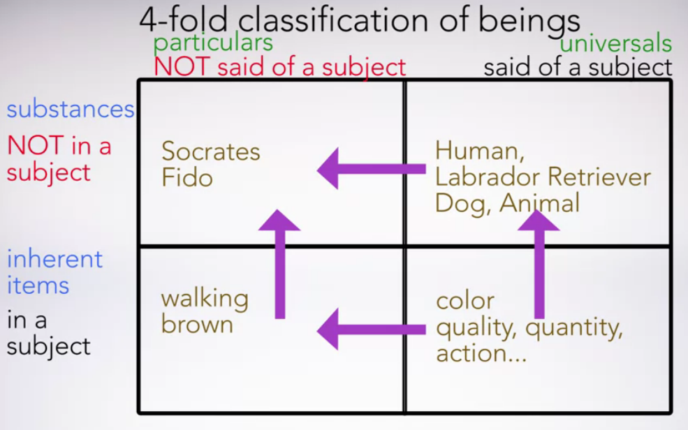

# Week 1

## Part 2, Lecture 1: Introduction to Part 2

- We will begin with Aristotle, Plato's greatest student with many different views than Plato
- In Rafael's School of Athens painting, Plato, thinks the ultimate reality is above us so points up, in contrast with Aristotle's view that ultimate reality is based on the everyday things around us
- Aristotle's Ethical Theory: What is the goal of life?
  - Aristotle's answer has inspired philosophers today to develop the cluster of theories known as virtue ethics
- After Aristotle, we will consider the Epicureans and the Stoics
- We use the term epicurean today, when talking about fine food and drink.
- The epicureans maintain that atoms moving around in the void are the ultimate constituents of the world, and that the gods lead a blessed life, free of all concern of human affairs or for the operation of the cosmos
- The stoic god by contrast, is a physical force that manifests itself in every detail of the cosmos, which it governs with perfect intelligence.

## Part 2, Lecture 2: Introduction to Aristotle

Aristotle (384-323 BCE):

- in many ways, is the antithesis or polar opposite of Plato

Plato founded an institution of research and higher education in Athens that was known as **The Academy.**

- its name indicates its location by a shrine sacred to a hero named Academos, but it now comes to stand for institutions of higher learning quite generally

Aristotle grew up in the court of the royal family in Macedonia and was sent to study at the Academy when he was roughly college age, 17.

- he remained there for 20 years, until the death of Plato

- he became a full-fledged member of the Academy

Aristotle would later found his own school: **The Lyceum**.

- also named after its location, a sacred shrine to Apollo Lyceus, but also the source of another familiar name for an educational institution today, the Lycee.

Aristotle's work was not intended for a general audience so it requires re-reading and extra diligence.

Standard way of referring to works of Aristotle: **Becker numbers**, named after Emanuel Becker who produced a complete edition of the works of Aristotle in the 19th century, it was published by the Prussian Academy.

- three parts: page number, the column number (A or B), and a line number
  - example: 998A30

In Aristotle's treatise known as the categories and is a picture of Aristotle's fundamental disagreement with Plato about the nature of reality (what Rafael painted).

## Part 2, Lecture 3: Subjects and Predicates

The Categories, is about the kinds, or categories, of things that there are.

Aristotle does not use his term to mean a class or a kind, but rather predication. So let's see how we get from predications to kinds of beings.

We can think of predication, not as a relation between words, but rather as an ontological matter. That is, as a **relationship between the beings**, or the entities, to which the words refer.

"Socrates walks," predicates one thing walking of another thing, Socrates.

- two beings:
  - predicated entity: "walking"
  - subject for that predicate: "Socrates"

Could there be walking without there being somebody, or some thing, doing the walking?

- no, walking needs a subject, an ontological subject, in order to exist.
- Socrates doesn't need a subject. He is a subject for other things.

"By 'in a subject' I mean what belongs in something, not as a part, and cannot exist separately from what it is in." (Catg. 1a24-25)

- Walking is not itself a part of Socrates.

So walking, which is in Socrates and not as a part, cannot exist separately from being in something.

Aristotle thinks the more fundamental kind of being is Socrates, more of a being, more real than walking.

This is similar to the relation of ontological dependence that Plato invokes between sensibles and forms, but for Aristotle, the more fully real entity is a concrete particular object familiar to us through experience, and **not an otherworldly form accessible only through the intellect.**

## Part 2, Lecture 4: Universals and Particulars

Inherence: some entities that are predicated of a subject are in that subject (what the previous lecture was about)

But not all predicated items inhere in their subjects.

Some of them, instead, are *said* of a subject but not in any subject.

Example:

- "Socrates is a human being" i.e. Human is *said* of Socrates.
- This answers the question, what is Socrates?
- Socrates may in fact be walking, but walking is not what he is.

Aristotle says if you want to tell whether a predicated entity inheres in its subject just substitute the definition of the predicated item for its name.

The significance of marking off this class of predications helps with Socrates' question in Euthyphro, *what is x?*

- **The sorts of predications that Aristotle classifies as said of predications are ones that give a proper answer to these questions**
- **inherent predications do not**

We can use this to answer Socrates question: *What is piety?*

- Euthyphro proposes that piety is what all the gods love.
- Aristotle might say yes, the pious is loved by all the gods, but this is an inherent predication, not a said of predication. Being-loved-by-the-gods is something that belongs to piety, it is in piety, but it is not what piety is, so it is not said of piety.

Aristotle helps Socrates' quest for the answer to his what is x question is a search for what is said of x.

Aristotle claims you can divide all beings into those that are said of a subject, and those that are not.

| Particulars             | Universals          |
| ----------------------- | ------------------- |
| not *said of* a subject | *said of* a subject |
| Socrates                | Human               |
| Fido                    | Labrador retriever  |
|                         | dog                 |
|                         | animal              |

- note that something me be both said of a subject like Labrador or retriever is said of Fido. And also have other things said of it. Since dog and also animal are said of Labrador retriever.

- What's a Labrador retriever? It's a dog. What's a dog? It's a kind of animal.
- Something like Labrador retriever can be both said of a subject and also have other things said of it.

**The basic distinction Aristotle is driving at here, is between what his general or universal on the one hand, and what is particular on the other.**

- things that are *said of* a subject are what Aristotle calls universals
  - they belong to many particular things:
    - human being belongs to Socrates, to Plato, to you.
- by contrast, particulars:
  - Fido is not a kind of Labrador retriever, but a Labrador retriever
  - Socrates is not a kind of human being, but a human being.
  - This is what Aristotle means when he says that things not said of a subject are individually and numerically one.
  - particulars such as Socrates and Fido do not have any instances that fall under them.

What is x questions:

- The beautiful itself turns out to be an entity that is said of the many beautifuls
- the just itself will be said of the many just things

**Aristotle inverts Plato's ontology in such a way that the many X things are *subjects* for the X itself and the many X things are *more real* than the X itself.**

## Part 2, Lecture 5: Substance and Subject

Ontology:

- *onta*: beings, or what there is

Aristotle's Categories is a work of ontology.

He is interested in classifying the kinds of beings there are.

- the most fundamental, important, or real

Aristotle has a four-fold classification:

He thinks you can sort anything that is into one of four categories by asking two questions about it. Is it said of a subject? Yes or no? And is it in a subject? Yes or no?

Remember, **the distinction between being set of a subject, and not being said of any subject, amounts to the distinction between universals and particulars.**

Things like colors, shapes, locations, activities, and so on exist only by inhering in subjects like Socrates or Fido.

Color is said of brown, and is a universal, and also inheres in a subject.

Arrows of dependence.

There are no arrows of dependence leading away from particular substances (top-left). These are **primary substances**, the most fundamental kind of being according to Aristotle.

In Greek, it is *ousia*, which is an abstract noun formed from the participle of the word *to be*.

- a more literal translation: *being-ness*
- a perfectly good rendering would be *reality*, where reality stands for genuine or first class as opposed to derivative, parasitic, or second grade being.

To call something an ousia is to confer a special, high-grade ontological status on it.

**The main point to keep in mind is that the term substance in our translation of Aristotle is standing in for ousia, which we can think of as the gold medal winner in the ontological olympics.**

With this understanding of ousia, we can see that it has the ontological status that Plato attributed to his intelligible forms.

Plato:

- ousia, the most fundamental entities, are suprasensible, intelligible forms

Aristotle:

- the most basic realities are those that serve as subjects for all the rest. And these are such ordinary entities as human beings, and other animals.

## Part 2, Lecture 6: Subjects of Change

Concrete particular objects like you and me, and presumably also things like tables and chairs end up being the most fundamental realities in Aristotle's ontological schema, according to what we might call the subject test for substance.

- **this is why Aristotle calls these things primary substances**

"It seems most distinctive of substance that numerically one and the same thing is able to receive contraries. For example the color that is numerically one and the same will not be pale and dark...But a substance... [a]n individual man, for instance... becomes at one time pale, at another time dark." (Categ. 4a10-15)

Colors are the sorts of things that can be lighter or darker, but they are not the sorts of things that can become lighter or darker.

The same thing goes for all the other things that inhere in substances, according to Aristotle.

Socrates is the thing that is actually changing, not the statement that his actions make true or false.

The morale of our story here is that **substances are not only the subjects of predicates but they are also the subjects of change.**

Aristotle, by contrast to Plato, has located his fundamental realities within the natural world, and selects as their most distinctive feature, that they are the subjects of change.

We will turn next to study Aristotle's natural philosophy, where he presents his own solution to the Parmenidean problem about change, but also runs into some ontological difficulties as a result. 