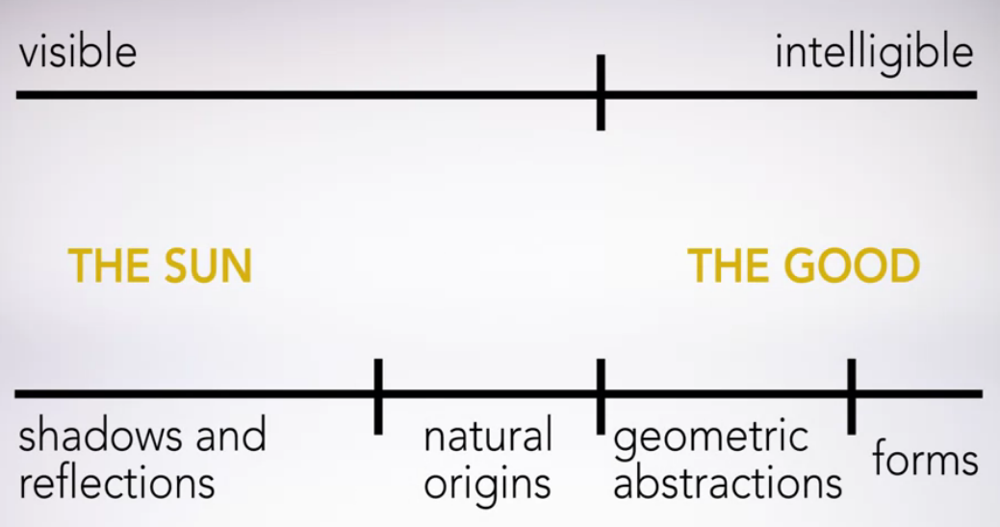
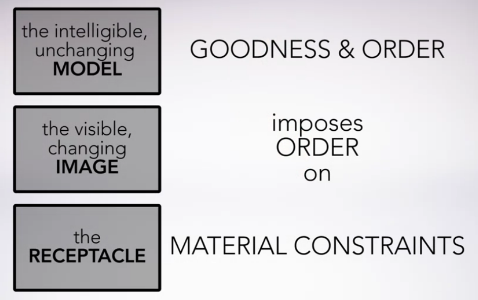
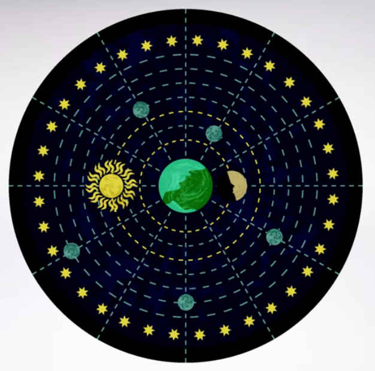
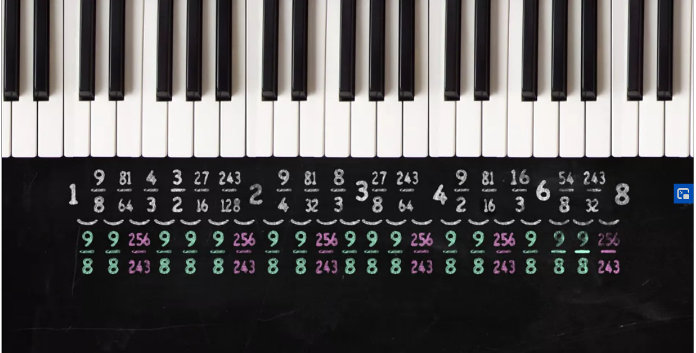
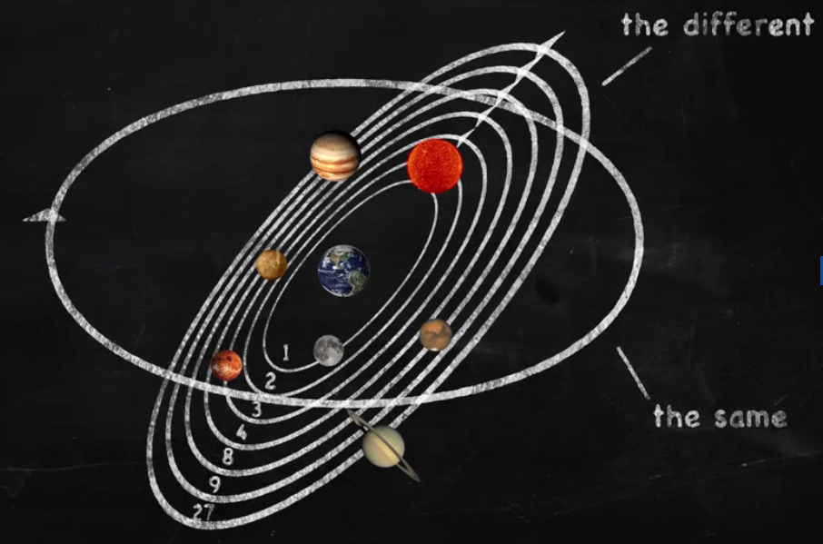

# Week 4

## Part 1, Lecture 27: Plato's Theory of Forms

Socrates shocks Glaucon by saying the rulers of a city must be philosophers.

**Plato's Theory of Forms**

- gives a further explanation of the difference between knowledge and belief

**The distinctive feature of the philosopher, he explains, is the belief that there exists such as what he calls the beautiful itself, or the just itself, or the good itself**

- he refers to these things as **forms**
- use this to ask the questions: What is piety? What is virtue? What is courage? What is justice?

In each case, he is looking for some one thing that is first of all the same in all cases of piety or virtue or courage or justice.

Second, what makes each of these things the way they are. Also called: **the Just itself** or **The Pious itself**...

His interlocutors are usually able to come up with lots of examples of justice, or piety, or courage or temperance.

- these are examples of what Socrates calls **The Many pious/just/courageous things**

They are also many in a different sense.

- they are just one of the many kinds of things that are courageous/pious/just/etc.

Socrates says, the many Xs always fail when proposed as an answer to the question, what is X?

**Forms**:

- grasped by **intellect**
- objects of **recollection**

The items that our souls have encountered in a previous disembodied form, according to the theory of recollection as it set forth in the Meno and the Phaedo.

According to the theory of recollection, the philosopher's practice is to try to regain contact with these forms using the intellect, or power of reasoning, rather than the senses.

By contrast, those who believe only in what we can see or hear or touch or taste, these are the ones he calls the lovers of sights and sounds.

- Believe there are only the many beautiful things, but nothing that is what beauty is in and of itself.
- That there are only the many just things but nothing that is what justice is in and of itself, and so on.

That's all there is to beauty, justice, goodness, and the like.

Socrates, borrowing an image from Heraclitus, likens to the delusion of dreamers who don't realize that they aren't awake.

**The moral of the story**:

- those who have not grasped what justice is, in and of itself, will never have any knowledge about justice
- whatever true beliefs they may have about justice are not tied down by any understanding of what makes things just
- and so their beliefs will be unstable, liable to wander away when they encounter even the flimsiest challenge
- if all you have is belief about justice, not knowledge, you could get things right, or you could just as easily get them wrong.
  - That's what Socrates means when he says that belief, which is all the sight and sound lovers have, is directed at what is and is not
  - while only knowledge is reliably directed at what is.

## Part 1, Lecture 28: The Real and the Good

Forms and the Good

Plato's big picture of his view of reality:

- The Divided Line at the end of book six
- and the image of the Cave at the beginning of book seven

**What is X?**

| The ONE              | The MANY                                                     |
| -------------------- | ------------------------------------------------------------ |
| the Beautiful itself | the many beautiful things                                    |
| the Just itself      | the many just things                                         |
| the Pious itself     | the many pious things                                        |
|                      | likenesses of the ONE or participate in the ONE (imperfect forms of the itself) |

We are to suppose that the things we think of as real in the visible world, the world of experience, are really only images or reflections of some higher reality.

- here the image of the Cave is helpful
- suppose the things we think of as real, real trees and animals and so on, are themselves just imitations of the truly real things.
- suppose the real things were outside the cave we've been holed up in all our lives.
- and the things we thought of as real trees, as distinct let's say, from the shadows they cast on the walls when carried before the fire, were really manufactured replicas of the real thing from some cosmic Toys R Us store, for instance.
- the trees and animals above ground are the **forms**, which a hierarchy, or structure, with the **Sun** representing the **good itself**

Socrates' **intelligible** realm: what we think of as real in comparison to their images are in fact only images or reflections of some further realities in a domain that is accessible only to our **intellect** or **reason**.

- some intelligible object examples:
  - abstract objects we deal with in geometry and mathematics

**These are not the same thing as the intelligible forms, according to Socrates.**

- that is, the things that answer the sort of what is x? questions that he asks.
- but getting practice working in mathematics and geometry will help us to get access to the intelligible forms to which even mathematical objects stand in their relation of images.

**Everything that is on the intelligible side of the divided line is more real than everything in the world of our experience, the visible world side in just the same way that a tree is more really a tree than it's image is.**

Plato's further claim is that the intelligible forms are more real than the objects of our experience.

If we are ever going to have knowledge (that is, knowledge that was spoken about in Meno) of any of the objects of our experience we have to grasp those intelligible forms.

**When Socrates denies that he has knowledge of anything, that's precisely because <u>he thinks he hasn't gotten the satisfactory answer to any of his what is X questions</u>.**

Socrates hasn't grasped the forms. But as a philosopher, that is, a lover or seeker after knowledge, **he passionately believes that there have to be forms, such things as the just itself, the beautiful itself, and presumably, also such things as the tree itself and so on**.

- otherwise, knowledge is impossible.

Plato's realm of intelligible forms has something in common with the Presocratic naturalist's presupposition, crystallized in Heraclitus' belief in the logos, that there is an underlying order to the world of our experience:

"Listen not to me but to the LOGOS: It is wise to agree that all things are ONE" (*Heraclitus B50*)

**The world is a knowable place.**

These intelligible forms are accessible only to our reason, our logos.

Socrates proposes that there is a kind of order, structure and priority among the intelligible forms.

An analogy: so much depends on the Sun. 

Among the intelligible forms, the form of the good is like the sun because it is the source of the other Forms' existence and intelligibility.

**So, on this picture, goodness is not simply an objective feature of the world, something that exists independently of what we happen to believe or desire. It is also a structural principle of reality.**

We'll see more of how this picture gets worked out in detail in the dialogue called Timaeus.

## Part 1, Lecture 29: The Creation of the World

Plato thinks all the action, so to speak, is in the intelligible world where the truly real things are, except he actually devotes a whole dialogue to a discourse on the natural world, **the Timaeus**.

In the School of Athens painting, Plato (on our left) is holding a book (the Timaeus) to show his reverence for the naturalist philosophers' arguments.

Cosmology is what the presocratic naturalists were engaged in.

Plato by contrast, has presented us with his Theory of Forms, according to which the changing world is merely an image or likeness of the true reality.

Timeaeus states his story is not literally and precisely true in every respect.

*eikos logos*: a likely story, not true in every respect

Key player: the divine craftsmen: the **Demiourgos**, also called the **Demiurge**

- looks to the world of the intelligible forms and makes replicas of them in the visible world by imposing order on some primordial soup
- Stuff that prior to his intervention is in discordant and disorderly motion
- it's like cosmic Play-Doh
- **it is in motion, but disorderly motion**
- the Demiurge has imposed order on that disorderly changing to create these real things including ourselves

**Reason imposes ORDER on NECESSITY.**

NECESSITY: that pre-existing stuff that both presents a problem for reason to solve and also imposes constraints on what reason can achieve as a solution

For example:

- if all the material you have at hand is wood and you want to build a bicycle, then there are limits to the quality of workmanship that you can achieve, however brilliant the design.

Thus, according to the Timaeus, there are two sorts of explanations you can give to anything that happens in the natural world:

- appeal to the goodness or order in it, why the wise creator did it
- constraints of material necessity the wise creator is working with

Plato thinks that goodness and order is built into the structure of the cosmos. There are two features to this:

- the structure of what he calls the World's Soul
- the structure of the material elements

## Part 1, Lecture 30: The World Soul

The basic conception of the cosmos that Timaeus is working with is pretty much the one that the pre-Socratic naturalists are working with.

- universe is geocentric, everything revolves around earth
  - roughly spherical and it has predictable and regular motions

These motions, Timaeus proposes must be due to a **soul**, since the soul is the principle of all motion.

The universe can be distinguished into a **body** and a **soul**, like an **animal**.

*anima*: root for animal; actually comes from the Latin translation of the Greek word for soul.

We are no longer dealing with the tripartite soul of the Republic, although it will turn up later for the creation of human beings.

Plato's world soul is a **purely rational soul**.

- these principles are **mathematical**

The world's body: earth, are, fire, and water

The world's soul: constructed out of an invisible mixture of very rarefied entities, being, same, and different.

- these are identified as the highest kinds in a different dialogue called the Sophist.

The Demiurge mixes these into a coherent mass, and then structures the mixture according to mathematical principles.

The term planet comes from the Greek word "wanderer," this acknowledges planets' retrograde motion.

His main point in the dialogue is that the motion is at bottom, regular and orderly.

And as such he claims, it is intelligent. Thus the cosmos is not only **alive**, having a soul, but **intelligent**.

He says we human beings are intelligent because our own individual souls are made of the same ingredient and constructed along the same mathematical principles as the world soul.

Let's turn from the macroscopic picture of the world soul to the microscopic, where Plato thinks there is order and goodness structuring in the world as well.

## Part 1, Lecture 31: Plato's Mathematical Physics

Timaeus on the material elements.

Recall the pre-Socratic naturalists such as Thales, Anaximander, Anaximenes, and Empedocles and so on thought that everything in the world is composed of roughly four kinds of stuff: earth, air, fire and water.

Plato also like Anaximander, thinks these elements are modifications of something more basic.

In Plato's view, it is only when the order of form is imposed on the RECEPTACLE that Earth, air, fire, and water come to be.

- the forms these material elements emulate are good

Solids are made up of 2-d planes, which are made up of triangles.

He says, every triangle can be divided into two right-angle triangles.

- these can either be **isosceles** (two 45 degrees) and **scalene**

The most perfect triangle is 30, 60, and 90 degrees (**half equilateral**)

- gets its name since putting two together creates a perfect equilateral triangle
- put 4 equilateral triangles together to create a tetrahedron (24 half-equilateral triangles)
- put 8 together to get octahedron (48 half-equilateral triangles)
- put 20 together to get icosahedron (120 half-equilateral triangles)

Timaeus has 6 triangles inside the equilateral triangle as each constituent piece is the same.

Now, he constructs a cube.

- take 4 right-angle isosceles triangles and juxtapose them to create a square
- take 6 squares and you create the **cube**, the fundamental element to the element of Earth

Timaeus identifies the smallest, pointiest shape, the tetrahedron, as the structure of **elemental fire**.

The next largest, the octahedron, is the form of air.

The largest of the three, the icosahedron, is the form of water.

Plato seems to be operating on the assumption that the denser and more sluggish the element, the more triangles it contains.

Since the model he is working with has elemental Earth as cube, only fire, air, and water convert with each other.

5 perfect solids in Plato's day:

- the **dodecahedron** is constructed out of 12 regular pentagons
  - makes a cameo appearance in the Timaeus at 55c as the **shape of the universe as a whole** since it approaches the shape of the sphere

**These are known as the five platonic solids because of their occurrence here in Plato's Timaeus.**

Plato is looking for four perfect solids to structure the four elements on his periodic table, Earth, fire, and water, and he goes to the geometers to get his list of perfect solids.

Unfortunately, there aren't four perfect solids that can be constructed out of the same plane figure.

- 3 out of equilateral triangles, 1 out of squares, and 1 out or regular pentagons

Plato wants something to connect the equilateral triangle and the square.

**Timaeus insists that all four of the perfect solids are constructed out of triangles because he wants a unified set of principles that account for the mathematical and geometrical structure of *both* the equilateral triangle and the square.**

Now, we know, today, that this lovely geometrical picture is not an accurate theory of the structure of matter, but I don't think even Plato thought it was.

That's another way in which the cosmology of the Timaeus is a likely story.

## Part 1, Lecture 32: Conclusion to Part 1

The pre-Socratic naturalists are responsible for the great achievement of claiming that order underlies the world of everyday experience.

Plato: the macro and microscopic world can be understand by its mathematical perfection, its goodness.

- "the form of the good is the form of all the other forms" (Republic)

Questions about virtue can be treated the same as questions about nature.

For Plato, goodness is an objective feature of the world that is manifest in the movements of the celestial bodies in nature and reflected in the goodness of individual souls.

Plato says people should not strive to achieve wealth, power, status, etc. but **"to put himself in order"**:

- **Socrates**: "...he puts himself in order...and harmonizes the three elements [of the soul] together, just as if they were literally the three defining notes of an octave--lowest, highest, and middle...He binds together all of these and, from having been many, becomes entirely one, temperate and harmonious..." (*Republic* 443d-e)

On Plato's understanding of the world, there's a considerable gap between the way we are, most of us, and what the best version of ourselves would be.

Just that there's a huge difference between the world as it appears to us and how it really is.

The task of philosophy as he understands it, is to bridge both those gaps. To Plato, no human endeavor is more important.

We become like the gods to the extent that we succeed in bridging that gap. Where God is understood not as a supernatural force that governs the cosmos from the outside, but as the ultimate principle of the inner workings of the cosmos.

In Plato's version, the divine is to be understood in terms of the intelligible order that is the ultimate reality of the cosmos.

Insofar as human beings have the power of reason, of logos, we have a share in the divine nature, and it is by developing this element in our nature, and putting it in charge of our lives that we become the best that we can be. This is a theme we will see developed in very different ways by Aristotle and later thinkers. So do stick around for part two of the course, we will follow the next part of the story. 