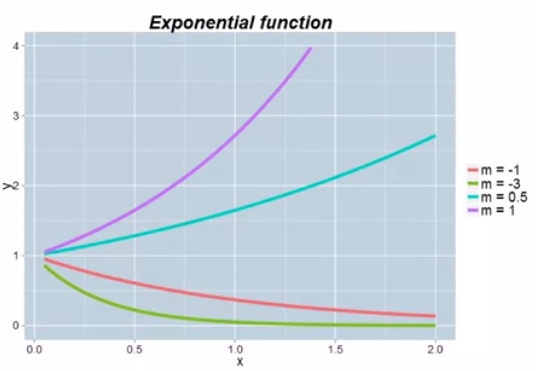
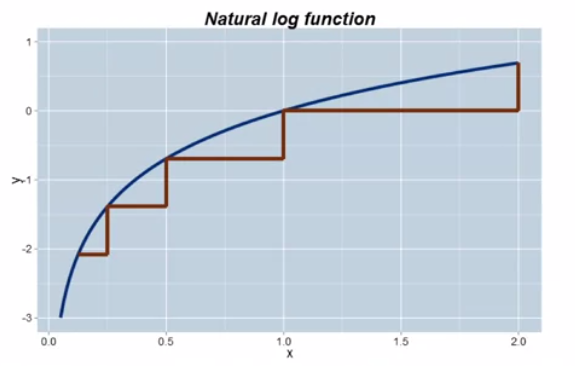
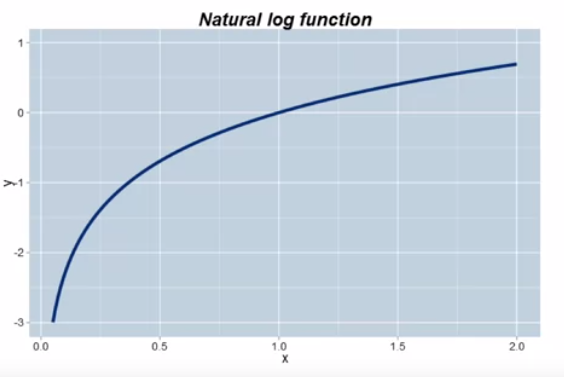

# Week 1

## 1.4 Key Steps in the Modeling Process

- Don't be concerned with if the model is *right* rather if it is *helpful*.
- Modeling is a continuous and evolutionary process

## 1.5 A Vocabulary for Modeling

### Data driven v. theory driven

On a spectrum of **Empirical** and **Theoretical**

- Theory: given a set of assumptions and relationships, then what are the logical consequences?
- Data: given a set of observations, how can we approximate the underlying process that generated them?

### Deterministic v. probabilistic/stochastic

- Deterministic: given a fixed set of inputs, the model always gives the same output
- Probabilistic: Even with identical inputs, the model output can vary from instance to instance
  - Example: A person spends $1000 on lottery tickets. After the lottery is drawn how much they are worth depends on a random variable, whether or not they won the lottery.

### Discrete v. continuous variables

### Static v. dynamic

- Static: the model captures a single snapshot of the business process
  - Given a website's installed software base, what are the chances that it is compromised today?
- Dynamic: the evolution of the process itself is of interest. The model describes the movement from state to state
  - Given a person's participation in a job training program, how long will it take until he/she finds a job and then, if they find one, for how long will they keep it?

## 1.6 Mathematical Functions

Four key functions, building blocks of quantitative modeling:

1. Linear
2. Power
3. Exponential
4. Log

### The linear function

$$
y = mx+b
$$

- the core function of quantitative modeling

### The power function for various powers of x

$$
y = x^m
$$

- x is the **base**

- m is the **exponent**

- Essential characteristic:

  - A one **percent** (proportionate) change in x corresponds to an approximate m **percent** (proportionate) change in y

- Facts:

  - $$
    x^{m}x^{n}=x^{m+n}
    $$

  - $$
    x^{-m}=\frac{1}{x^m}
    $$

### The exponential function for various values of m

$$
y = e^{mx}
$$

- e is mathematical constant: 2.71828...
- Notice that as compared to a power function, x is in the exponent of the function and not the base
- Essential characteristic:
  - the rate of change of y is proportional to y itself
- Interpretation of m for small values of m (say $ -0.2 \leq m \leq 0.2 $):
  - For every one-unit change in x, there is an approximate 100m% proportionate change in y
  - Example: if m = 0.05, then a one-**unit** increase in x is associated with an approximate 5% increase in y

### The log function

$$
y = log_{b}(x)
$$

- b is called the base of the logarithm
- The most frequently used base is the number "e" and the logarithm is called the "natural log"
- The log undoes (is the inverse of) the exponential function:
  - $ log_ee^x = x $
  - $ e^{log_ex} = x $
- $ log(xy) = log(x) + log(y) $
- In this course we will always use the natural log and write it simply as $ log(x) $

- The log function is very useful for modeling processes that exhibit **_diminishing returns to scale_**, i.e. we are putting more into the process, we get more out, but not as much as before
  - Example: say you have a few people helping you in the kitchen, it helps you. But if there are say 10 people in the kitchen, the amount of help reaches a max amount
- These are processes that increase but at a decreasing rate
- Essential characteristic:
  - A constant proportionate change in x is associated with the same absolute change in y
- the most commonly used transformation in quantitative modeling
- if we aren't looking at the data directly, we are looking at the log transform of the data

- proportionate change in x is associated with constant change in y

