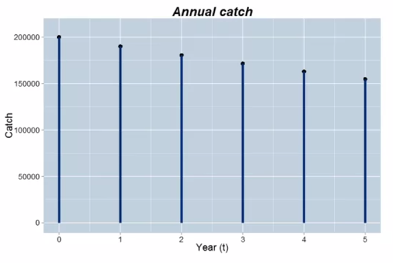
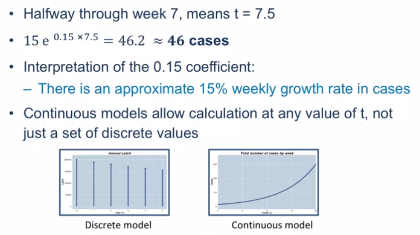
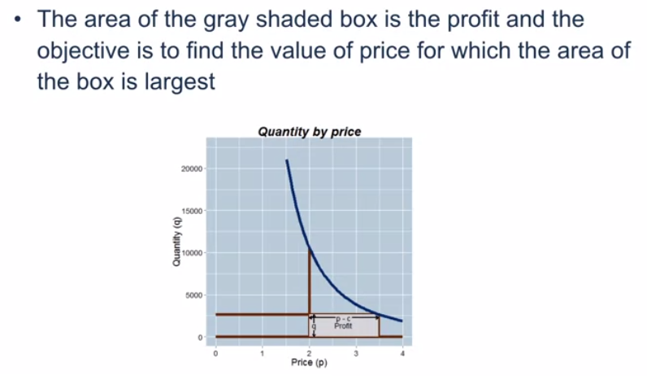

# Week 2

Module 2 content

- Linear models
- Growth and decay in discrete time
- Growth and decay in continuous time
- Classical optimization

## 2.1 Introduction to Linear Models and Optimization

### Deterministic Models

- There are no random/uncertain components (inputs and/or outputs) in these models
- If the inputs to the model are the same then the outputs will always be the same
- The downside of deterministic models: it is hard to assess uncertainty in the outputs

### Linear models

- Recall the formula definition of a straight line: $ y = mx + b $
- Characterization of a line: the slope is constant
- The change in y for a one-unit change in x is the same, **regardless** of the value of x
- In practice you should ask if the constant slope assertion is realistic
- If it is not realistic, then a straight line model is probably not the way to go

### A linear cost function

- Call the number of units produced `q`, and the total cost of producing `q` units `C`

- Define: $ C = 100 + 30q $

- Calculate some illustrative values:

  | q    | C    |
  | ---- | ---- |
  | 0    | 100  |
  | 10   | 400  |
  | 20   | 700  |

#### Interpretation

- the two coefficients in the line are the intercept and slope: `b` and `m` in general, 100 and 30 in this particular instance
- `b`: the total cost of producing 0 units
  - A better interpretation: that part of total cost that doesn't depend on the quantity produced: the **_fixed_** cost
- `m`: the slope of the line
  - The change in total cost for an incremental unit of production: the **_variable_** cost

### Example with a "time-to-produce" function

- It takes 2 hours to set up a production run, and each incremental unit produced always takes an additional 15 minutes (0.25 hours)
- Call `T` the time to produce `q` units, then: $ T = 2 + 0.25q $
- Interpretation
  - `b`: the **_setup time_** (2 hours)
  - `m`: the **_work rate_** (15 minutes per additional item)

### Linear programming

- One of the key uses of linear models is in **Linear Programming (LP)**, which is a technique to solve certain **optimization** problems
- These models incorporate **constraints** to make them more realistic
- Linear programming problems can be solved with add-ins for common spreadsheet programs

## 2.2 Growth in Discrete Time

### Growth in discrete time

- Growth is a fundamental business concept
  - The number of customers at time `t`
  - The revenue in quarter `q`
  - The value of an investment at some time `t` in the future
- Sometimes a linear model may be appropriate for a growth process
- But an alternative to a **_linear (additive) growth_** model is a **_proportionate_** one
- Proportionate growth: a constant percent increase (decrease) from one period to the next

### Simple interest

- Start off with $ \$100 $ (**_principal_**) and at the end of every year earn 10% **_simple interest_** on the initial $ \$100 $

- Simple interest means that interest is only earned on the principal investment

  | Year  | 0    | 1    | 2    | 3    | 4    | 10   |
  | ----- | ---- | ---- | ---- | ---- | ---- | ---- |
  | Value | 100  | 110  | 120  | 130  | 140  | 200  |

- Every year the investment grows by the same amount ($ \$10 $)

### Compound interest

- Start off with $ \$100 $ (**_principal_**) and at the end of every year earn 10% **_compound interest_** on the initial $ \$100 $

- Compound interest means that the interest itself earns interest in subsequent years

  | Year  | 0      | 1      | 2      | 3      | 4      | 10     |
  | ----- | ------ | ------ | ------ | ------ | ------ | ------ |
  | Value | 100.00 | 110.00 | 121.00 | 133.10 | 146.41 | 259.37 |

- Notice that the growth is no longer the same absolute amount each year, but it is the same proportionate (relative) amount (10%)

## 2.3 Constant Proportionate Growth

### Constant proportionate growth

- Denote the initial amount as $ P_0 $

- Denote the constant proportionate growth factor by $ \theta $ (for example 10% growth means multiply by 1.1 at the end of each time period)

- The growth progression is

  | Time            | 0     | 1             | 2               | 3               | t               |
  | --------------- | ----- | ------------- | --------------- | --------------- | --------------- |
  | Amount, $ P_t $ | $P_0$ | $ P_0\theta $ | $ P_0\theta^2 $ | $ P_0\theta^3 $ | $ P_0\theta^t $ |

- $ \theta > 1 $ means the process is growing

- $ \theta < 1 $ means the process is declining/decaying

- This type of progression is called a <u>**_geometric progression_**</u> or <u>**_geometric series_**</u>

### Example

- An Indian Ocean nation caught 200,000 tonnes of fish this year
- The catch is projected to fall by a constant 5% factor each year for the next 10 years
- How many fish are predicted to be caught 5 years from now?
  - $ P_t = P_0\theta^t = 200,000(0.95)^5 = 155,000 $
- Including this year, what is the total expected catch over the next 5 years?
  - $ \sum_{t=0}^{5} P_t = P_0 + P_1 + P_2 + P_3 + P_4 + P_5 $
  - $ = P_0 + P_0\theta + P_0\theta^2 + P_0\theta^3 + P_0\theta^4 + P_0\theta^5 $
  - $ = P_0(1 + \theta + \theta^2 + \theta^3 + \theta^4 + \theta^5) $
  - $ = 200,000(1 + 0.95 + 0.95^2 + 0.95^3 + 0.95^4 + 0.95^5) $
  - $ = 200,000(1 + 0.95 + .9025 + .857375 + .81450625 + 0.7737809375) $
  - $ = 200,000 \times 5.2982 $
  - $ = 1059632 \approx 1,060,000 $ (**correct**)

### The constant multiplier

- For the catch to fall by 5% each year, means that the multiplier is $ \theta = 0.95 $

- In general, if the process is changing by R% in each time period, then the multiplier is:

  $ \theta = 1 + \frac{R}{100} $

### Graphing the annual fish catch

- steps are getting smaller each time, **proportionate** versus **additive** growth model

### The sum of the geometric series

- If we denote the sum up to time $ t $ as $ S_t $, the:

  $ S_t = P_0 \frac{1-\theta^{t+1}}{1-\theta} $

- Wish the fisheries example:

  $ S_5 = 200,000 \frac{1-0.95^{5+1}}{1-0.95} = 1,059,632 $

- The mathematical formulation of the model can sometimes provide more direct answers than a spreadsheet

## 2.4 Present and Future Value

### Present and future value

- If there is no inflation and the prevailing interest rate is 4%, then which of the following options would you prefer?
  - $ \$1000 $ today or $ \$1500 $ in ten years?
- Either look to see how much $ \$1000 $ will be worth in ten years , or
- Calculate how much you would have to invest today to get $ \$1500 $ ten years from now
- The latter approach relies on the concept of **_present value_**
  - the expected current value of an income stream

### The present value calculation

- We know that $ P_t = P_0\theta^t $ and making $ P_0 $ the subject of the formula means that $ P_0 = P_t\theta^{-t} $
- Therefore $ \$1500 $ in ten years time in a 4% interest rate environment is worth $ 1500(1 + 0.04)^{-10} $ in today's money
- This equals $ \$1013.346 $, which is more than $ \$1000 $, so you should prefer the second investment of $ \$1500 $ received in ten years
- This straightforward proportionate increase model allows for a simple discounting formula

### Uses of present value

- A primary use is in discounting investments to the present time
- An **_annuity_** is a schedule of fixed payments over a specified and finite time period
- The present value of an annuity is the **_sum_** of the present values of each separate payment
- Present value is also used in **_lifetime customer value_** calculations

### Continuous compounding

- The compounding period for an investment can be yearly, monthly, weekly, daily etc.

- As the compounding period gets shorter and shorter, in the limit, the process is said to be **_continuously compounded_**

- If a principal amount $ P_0 $ is continuously compounded at a nominal annual interest rate of R%, then at year t,

  $ P_t = P_0e^{rt} $ where $ r = \frac{R}{100} $

- In this model, $ t $ can take on  any value in an interval, whereas in the discrete model $ t $ could only take on distinct values
- $ \$1000 $ **_continuously compounded_** at a nominal annual interest rate of 4% is worth $ 1000e^{0.04} = 1,040.80 $ after one year
- Note that this is a little more than if the 4% was earned at the very end of the time period, in which case you would have exactly $ \$1040 $ at the end of the year

### Modeling an epidemic

- The model $ P_t = P_0e^{rt} $ doesn't just describe money growing
- This model is called exponential growth or decay depending on whether $ r $ is positive or negative respectively
- A continuous time model for the initial stages of an epidemic states that the number of cases at week $ t $ is $ 15e^{0.15t} $ (15% increase, week-to-week)
- Halfway through week 7, how many cases do you expect?

### Calculating the expected number of cases

## 2.5 Optimization

### Using a model for optimization

- A common modeling objective is to perform a subsequent optimization
- The objective of the optimization is to find the value of an input that maximizes/minimizes an output
- Example: find the price at which profit is maximized

### Demand model

- Consider the demand model: $ Quantity = 60,000 \times Price^{-2.5} $
- If the price of production is constant at $ c = 2 $ for each unit, then at what price is profit maximized?
- Profit = Revenue - Cost
- $ Revenue = Price \times Quantity = p \times q $
- $ Profit = pq - cq = q(p - c) = 60,000p^{-2.5}(p - 2) $
- Goal: Choose $ p $ to maximize this equation

### Brute force approach

- Choose different values of $ p $ and plot profit

### Calculus approach

- Profit is maximized when the **_derivative_** (rate of change) of profit with respect to price equals 0
- Through **_calculus_** one obtains the optimal value of price as $ p_{opt} = \frac{cb}{1+b} $, where $ c $ is the production cost and $ b $ is the exponent in the power function
- In this example $ c = 2 $ and $ b = -2.5 $. This gives $ p_{opt} = \frac{2 \times -2.5}{(1 - 2.5)} \approx 3.33 $
- The value (-b) is known as **_the price elasticity of demand_**

### Visualizing the calculus solution

