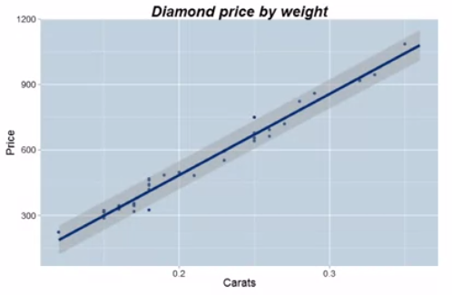
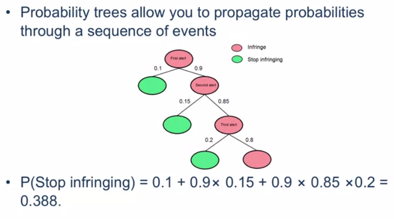
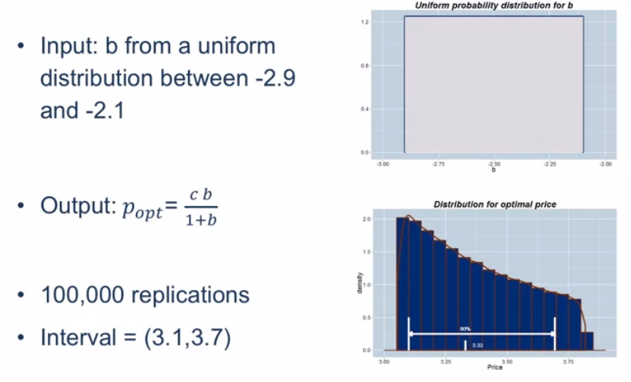
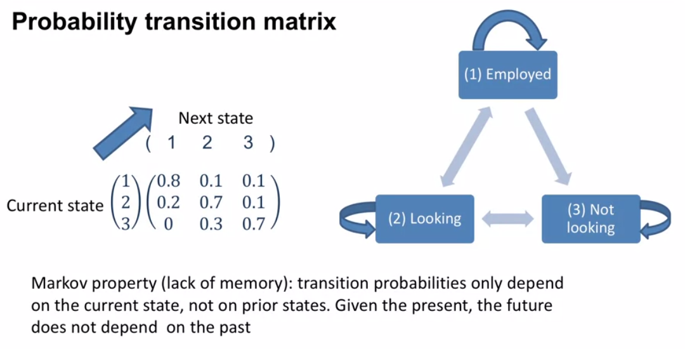
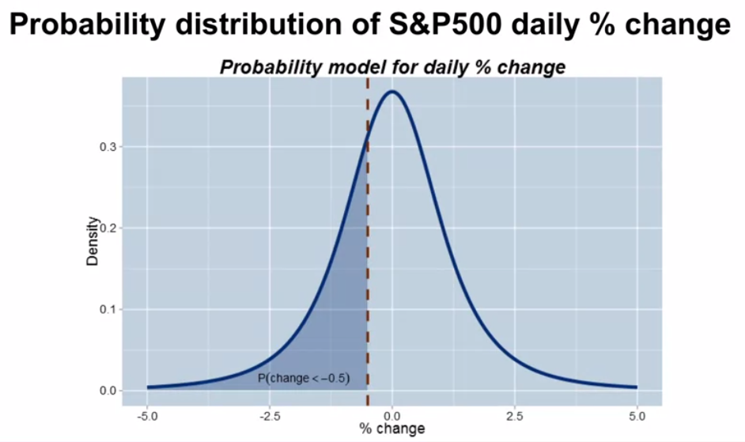
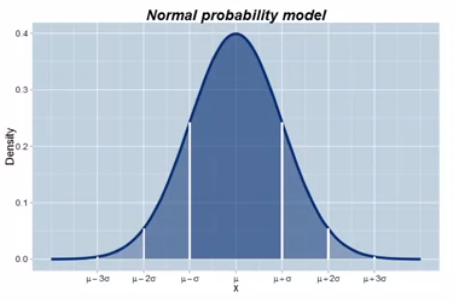
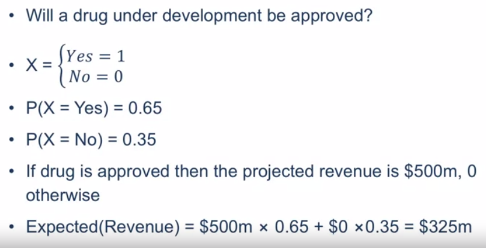
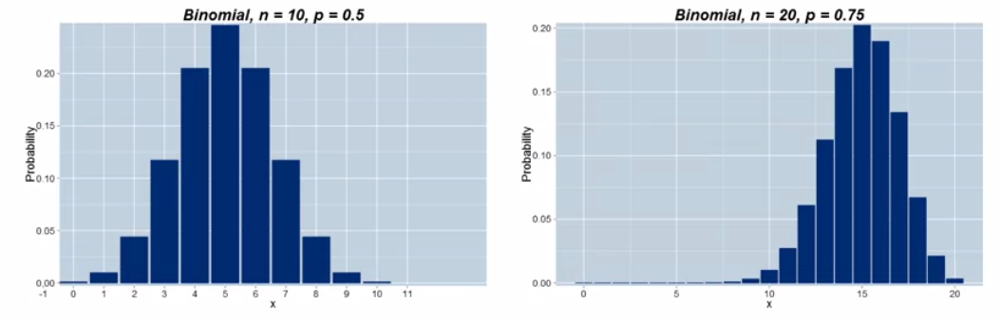
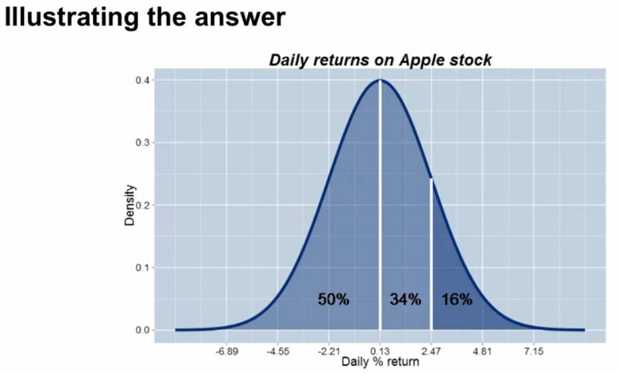

# Week 3

## 3.1 Introduction to Probabilistic Models

- uncertain outcomes rather than deterministic outcomes

### Module 3 content

- What are probabilistic models?
- Random variables and probability distributions -- the building blocks
- Examples of probabilistic models
- Summaries of probability distributions: means, variances, and standard deviation
- Special random variables: Bernoulli, Binomial and Normal
- The Empirical Rule

### Probabilistic models

- These are models that incorporate **_random variables_** and **_probability distributions_**
- Random variables represent the potential outcomes of an uncertain event
- Probability distributions assign probabilities to the various potential outcomes
- We use probabilistic models in practice because realistic decision making often necessitates recognizing uncertainty (in the inputs and outputs of a process)

### Key features of a probabilistic model

- By incorporating **_uncertainty_** explicitly in the model we can measure the uncertainty associated with the outputs, for example by giving a range to a forecast, which is a more realistic goal
- In a business setting incorporating **_uncertainty_** is synonymous with understanding and quantifying the **_risk_** in a business process, and ideally leads to better management decisions

## 3.2 Examples of Probabilistic Models

### Some examples of probabilistic models

- **_Regression models_** (module 4)
- **_Probability trees_**
- **_Monte Carlo_** simulation
- **_Markov models_**

## 3.3 Regression Models

### Regression models

- $ E(Price | Carats) = -259.6 + 3721 \times Carats $

- The gray band gives a prediction interval for the price of a diamond taken

  

- Regression models use data to estimate the relationship between the mean value of the outcome(Y) and a predictor variable(X)
- The intrinsic variation in the raw data is incorporated into forecasts from the regression model
- The less noise in the underlying data the more precise the forecasts from the regression model will be

## 3.4 Probability Trees

### Probability Trees

## 3.5 Monte Carlo Simulations

### Monte Carlo simulation

- From the demand model:

  $ Quantity = 60,000 \times Price^{-2.5} $

- The optimal price was $p_{opt} = \frac{cb}{1+b} $, where $ b = -2.5 $, $ c $ is the cost, $ c = 2 $, and $p_{opt} \approx 3.33 $

- But what if $ b $ is not known exactly?

- Monte Carlo simulation replaces the number $ -2.5 $ with a random variable, and recalculates $ p_{opt} $ using different realizations of this random variable from some stated probability distribution

### Input and output from a Monte Carlo simulation

## 3.6 Markov Chain Models

### Markov chain models

- the fourth **probabilistic model**
- A **dynamic**, **probabilistic**, and **discrete**
- Dynamic models for discrete time state space transitions
- Example: employment status (the state of the chain)
- Treat time in 6 month blocks
- Model states:
  - Employed
  - Unemployed and looking
  - Unemployed and not looking

- **given the present, the future does not depend on the past**

## 3.7 Building Blocks of Probability Models

### Building blocks of probability models

- Random variables (discrete and continuous)
- Probability distributions
- Random variables represent the potential outcomes of an uncertain event
- Probability distributions assign probabilities to the various potential outcomes

### A discrete random variable

### A continuous random variable

- The **_percent change_** in the S&P500 stock index tomorrow: $ 100 \times \frac{p_{t+1}-p_t}{p_t} $ where $ p_t $ is the closing price on day $ t $
- It can potentially take on **any** number between -100% and infinity
- For a continuous random variable probabilities are computed from areas under the **_probability density function_**

### Key summaries of probability distributions

- Mean ($ \mu $) measures centrality
- Two measures of spread:
  - Variance ($ \sigma^2 $)
  - Standard deviation ($ \sigma $)

## 3.8 The Bernoulli Distribution

### The Bernoulli distribution

- **Binary, 0 or 1**
- The random variable X takes on one of two values:
  - $ P(X = 1) = p $
  - $ P(X = 0) = 1 - p $
- Often viewed as an experiment that takes on two outcomes, success/failure. Success = 1 and failure = 0
- $ \mu = E(X) = 1 \times p + 0 \times (1 - p) = p $, the **mean** or **expected value**
- $ \sigma^2 = E(X - \mu)^2 = (1 - p)^2p + (0 - p)^2(1 - p) = p(1 - p) $, the **variance**
- $ \sigma = \sqrt{p(1-p)} $, the **standard deviation** is just the square root of the variance
- For $ p = 0.5 $, $ \mu = 0.5 $, $ \sigma^2 = 0.25 $ and $ \sigma = 0.5 $

### Example: drug development

## 3.9 The Binomial Distribution

### The Binomial distribution

- A Binomial random variable is the number of success in *n **independent*** Bernoulli trials
- Independent means that P(A and B) = P(A) x P(B)
- Independence means that knowing that A has occurred provides no information about the occurrence of B
- Independence is a common simplifying assumption in many probability models and makes their construction and subsequent calculations much easier

- Example: toss a coin ten times, and count the number of heads (call this X)

- Then X has a Binomial distribution with parameters $ n = 10 $ and $ p = 0.5 $
- In general: $ P(X = x) = \binom{n}{x}p^x(1-p)^{n-x} $, where $ \binom{n}{x} $ is the **_binomial coefficient_**: $ \frac{n!}{x!(n-x)!} $
- $ \mu = E(X) = np,\ \sigma^2 = E(X - \mu)^2 = np(1-p) $

## 3.10 The Normal Distribution

- perhaps most important distribution of all
- The Normal distribution, colloquially known as the *Bell Curve*, is the most important modeling distribution
- Many disparate processes can be well **_approximated_** by Normal distributions
- There are mathematical theorems (the Central Limit Theorem) that tell us Normal distributions should be expected in many situations
- A Normal distribution is characterized by its mean $ \mu $ and standard deviation $ \sigma $. It is symmetric about its mean.

### Examples

- There is a **_universality_** to the Normal distribution
  - Biological: heights and weights
  - Financial: stock returns
  - Educational: exam scores
  - Manufacturing: the length of an automotive component
- It is therefore often used as a distributional assumption in Monte Carlo simulations (knowing the mean and standard deviation is enough to define a Normal distribution)

## 3.11 The Empirical Rule

### The Empirical Rule

- The Empirical Rule is a rule for calculating probabilities of events when the underlying distribution or observed data is approximately Normally distributed
- It states
  - There is an approximate **68%** chance that an observation falls within **one** standard deviation from the mean
  - There is an approximate **95%** chance that an observation falls within **two** standard deviations from the mean
  - There is an approximate **99.7%** chance that an observation falls within **three** standard deviations from the mean

### Empirical Rule example

- Assume that the daily **return** on Apple's stock is approximately Normally distributed with mean $ \mu = 0.13% $ and $ \sigma = 2.34% $

- What is the probability that tomorrow Apple's stock price increases by more than 2.47%?

- Technique: count how many standard deviations 2.47% is away from the mean, 0.13%. Call this **_counter_** the **_z-score_**
  $$
  Z = \frac{2.47 - 0.13}{2.34} = 1
  $$
  

- So, from the Empirical Rule the probability equals approximately 16%

## 3.12 Summary

- What are probabilistic models?
  - ways of capturing risk and uncertainty
- Random variables and probability distributions -- the building blocks
- Examples of probabilistic models
- Summaries of probability distributions: means, variances, and standard deviation
- Special random variables: Bernoulli, Binomial, and Normal
- The Empirical Rule

## Week 3 Quiz

6. $ p = 0.6,\ n = 4,\ x = 2 $

   $ \binom{n}{x} = \frac{n!}{x!(n-x)!} $
   $$
   \begin{equation}
   \begin{split}
   P(X=x) & = \binom{n}{x}p^x(1-p)^{n-x} \\
   & = \frac{24}{4}(0.6)^2(0.4)^2 \\
   & = 6(0.36)(0.16)
   \end{split}
   \end{equation}
   $$
   