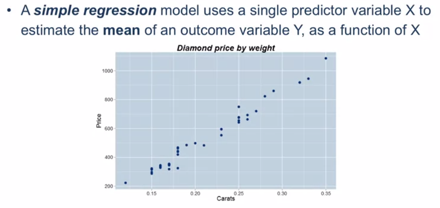
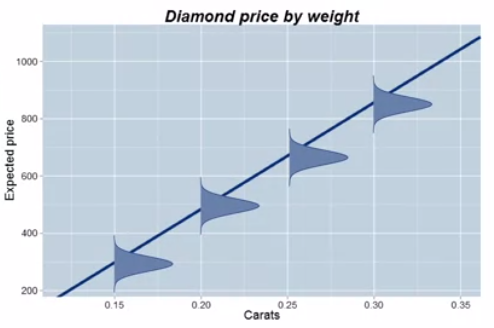
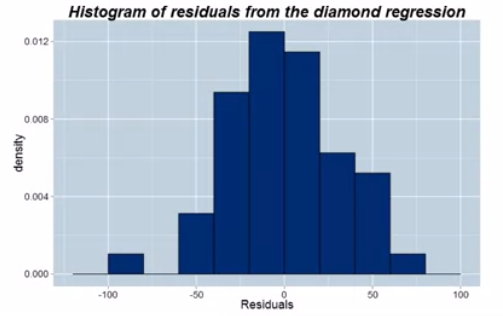
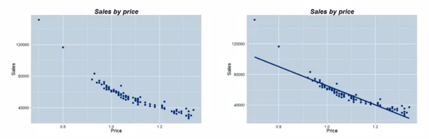
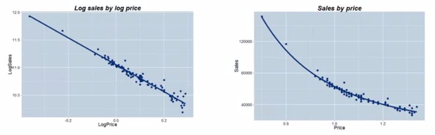
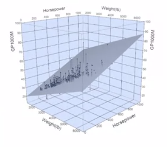
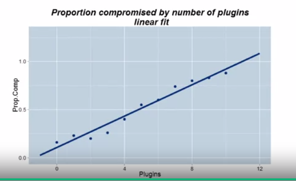
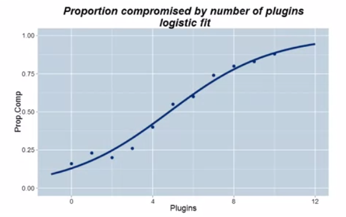

# Week 4

## 4.1 Introduction to Regression Model

### Module 4 content

- What is a regression model?
- Questions that a regression can answer
- Correlation and linear association
- Fitting a line to data
- Interpretation of the regression coefficients
- Prediction intervals in regression
- Multiple regression -- many predictor variables
- Logistic regression -- what to do when the outcome variable is dichotomous

### Regression models

### Example

- Using the diamonds data: the predictor variable is the diamond's weight in carats and the outcome variable is the price of the diamond
- Heavier stones tend to cost more money (positive association) but a regression formalizes this idea into a model that reveals how the expected price varies with weight
- If the relationship is modeled with a straight line we call it a **_linear_** regression: $ E(Y|X) = b_0 + b_1X $

### Correlation

- **_Correlation_** is a measure of the strength of **_linear association_** between two variables
- It is denoted by the letter *r*. Fact: $ -1 \leq r \leq +1 $
- Negative values of the correlation indicate negative association and positive values indicate positive association
- A correlation of 0 means no linear association between the variables
- For the diamonds data, $ r = 0.989 $ which is an extremely strong positive correlation

## 4.2 Use of Regression Models

### Questions that can be answered with a regression

- In a business setting regression is most often used as a **_prediction_** tool. It is a core **_predictive analytics_** methodology
  - What price do you expect to pay for a diamond that weighs 0.3 carats?
  - Give me a **_prediction interval_** in which the price is likely to fall
- Interpreting coefficients from the model
  - How much on average do you expect to pay for diamonds that weigh 0.3 carats v. diamonds that weigh 0.2 carats? (ans. = 372)
- How much of the variability in price is accounted for by the weight of the diamond?

- Prospecting for opportunities (new customers, investments etc.)
- If you found a diamond for sale that weighed 0.25 carats but cost only $500, would you be interested?
- The key idea is that this point is below the regression line
- Maybe it is mispriced and a great opportunity or maybe it is a flawed diamond, but it is certainly worth a look!

### Fitting a model to data using least squares

- Fitting a model requires an optimality criteria
- Most regression models are fit using **_least squares_**
  - Find the line that minimizes the sum of the squares of the vertical distance from the points to the line

### Residuals and fitted values

- Key insight:
  - The regression line decomposes the observed data into two components
    - The fitted values (the predictions)
    - The residuals (the vertical distance from point to line)
- Both are useful:
  - The fitted values are the forecasts
  - The residuals allow us to assess the quality of the fit. If a point has a large residual it is not well fit by the regression. If we can explain why, we have learnt something new

## 4.3 Interpretation of Regression Coefficients

### Interpretation of regression coefficients

- $ E(Y|X) = 182 + 0.22X $
- Equate units on each side
- Intercept is measured in units of Y
- Slope is measured in units of Y/X
- Intercept = Setup time in minutes
- Slope = Work rate in minutes per additional item

## 4.4 R-squared and Root Mean Squared Error (RMSE)

R2 and Root Mean Squared Error (RMSE)

- R2 measures the proportion of variability in Y explained by the regression model. It is the square of the correlation, r

- RMSE measures the **standard deviation** of the residuals (the spread of the points about the fitted regression line)

  | Example         | R2 | RMSE  |
  | --------------- | ------------- | ----- |
  | Diamonds        | 98%           | 31.84 |
  | Fuel economy    | 77%           | 4.23  |
  | Production time | 26%           | 32.11 |

### Using Root Mean Squared Error

- Assumption: at a fixed value of X, the distribution of points about the true regression line follows a Normal distribution, centered on the regression line

- These normal distributions all have the same standard deviation $ \sigma $, which is estimated by RMSE

  

### An approximate 95% prediction interval for a new observation

- Using the Normality assumption and the Empirical Rule, (within the range of the observed data) an approximate 95% prediction interval for a new observation is given by:
  - $ Forecast \pm 2 \times RMSE $
- For the diamonds data the RMSE is approximately 32
- Therefore under the Normality assumption the width of the approximate 95% prediction interval is $ \pm \$64 $
- An approximate 95% PI for the price of a diamond that weighs 0.25 carats is $ -260 + 3721 \times 0.25 \pm 64 = (606,734) $

### Residual diagnostics - checking the Normality assumption

- The histogram of residuals from the diamonds regression is approximately Normally distributed, providing no strong evidence **_against_** the Normality assumption

  

## 4.5 Fitting Curves to Data

- Often relationships are non-linear

- Demand for a pet food (measured in cases sold) against price. A line is a bad fit to the data.

  

### On observing curvature, transform

- This is where the basic math functions discussed in module 1 come in very useful

- Look at the pet food data after having taken the log transform

  

- the right graph was accomplished doing a back-transform to the original scale of the data

### The regression equation for the log-log model

- The regression equation is now:
  - $ E(log(Sales) | Price)) = b_0 + b_1log(Price) $
- In this instance we have:
  - $ E(log(Sales) | Price)) = 11.015 - 2.442log(Price) $
- This process shows how we could actually estimate the demand model that was the subject of the optimization in module 2

## 4.6 Multiple Regression

### Multiple regression

- **_Multiple regression_** models allow for the inclusion of many predictor variables
  - In the fuel economy dataset we might add the horsepower of a car as an additional predictor
  - In the diamonds dataset we might add in the color of the diamond to improve the model
- With two predictors, $ X_1 $ and $ X_2 $ the regression model becomes:
  - $ E(Y|X_1, X_2) = b_0 + b_1X_1 + b_2X_2 $

### Weight and horsepower as predictors of fuel economy

- Fitting a multiple regression model of fuel economy as a function of weight and horsepower gives:

  - $ E(GP1000M|Weight, Horsepower) = 11.68 + 0.0089Weight + 0.0884Horsepower $

- The model is now a plane rather than a line

- For this model $ R^2 = 84\% $ and $ RMSE = 3.45 $, an improvement over the simple regression model with only weight included

  

## 4.7 Logistic Regression

### Logistic regression

- Linear regression is most appropriate when the outcome variable Y is continuous
- In many business problems, the outcome variable is **not** continuous but rather, **_discrete_**
  - Purchase a product: Yes/No
  - Medical outcome: Live/Die
  - Website activity: Sign up/Don't sign up
- These outcomes can be viewed as Bernoulli random variables

- Logistic regression is used to estimate the probability that a Bernoulli random variable is a *success*, as a function of predictor variables
- For example, how does the probability that a website is compromised vary as a function of the number of plugins installed?

### Website compromise study

### Linear fit

- The linear fit does not extrapolate well, predicting proportions greater than 1

  

### Logistic regression fit

- The logistic regression fit is more appropriate, always predicting probabilities between 0 and 1

  

## 4.8 Summary of Regression Models

### Module summary

- What is a regression model?
- Questions that a regression can answer
- Correlation and linear association
- Fitting a line to data
- Interpretation of the regression coefficients
- Prediction intervals in regression
- Multiple regression - many predictor variables
- Logistic regression - what to do when the outcome variable is dichotomous

