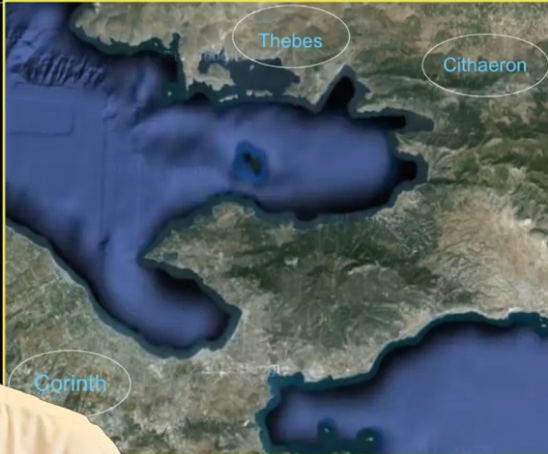

# Week 8

## 8.1: Introduction to Oedipus

- Eurypedes, Sophocles, and Aeschylus make up the three greats of ancient Athens
- Sophocles: Oedipus
- What makes up a Greek identity? Remember from the Odyssey with Odysseus.
  - he has to recover his name, his background, and where he is from
- Sophocles inverts all of this, turns it upside down
- p. 258 of the Odyssey, matches the story of Oedipus
  - son kills the father, mother marries the son, mother commits suicide
  - Oedipus is born from this
  - Homer doesn't go into depth
- Sophocles remakes this in a powerful way
- Oedipus is trying to figure out the identity of the murderer, also causing him to ask himself the same question
- Oedipus ripping out his own eyes and his mothers' suicide happen behind the door

## 8.2: Oedipus and Fate

- lots of riddles
- message is trying to be sent but is being sent in an oblique manner
- life doesn't always reveal its messages clearly
- good with the Sphinx' riddle but not other riddles in his life
- Oedipus turns a blind eye to what is to come, ending up blinding himself horrificly
- Oedipus' dislocation is tragic
- site at Delphi will show up in important ways
- it knows everything that is going to happen to him and is continuous throughout his life
- Oedipus should be humble at Delphi and he is anything but
- important theme: **fate**
- Is he to blame for what he endures or is it fate?
- It seems he does not bear any responsibility.
- He hears from the oracle early on that he will kill his father and marry his mother, and he immediately runs away
- He is intelligent for solving the Sphinx' riddle, and receives wealth, notoriety, and acclaim.
- As he is diligently staying away from what the oracle said would happen, he marries someone who is relatively the same age as his mother, and he kills someone of his father's age.
- He kills him by playing chicken on an ancient Roman highway
- Oedipus gets bonked on the head after the collision, and then murders everyone there. He is a little off.
- He is a very intelligent person. But the question of judgment is slightly different.
- These little suspicions around the people of the older generation...
- He repeatedly conditions his own life and success on the Delphic oracle being wrong, very sacrilegious.

## 8.3: Oedipus and Oracles

- he is a great solver of riddles, let's look at this in more depth
- however, he struggles with the messages coming back from Delphi
- he pays a terrible price for not being able to understand these messages
- Teiresias is Apollo's priest, and Oedipus is wrong for not listening to him
- Teiresias, doesn't want to tell him directly, but eventually gets boxed in and then says to Oedipus, "You are the pollution. You murdered the guy."
- Oedipus starts accusing nasty things upon Teiresias after this.
- Creon asks Oedipus, "Suppose you do not understand..."
  - Oedipus is incapable of confronting when he is either wrong or cannot find what is right.
- Oedipus realizes that he is the own to murder the King at the crossroads. He says here:
  - "A wandering of the soul I could run mad."
  - What the oracle has said is true.
- Oedipus wants the herdsman to confirm the lie that thieves killed the King.
- the herdsman is revealed to be the man who Oedipus was given to by the Corinthian and was raised by him
- the Corinthian herdsman reveals to Oedipus that he was given to him and was adopted
- then, Oedipus realizes he is the murderer of his own father, Lias, and has married his own mother
- he rips out his eyes and his mother commits suicide
- we are all left with limits with our knowledge. Now, Oedipus is forced to live with his limits as he refused to do so in the past.

## 8.4: The Land and Identity

- in teasing out his own identity, Oedipus, yes, has to reckon with his lineage, his background, with Jocasta and with Laius.
- he has to wrestle with these awful conclusions and wind up in a terrible state of awful suffering.
- as part of his story is unfolding, another one is also unfolding. This is what Greek identity is all about.
- you're not just your lineage, but also where you're from.
- Oedipus' story of where he's from is interesting and complex.

Relevant places to Oedipus' story:

- Thebes:
  - a famous place
  - rich complex background
  - also plays out in Euripedes Baccae
- Corinth is much like Thebes
- Cithaeron is a wild, uncivilized place
- the main land that ties Oedipus is not Thebes or Corinth, that he thinks, but Cithaeron
- Cithaeron:
  - has important role in the beginning
  - Creon says to Oedipus "the clue is in the land"
  - Oedipus thinks he might belong there
- Laius cast Oedipus (when he was an infant) "forth upon a pathless hillside" -- Jocasta (720)
- "On Cithaeron's slopes in the twisting thickets you were found" -- Corinthian messenger (1027)
- Oedipus begins to honor Cithaeron as he claims to come from there
- Now, not only is his biological lineage compromised, the connection he has to the land he is from, Cithaeron, is compromised.
  - what land heroes are from is important to their story

## 8.5: Chthonic Identity

- Oedipus' story of Thebes is rooted in a family with close connections to the land.
- Cadmus, the founding family of Thebes.
  - he was on a journey from his ancestral background city of Venice.
  - arrives at Thebes and there's a serpent wrapped around a spring, threatening people who try to get there.
  - Cadmus, who is powerful and strong, slays the serpent and takes his teeth and throws them into the ground.
  - from these teeth sprout up out of the ground itself grand heroes that are armed. 
  - They have this massive battle, fight one another in this archetypal act of fratricide.
  - Five of them survive and they become the founding families of Thebes.
  - This is the story where the Thebans understand themselves to come from.
- **Universal Law 7: A deep connection to the land is a common human expression.**
  - there is an aristocratic aspect, 19th Floridian...
  - the land came to you, a rooted connection to the land
- in the story of the founding families of Thebes, there is a very strong connection to the ground itself
- this is called **Autochthony**: born from the land
  - Autochtonis births are common in ancient myth
  - someone has to pick you up out of the ground, misfiguring your feet or something
    - Achilles' heel
    - Jason, a famous Greek hero, lost a sandal
- We learn from Oedipus' story that his name means "swollen foot"
  - Oedipus = Oideo + pous
  - many reasons this is so:
    - father cuts through is poor infant tendons and binds them together at his ankles, so he has vulnerability there.
- further connection to this autochthonous background that's being hinted at in talking about Oedipus' own lameness of his feet.
- Creon, line 130 -- "The riddling Sphinx induced us to neglect mysterious crimes and rather seek solution of troubles at our feet."
  - Oedipus has trouble with his own feet and needs to figure that one out.
- Teiresias, prophet who has Apollo's own insight, line 417 -- "A deadly footed, double striking curse, from father and mother both, shall drive you forth..."
- Jocasta, line 718 -- "King Laius pierced his ankles by the hands of others cast him forth"
- Oedipus, line 802 -- "going on foot, I was encountered by a herald and a carriage with a man in it"
  - recounting his own version of the event when Laius is killed
  - he is on foot at the time, there is a connection there with Oedipus' rootedness in his foot-based identity
- Messenger, line 1033-35, as he tells Oedipus' own background -- "I loosed you; The tendons of your feet were pierced and fettered... So that from this you're called your present name."
- Each of these point to Oedipus' foot defect, autochnous birth, a pure connection to the land
- the poet shows that his own father trying to kill him through his misfiguring his feet is emblematic of his birth and potential rebirth
  - it could be emblematic in two ways, either:
    - of how his father tried to kill him, through misfiguring his feet
    - own connection to Citharaon, his own rebirth, a special connection, rootedness despite his father's attempts to put him lost on the hillside
- without his father's attempts, he would not have the opportunity for rebirth
- but now, Oedipus is from nowhere
  - he is literally from a trackless hillside
  - singleton born out of the earth
  - has no people
  - no linkage
- the only connection remains is his own autotchonous connection to Chithaeron
  - kind of a sad, pathetic quality to it
  - only connection is to this baron wasteland
- autochtnous birth always has this sense of removing someone from their geneology
  - the fantasy of not having any parents or lineage
  - a certain appeal, escapism from a complex, and rough family background
- his family connections are so bad to Oedipus that he turns his back on them and says his only connection is with Chithaeron
- we are stuck with connections with each other
  - only way Oedipus deals with this is through this form of escapism

## 8.6: Readings of Oedipus

- Oedipus gives us a wonderful opportunity to dip into our toolbox
- functionalist lense: myths are told to legitimize and authorize social norms in the culture that is telling the myths to themselves.
  - First, incest is bad
  - the role of Delphi
    - divine wisdom that comes from oracles should be heeded
    - Oedipus tries to answer the questions himself without consulting for guidance from the oracle
- Freudian lense: all of us are repellant to ourselves, our own primal desires that we repress
  - we have conflicting feelings of our parents
    - sometimes too strong, so we supress them
    - Oedipus (son) has competitiveness with the father and intimacy with mother
  - we live out these desires through Oedipus and eschew him
- Autochthony:
  - connection with Chithaeron
  - he is expressing a very old and stubborn idea about where humans come from
  - the idea that humans might just spring up from the Earth itself
  - it's hard to dismiss because:
    - it gets rid of the problem of wanderingness
    - allows a certain kind of escapism from the complexities that we have with genealogical descent
- structuralist might look at this story as a family that's oscillating between on the one hand, embracing the idea of genetic lineage and background in their family.
- On the other hand, talking about autochthonous birth from the land itself.
- Both are anchored in Oedipus' story.
- Neither are resolved or worked out in the story.
- the tension between the two creates a voltage, how a structuralist would describe the story.

## 8.7: Greek and Dionysian Ritual

