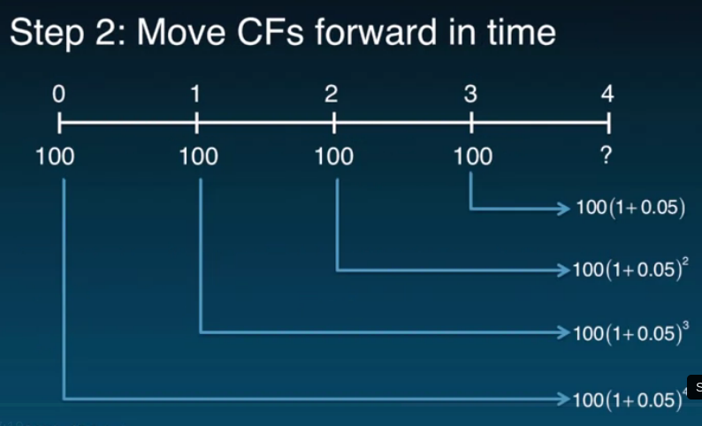
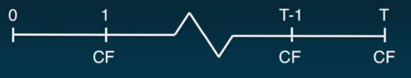
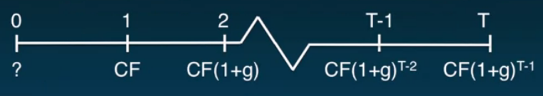
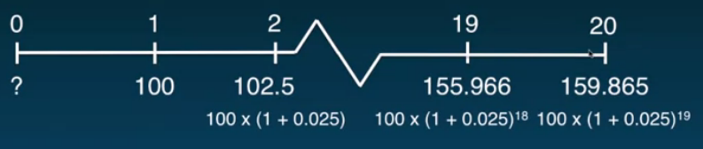
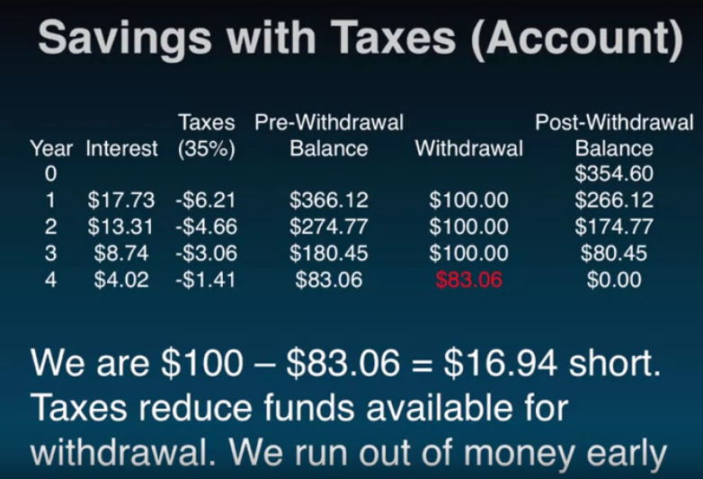
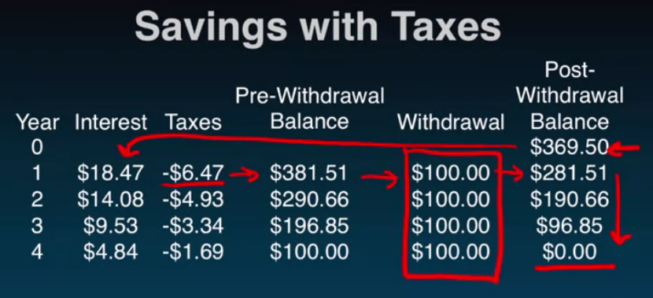

# Week 1: Time Value of Money

Do not aggregate cash flows from different points in time.

### Discount Factor

The **discount factor** is our exchange rate for time:
$$
(1+R)^t
$$
$ t $ = time periods into future $ (t > 0) $ or past $ (t < 0) $ to move cash flows

$ R $ is the **rate of return** offered by investment alternatives in the capital markets of **equivalent risk**.

- aka, discount rate, hurdle rate, opportunity cost of capital

To determine R, consider the risk of the cash flows that you are discounting.

**Riskier investment, higher return.**

### Discounting

**Discounting** cash flows moves them back in time.

- once we date them back to a time, we can add them

$ CF_1 \times (1 + R)^-1 = PV_0(CF_1) $

- $ PV_0(CF_1) $ is the present value of cash flow at time $ 1 $

### Example - Savings

How much do we need today to extract 100 dollars each year for the next 4 years when accruing at 5% per year?

$ P_0 $ = ?

$ P_1 = \frac{100}{1+0.05} = 95.238 $

 $ P_2 = \frac{100}{(1+0.05)^2} = 90.703 $

$ P_3 = \frac{100}{(1+0.05)^3} = 86.384 $

$ P_4 = \frac{100}{(1+0.05)^4} = 82.270 $

$ P_0 = \sum^{4}_{i=1}P_i = 95.238 + 90.703 + 86.384 + 82.270 = \$354.60 $

**Interpretation 1**: We need \$354.60 today in an account earning 5% each year so that we can withdraw $100 at the end of each of the next four years.

**Interpretation 2**: The **present value** of $100 received at the end of the next four years is \$354.60 when the discount rate is 5%.

**Interpretation 3**: Today's **price** for a contract that pays \$100 at the end of the next four years is \$354.60 when the discount rate is 5%.

We are assuming the discount rate, $ R $, is constant over time.

### Lessons

- Never add/subtract cash flows from different time periods
- Money has a time unit
- Use (i.e., multiply by) **discount factor** to change cash flows' time units: $ (1+R)^t $
- Use a **time line** to help formulate problems
- **Present value** as of time $ s $, of a cash flow at time $ t > s $ is denoted, $ PV_s(CF_t) $
  - Tells us the **value** future cash flows
  - Tells us the **price** of a claim to those cash flows

## Time Value of Money: Compounding

- moving value of money forward

**Compounding** CFs moves them forward in time.

$ CF_3(1 + R)^1 = FV_4(CF_3) $

- **future value as of period cash flow 3**

### Example 1 - Savings

How much money will I have after three years if I invest \$1,000 in a savings account paying 3.5% interest per annum?

$ FV_3 = 1,000(1 + 0.035)^3 = \$1,108.7179 $

This is the future value of the \$1,000.

### Example 2 - Savings

How much money will we have four years from today if we save \$100 a year, beginning today, for the next three years, assuming we earn 5% per annum?

$ FV_1 = 100(1 + 0.05)^1 $

**Interpretation 1**: We will have \$452.56 at the end of four years if we save \$100 starting today for the next three years and our money earns 5% per annum.

**Interpretation 2**: The future value four years from today of saving \$100 starting today for the next three years at 5% per annum is \$452.56.

### More Generally

Can add CFs at any point in time if same units.

### Problem Set 2

5. $$
   \begin{equation}
   \begin{split}
    FV_{34}(CF_{0}) & = CF_{0}(1+R)^{34} \\
    \frac{FV_{34}(CF_{0})}{CF_0} & = (1+R)^{34} \\
    \sqrt[34][\frac{FV_{34}(CF_{0})}{CF_0}] & = 1 + R \\
    \sqrt[34][\frac{FV_{34}(CF_{0})}{CF_0}] - 1 & = R \\
    \sqrt[34][\frac{1,000,000}{5,000}] - 1 & = R \\
    1.1686 - 1 & = R \\
    R & = 0.1686
   \end{split}
   \end{equation}
   $$

## Useful Shortcuts

### Annuity

An **annuity** is a **finite** stream of cash flows of **identical magnitude** and <u>**equal spacing in time**</u>.

E.g., Savings vehicle, home mortgage, auto lease, bond payments
$$
\begin{equation}
\begin{split}
PV\ of\ Annuity & = \frac{CF}{R}(1-(1+R)^{-T}) \\
& = CF \times \frac{1-(1+R)^{-T}}{R}
\end{split}
\end{equation}
$$
Where the **annuity factor** $ = \frac{1-(1+R)^{-T}}{R} $

\*The first cash flow arrives one period from today.

### Example 1 - Savings

How much do you have to save today to withdraw \$100 at the end of each of the next 20 years if you can earn 5% per annum?
$$
\begin{equation}
\begin{split}
PV\ of\ Annuity & = \frac{100}{0.05}(1-(1+0.05)^{-20}) \\
& = 1,246.22
\end{split}
\end{equation}
$$
I would have to save \$1,246.22 today to withdraw \$100 at the end of each year for the next 20 years.

### Growing Annuity

A **growing annuity** is a **finite** stream of cash flows that <u>**grow at a constant rate**</u> $ (g) $ and that are **evenly spaced through time**.

E.g., Income streams, savings strategies, project revenue/expense streams
$$
\begin{equation}
\begin{split}
PV\ of\ Growing\ Annuity & = \frac{CF}{R-g}\Bigg(1-\bigg(\frac{1+R}{1+g}\bigg)^{-T}\Bigg) \\
\end{split}
\end{equation}
$$
\*The first cash flow arrives one period from today.

### Example 2 - Savings

How much do you have to save today to withdraw \$100 at the end of this year, \$102.50 next year, \$105.06 the year after, and so on for the next 19 years if you can earn 5% per annum?

$$
\begin{equation}
\begin{split}
PV\ of\ Growing\ Annuity & = \frac{100}{0.05-0.025}\Bigg(1-\bigg(\frac{1+0.05}{1+0.025}\bigg)^{-20}\Bigg) \\
& = 1,529.69
\end{split}
\end{equation}
$$

### Perpetuity

A **perpetuity** is an **infinite** stream of cash flows of **identical magnitude** and **equal spacing in time**.

E.g., Perpetuities, consol bonds
$$
PV\ of\ Perpetuity = \frac{CF}{R}
$$

### Example 3 - Savings

How much do you have to save today to withdraw \$100 at the end of each year forever if you can earn 5% per annum?
$$
\begin{equation}
\begin{split}
PV\ of\ Perpetuity & = \frac{CF}{R} \\
& = \frac{100}{0.05} \\
& = 2,000
\end{split}
\end{equation}
$$
Near infinity, it is so small that it is practically zero.

### Growing Perpetuity

A **growing perpetuity** is an **infinite** stream of cash flows that **grow at a constant rate** and that are **evenly spaced through time.**

E.g., Dividend streams
$$
PV\ of\ Growing\ Perpetuity = \frac{CF}{R-g}
$$
\*The first cash flow arrives one period from today.

### Example 4 - Savings

How much do you have to save today to withdraw \$100 at the end of this year, \$102.50 next year, \$105.06 the year after, and so on forever if you can earn 5% per annum?
$$
\begin{equation}
\begin{split}
PV\ of\ Growing\ Perpetuity & = \frac{CF}{R-g} \\
& = \frac{100}{0.05-0.025} \\
& = 4,000
\end{split}
\end{equation}
$$

### Lessons

- An **annuity** is a **finite** stream of cash flows of **identical magnitude** and <u>**equal spacing in time**</u>.
  $$
  \begin{equation}\begin{split}PV\ of\ Annuity & = \frac{CF}{R}(1-(1+R)^{-T}) \\& = CF \times \frac{1-(1+R)^{-T}}{R}\end{split}\end{equation}
  $$
  Where the **annuity factor** $ = \frac{1-(1+R)^{-T}}{R} $

  \*The first cash flow arrives one period from today.

- A **perpetuity** is an **infinite** stream of cash flows of **identical magnitude** and **equal spacing in time**.

  E.g., Perpetuities, consol bonds
  $$
  PV\ of\ Perpetuity = \frac{CF}{R}
  $$

- 

### Caution

- Annuity and perpetuity formulas assume first cash flow occurs one period from today
- Growth rate, $ g $, must be less than the discount rate, $ R $, for $ PV $ formulas to make sense
- Understand excel functions assumptions

## Taxes

**Lesson**: Taxes reduce the return on our investment, $ R $

One way to account for that:

### After-tax Discount Rate

**After-tax Discount Rate** = $ R_t = R \times (1 - t) $

- for our example:

  $ 5\% \times (1 - 35\%) = 3.25\% $

Plug in $ R_t $ for $ R $ in the present-value cash flow equation.

**Implication**: We need to save more to (\$369.50 > \$354.69) to withdraw \$100 each year *after taxes*.

**Note**: \$369.50 - \$354.60 = \$14.90 which also equals the present value of the taxes at 5%.

### Lessons

- Taxes reduce our dollar return

- The **after-tax return**, $ R_t $, on an investment is:
  $$
  R_t = R \times (1 - t)
  $$
  where $ R $ is the **nominal return** and $ t $ is the **tax rate**.