# Week 2: Interest Rates

## Time Value of Money: Inflation

### Inflation

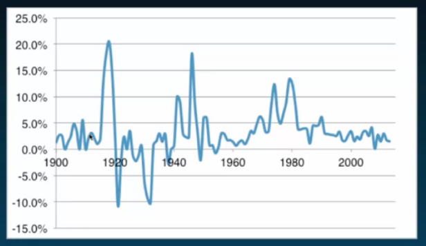

#### How does inflation impact our returns?

**Lesson**: Inflation won't affect the money we earn.

- it does, however, affect the value being withdrawn

### Real Discount Rate

$$
1+RR = \frac{(1+R)}{(1+\pi)}
$$

$ RR $ is the real discount rate

$ R $ is the nominal discount rate

$ \pi $ is expected inflation

- Commonly used approximation:
  $$
  RR = R - \pi
  $$

- For our example:
  $$
  RR = \frac{(1+0.05)}{1+0.025} - 1 = 2.44\%
  $$

### Savings with Inflation

- Difference:
  - taxes affect \$
  - Inflation affects consumption, not \$
    - Earn nominal return but can't buy as much

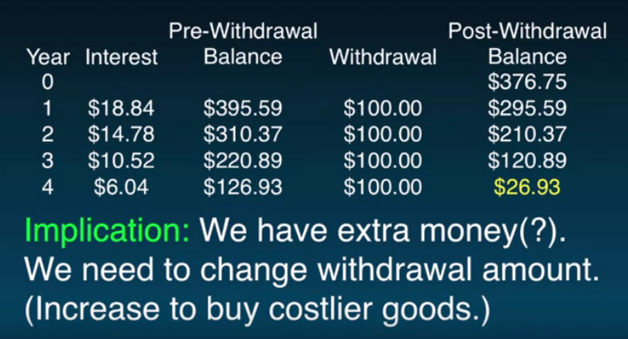

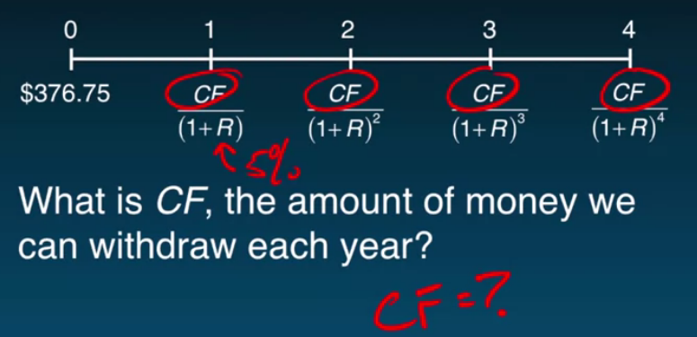
$$
\begin{equation}
\begin{split}
\$376.75 &= \frac{CF}{(1+0.05)} + \frac{CF}{(1+0.05)^2} + \frac{CF}{(1+0.05)^3} + \frac{CF}{(1+0.05)^4} \\
CF &= \$376.75 \Bigg( \frac{1}{(1+0.05)} + \frac{1}{(1+0.05)^2} + \frac{1}{(1+0.05)^3} + \frac{1}{(1+0.05)^4} \Bigg)^{-1} \\
&= \$106.25
\end{split}
\end{equation}
$$

- note that it is greater than the \$100 we initially wanted to withdraw

So then we have:

| Year | Interest | Pre-Withdrawal Balance | Withdrawal | Post-Withdrawal Balance |
| ---- | -------- | ---------------------- | ---------- | ----------------------- |
| 0    |          |                        |            | \$376.75                |
| 1    | \$18.84  | \$395.59               | \$106.25   | \$289.34                |
| 2    | \$14.47  | \$303.81               | \$106.25   | \$197.56                |
| 3    | \$9.88   | \$207.44               | \$106.25   | \$101.19                |
| 4    | \$5.06   | \$106.25               | \$106.25   | \$0.00                  |

- **ideally withdrawals grow each year to accommodate inflation**

If inflation rate is 2.5%:

| Year | Withdrawal                              |
| ---- | --------------------------------------- |
| 0    |                                         |
| 1    | $ 100 \times (1 + 0.025)^1 = \$102.50 $ |
| 2    | $ 100 \times (1 + 0.025)^2 = \$105.06 $ |
| 3    | $ 100 \times (1 + 0.025)^3 = \$107.69 $ |
| 4    | $ 100 \times (1 + 0.025)^4 = \$110.38 $ |

- this sequence of withdrawals maintains purchasing power of \$100 in today's terms
  - these are "nominal" values corresponding to the real \$100 purchasing power in year 0.
- PV at 5% discount rate = \$376.75
  - we discount nominal cash flows by the nominal rate to get the price
- **Note**: PV of nominal CFs at nominal discount rate = PV of real cash flows at real rate

**Intuition**: The inflation term in the numerator and denominator cancel.

So then:

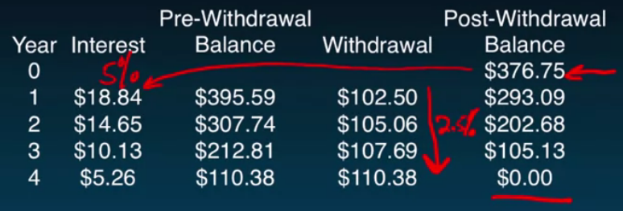

## Interest Rates: APR and EAR

Last Time

Time Value of Money

- Intuition, tools and discounting
- Compounding
- Useful shortcuts
- Taxes
- Inflation

This Time

Interest Rates

- Interest rate quotes
- Non-annual cash flows and compounding

### Current 5-Year Jumbo CD Rates

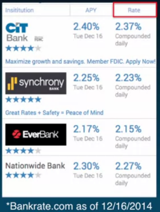

$ APR = 2.37\% $

$ k = 365 (or\ 360,\ 252) $

$ i = 2.37\% / 365 = 0.006714\% $

$ EAR = (1 + i)^k = (1 + 0.006714)^{365} - 1 = 2.398\% $

Rate = **APR** or **Annual Percentage Rate**

**Simple interest** = interest earned *without* compounding

**APR** not typically what we earn or pay

APY = **EAR** or **Effective Annual Rate**

- what we care about

**EAR** measures actual amount of interest earned/paid in year

**Lesson**: APR is *not* a discount rate.

APR is a means to an end. We use it to get a discount rate (e.g., EAR)

**EAR = discount rate**

**APR = quote**

**Lesson**: The relation between APR and EAR is:
$$
\begin{equation}
\begin{split}
EAR &= \Bigg(1 + \frac{APR}{k}\Bigg)^k - 1 \\
&= (1+i)^k - 1
\end{split}
\end{equation}
$$
$ i $ is the **periodic interest rate**, or **periodic discount rate**

- $ i = \frac{APR}{k} $

where $ k $ is the number of compounding periods per year

monthly: $ k = 12 $

semi-annual: $ k = 2 $

### Example

Invest \$100 in CD offering 5% APR with semi-annual compounding. How much money will you have in one year?

**First method**:

$ i = \frac{APR}{k} = \frac{5\%}{2} = 2.5\% $

$ FV_2(100) = 100 \times (1 + 0.025)^2 = 105.0625 $

**Second method, from perspective of years**:

$ EAR = (1 + i)^k - 1 = (1 + 0.025)^2 - 1 = 5.0625\% $

$ FV_1(100) = 100 \times (1 + 0.050625)^1 = 105.0625 $

**Lesson**: If you discount cash flows using EAR, then measure time in years. If you discount cash flows using periodic interest rate, then measure time in periods.

### Proof

$$
\begin{equation}
\begin{split}
(1 + EAR)^T &= \Bigg(1 + (1 + i)^k - 1 \Bigg)^T \\
&= \Bigg((1 + i)^k \Bigg)^T \\
&= (1 + i)^{kT} \\
&= (1 + i)^N
\end{split}
\end{equation}
$$

where $ N = kT = \#\ of\ periods $

### Periods vs Years

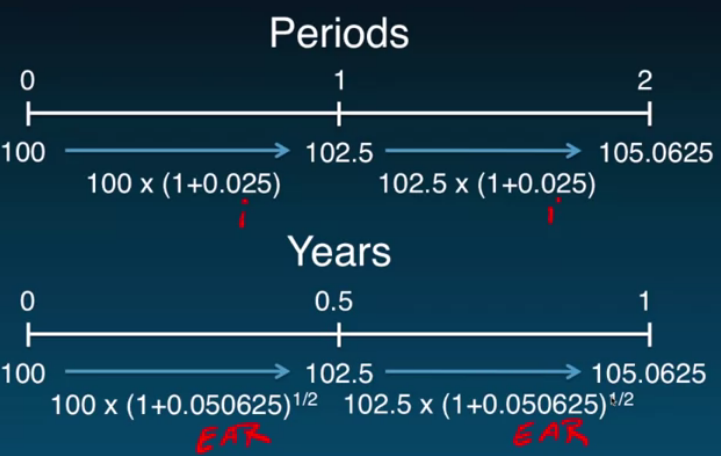

### Lessons

- **EAR** is a discount rate

  - Measures cash flows in years

- **Period interest rate, *i***, is a discount rate

  - Measures cash flows in periods

- **APR** is not a discount rate

- Moving between **EAR** and **APR**

  - $$
    \begin{equation}
    \begin{split}
    EAR &= \Bigg(1 + \frac{APR}{k}\Bigg)^k - 1 \\
    &= (1+i)^k - 1
    \end{split}
    \end{equation}
    $$

    where $ i = APR / k $ and $ k = \#\ of\ periods\ per\ year $

### Coming up next

- Interest Rates
  - Term Structure of interest rates and the yield curve

### Problem Set 1

1. $ 0.003225 $
2. $ 0.0394 $
3. $ 1879.80 $
   1. $ CF = \frac{PV \times \frac{APR}{k}}{1 - (1 + \frac{APR}{k})^{-T \times k}} $
4. $ EAR = 0.0506 $, $ 1103.81 $

## Interest Rates: Term Structure

Last Time

Interest Rates

- Interest rate quotes
- Non-annual cash flows and compounding

This Time

Interest Rates

- Term Structure
- Yield Curve

Thus far we have assumed discount rates are constant through time:

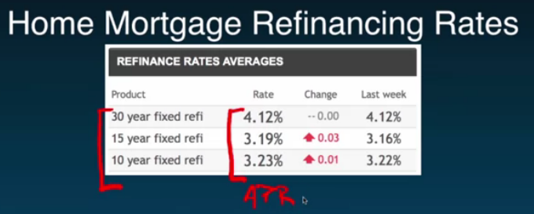

The **Term Structure** is the relation between the **investment term** and the **interest rate**.

The **Yield Curve** is a graph of relation between the **investment term** and the **interest rate**.

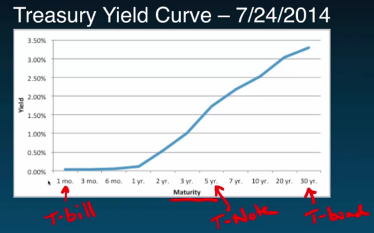

What is a yield?

- A yield, $ y $, is the one discount rate that when applied to the promised cash flows of the security recover the price of the security.
- $ Price = \frac{CF_1}{(1+y)} + \frac{CF_2}{(1+y)^2} + \frac{CF_3}{(1+y)^3} + ... + \frac{CF_T}{(1+y)^T} $

To build the yield curve simply compute the yield for securities of different maturities...

**Treasury Yield Curves** graph the relation between interest rates on **risk-free loans** and loan maturity.

Other yield curves graph the relation between interest rates on **risky loans** and loan maturity.

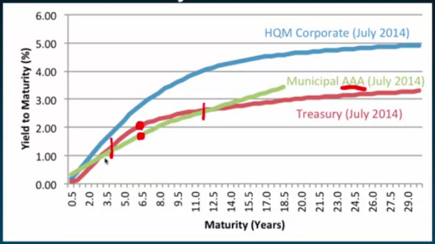

- **HQM Corporate debt**: investment grade debt (triple B or better)

**Lesson**: Yields vary by **maturity** and **risk**

All of these interest rates are referred to as **spot rates**.

The **spot rate** is the interest rate for a loan made today.

- Typically a different spot rate for loans of different maturities and risk

Punch line:

This is an approximation:
$$
PV = \frac{CF_1}{(1 + R)} + \frac{CF_2}{(1 + R)^2} + \frac{CF_3}{(1 + R)^3}
$$
for
$$
PV = \frac{CF_1}{(1 + R_1)} + \frac{CF_2}{(1 + R_2)^2} + \frac{CF_3}{(1 + R_3)^3}
$$

### Coming up next

- Discounted Cash Flow (DCF)
  - Time value of money in a corporate setting
  - Figure out how to derive (free) cash flows
  - Capital budgeting is illustrative vehicle

## Discounted Cash Flow: Decision Making

Last Time

Interest Rates

- APR
- EAR
- Non-annual and cash flows compounding
- Term Structure

This Time

Discounted Cash Flow (DCF)

- Decision Making

Q: How should we make financial decisions?

A: Undertake those actions that create value.

Q: Which actions create value?

A: Those in which the benefits exceed the costs...

Q: What if costs and benefits arrive at different times?

A: Compare $ PV(Benefits)\ to\ PV(Costs) $

A: The discount rate, $ R $, adjusts for timing *and* risk of cash flows.

**Lesson**: The **NPV (New Present Value) Decision Rule** says accept all projects with a positive NPV and reject all projects with a negative NPV:
$$
\begin{equation}
\begin{split}
NPV &= PV(Benefits) - PV(Costs) \\
&= FCF_0 + \frac{FCF_1}{(1 + R)} + \frac{FCF_2}{(1 + R)^2} + ... + \frac{FCF_T}{(1 + R)^T}
\end{split}
\end{equation}
$$
$ FCF $ means $ Free\ Cash\ Flow $

$ NPV > 0 \Rightarrow Accept $
$ NPV < 0 \Rightarrow Reject $

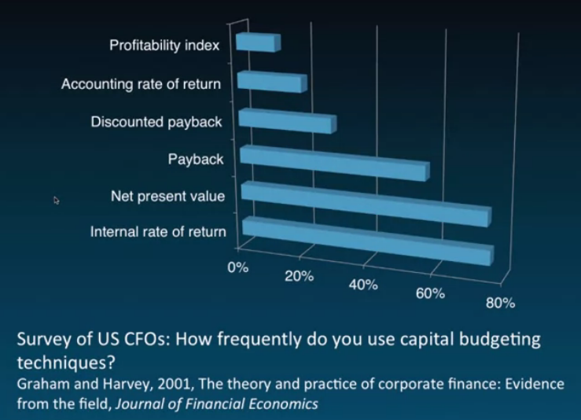

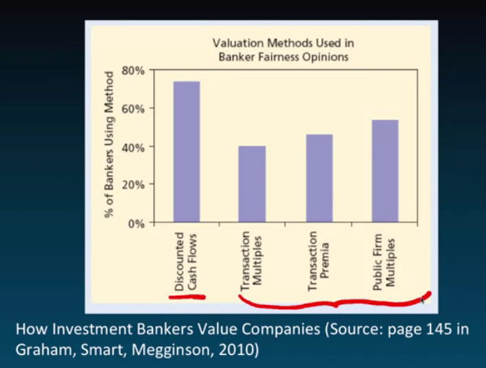

### Lessons

- **NPV** is a decision rule that quantifies the value implications of decisions
  - Optimal rule
- Other rules still informative
  - Understand their weaknesses

### Coming up next

- Discounted Cash Flow
  - How to compute

Dollar Cost Averaging:
$$
FV = P \times (1 + R)^n + n \times P
$$
