# Week 3: Discounted Cash Flow Analysis

## Discounted Cash Flow: Free Cash Flow

Last Time

Discounted Cash Flow (DCF)

- **his opinion (academics) says this is the best rule**

- Decision making
  - NPV rule
  - IRR
  - Payback
- Practical approach

This Time

Discounted Cash Flow (DCF)

- Free Cash Flow (the bedrock foundation of DCF)

**Recall: Two components to NPV**

1. Free Cash Flows
2. Discount Rate

$$
\begin{equation}
\begin{split}
NPV &= PV(Benefits) - PV(Costs) \\
&= FCF_0 + \frac{FCF_1}{(1 + R)} + \frac{FCF_2}{(1 + R)^2} + ... + \frac{FCF_T}{(1 + R)^T}
\end{split}
\end{equation}
$$

$ FCF = (Revenue - Costs - Depreciation) \times (1 - t_c) $

- This has many names:
  - **Unlevered Net Income**
  - **Net Operating Profit After Taxes (NOPAT)**
  - **Earnings Before Interest After Taxes (EBIAT)**
- where $ t_c $ is marginal tax rate
- or Amortization instead of Depreciation or both

We add back in $ Depreciation $:
$$
FCF = (Revenue - Costs - Depreciation) \times (1 - t_c)  + Depreciation \\ - Capital\ Expenditures - Change\ in\ Net\ Working\ Capital
$$
$ Net\ Working\ Capital\ (NWC) = Current\ assets - current\ liabilities $

$ Current\ assets = Cash + Accounts\ Receivable\ (A/R) + Inventory $

**Lesson**: **FCF** is the **residual cash flow** left over after **all** of the project's requirements have been satisfied and implications accounted for.

**Lesson**: **FCF** is the **cash flow** that can be distributed to the financial claimants (e.g., debt and equity) of the project or company.

**Lesson**: **FCF** is **not** the same as accounting cash flow from the **statement of cash flows (SCF)** but we can derive FCF from the SCF.

**Lesson**: **FCF** is more precisely **unlevered free cash flow** to distinguish it from **free cash flow to equity (FCFE)** or **levered free cash flow**.
$$
FCF = (Revenue - Costs - Depreciation) \times (1 - t_c)  + Depreciation \\ - Capital\ Expenditures - Change\ in\ Net\ Working\ Capital \\
- Interest \times (1 - t_c) + Net\ Borrowing
$$
or also written:
$$
FCFE = FCF - Interest \times (1 - t_c) + Net\ Borrowing
$$
**Lesson**: **FCFE** (Free Cash Flow to Equity) is residual cash flow left over after **all** of the project's requirements have been satisfied, implications accounted for, *and* all debt financing has been satisfied.

**Lesson**: **FCFE** is the **cash flow** that can be distributed to the shareholders (i.e., equity) of the project or company.

**Lesson**: **FCFE** is more precisely **levered free cash flow** because it is affected by the choice of leverage (i.e., debt).

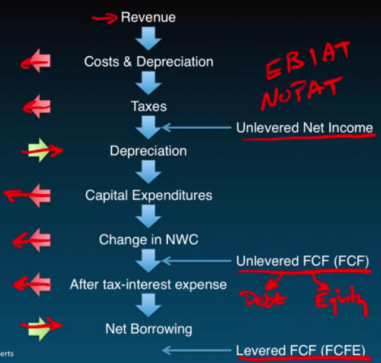

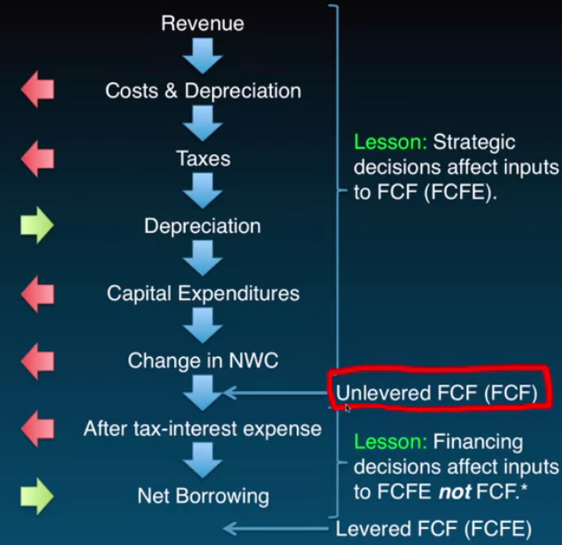

### Lessons

- **NPV** is a decision rule that quantifies the value implications of decisions
  - Positive NPV implies value increasing
  - Negative NPV implies value decreasing

### Coming up next

- Discounted Cash Flow (DCF)
  - Forecast Drivers

## Discounted Cash Flow: Forecast Drivers

Last Time

Discounted Cash Flow (DCF)

- Free Cash Flow

This Time

Discounted Cash Flow (DCF)

- Forecast Drivers

Back in 2008, should we enter the tablet market? Should we produce and sell this tablet?

- to make that decision, we do a DCF

$$
FCF = (Revenue - Costs - Depreciation) \times (1 - t_c)  + Depreciation \\ - Capital\ Expenditures - Change\ in\ Net\ Working\ Capital
$$

$ Revenue = Market\ Size \times Market\ Share \times Price $

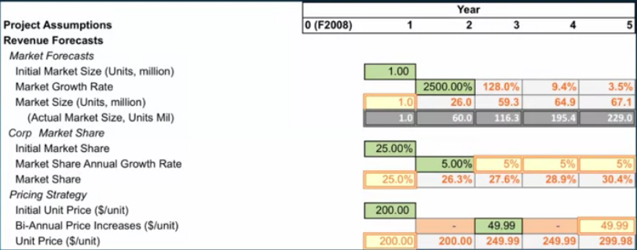

- get this data from your market strategists
- these are just assumptions

$ Costs = Cost\ Margin \times Revenue $

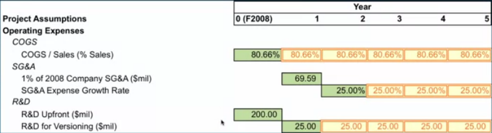

- *COGS*: Cost of Goods Sold

$ Capital\ Expenditures\ \&\ Depreciation $

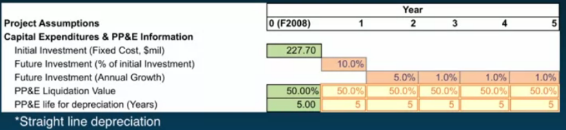

- $ PP\&E\ Liquidation\ Value $: $ Plant,\ Property\ \&\ Equipment\ Liquidation\ Value $
  - for us, we are doing $ 50\% $ or 50 cents on the dollar

- $ PP\&E\ life\ for\ depreciation\ (Years) $
  - we assume all capital depreciates linearly for 5 years, its economic life is 5 years
  - each year, 1/5 of the capital disappears
    - **this is important as a tax shield**

$ Net\ Working\ Capital = Cash + Inventory + AR - AP $

- where $ AR = Accounts\ Receivable $ (how long it takes to receive payment from sale)

  $ AP = Accounts\ Payable $ (how long it takes to pay suppliers)

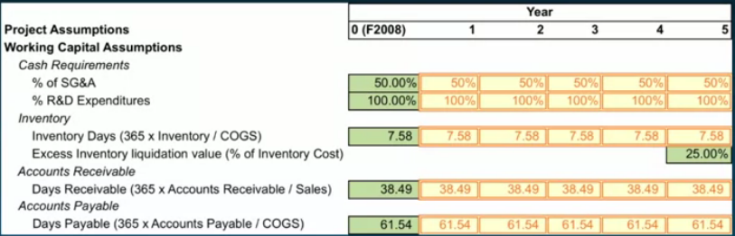

We want the change in Net Working Capital:

$ \Delta\ Net\ Working\ Capital = Net\ Working\ Capital\ (t) - Net\ Working\ Capital\ (t - 1) $

where $ \Delta $ = change over one period

$ Taxes $

We want the marginal tax rate (MTR) = Tax rate on additional \$ of earnings 25.5%.

People will typically establish a corporate tax rate of 35%.

**Lesson**: Point of DCF is to focus discussion and analysis on relevant issues.

**Lesson**: Successful valuation (i.e., decision making) depends critically on input from non-finance personnel.

### Lessons

- **Forecast Drivers** are the assumptions used to populate our free cash flow forecasts
- Goal is to establish framework for discussion
  - Think about value drivers

### Coming up next

- Discounted Cash Flow (DCF)
  - Forecasting free cash flow

## Discounted Cash Flow: Forecasting Free Cash Flows

Last Time

Discounted Cash Flow (DCF)

- Forecast Drivers

This Time

Discounted Cash Flow (DCF)

- Forecasting free cash flows

$$
FCF = (Revenue - Costs - Depreciation) \times (1 - t_c)  + Depreciation \\ - Capital\ Expenditures - Change\ in\ Net\ Working\ Capital
$$
Goal today: Translate forecast drivers into \$ forecasts

$ Revenue $

$ Revenue\ 1 = 1.0 \times 0.25 \times 200 = 50 $

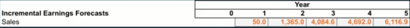

$ Costs $

$ COGS = \frac{COGS}{Sales} \times Sales $

Year 1: $ 0.8066 \times 50.0 = 40.33 $

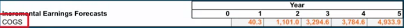

$ SG\&A $

Year 1: 
$$
\begin{equation}
\begin{split}
SG\&A &= 1\%\ of\ '08\ SG&A \\
&= 0.01 \times \$6,959 = \$69.6
\end{split}
\end{equation}
$$
Year 2-5:
$$
\begin{equation}
\begin{split}
SG\&A &= 25\%\ Annual\ Growth\ Rate \\
&= \$69.59 \times (1 + 0.25) = \$87.0
\end{split}
\end{equation}
$$
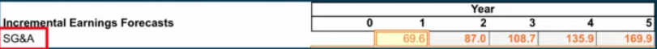

$ R\&D $

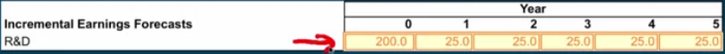

$ Revenue - Costs $

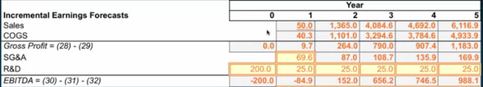

- EBITDA: Earnings Before Interest, Taxes, Depreciation, and Amortization

$ Capital\ Expenditures $

Year 0: Initial investment = $227.7 $

Year 1: 10% of initial investment = $ 0.10 \times \$227.7 = \$22.77 $

Year 2: 5% annual growth = $ \$22.77 \times (1 + 0.05) = \$23.9 $

Year 3-5: 1% annual growth = $ \$23.9 \times (1 + 0.01) = \$24.1 $

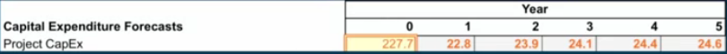

Straight line depreciation over 5 years

$ Depreciation $

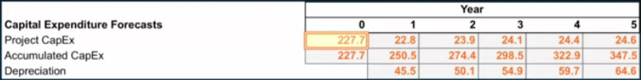

Year 1: $ \$227.7 / 5 = \$45.5 $

Year 2: $ \$250.5 / 5 = \$50.1 $

What happens to all of that physical capital (\$347.5)?

- we can re-invest

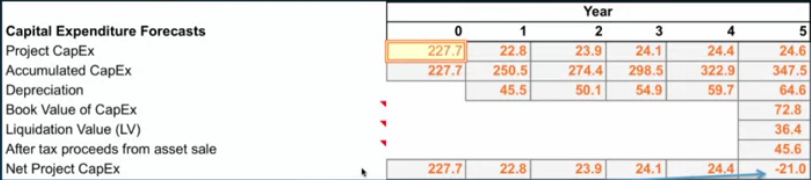

- Book Value = Accumulate CapEx - Sum of Depreciation
- -21.0 reflects an inflow of capital

$ Net\ Working\ Capital $

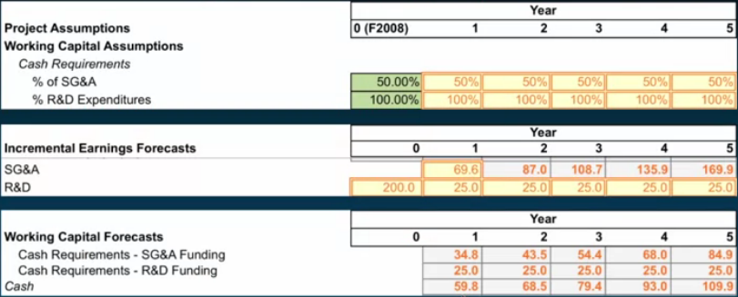

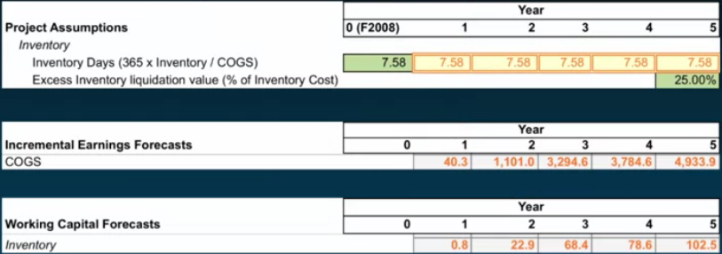

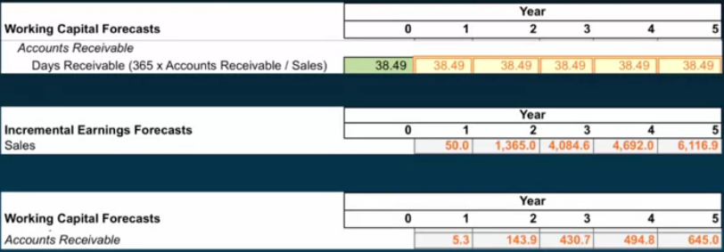

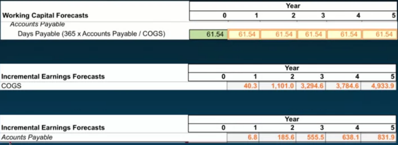

$ Net\ Working\ Capital = Cash + Inventory + AR - AP $

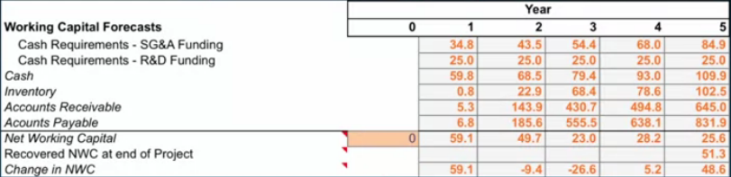

- Change in NWC = $ \Delta NWC = NWC(t) - NWC(t-1) $

We have all the pieces. Organize into a useful (and familiar) format.

### (Quasi-) Income Statement

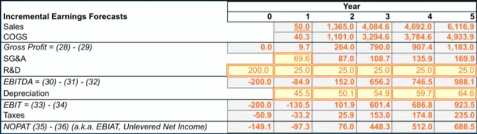

- this is quasi because interest is not included, that is financing
- $ NOPAT = (Revenue - Costs - Depreciation) \times (1 - t_c) $

Then:

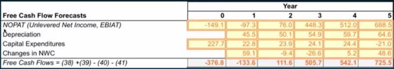

### Other Free Cash Flow Considerations

- Opportunity Costs (Alternative uses of resources)
- Project Externalities (Cannibalization, spillovers)

- Sunk Costs (Ignore)

- Other non-cash items (E.g., amortization (generates tax shield))
- Salvage values (Assets do not disappear)
- Execution Risk (Idiosyncratic)

- Cash flow frequency (Project dependent)

