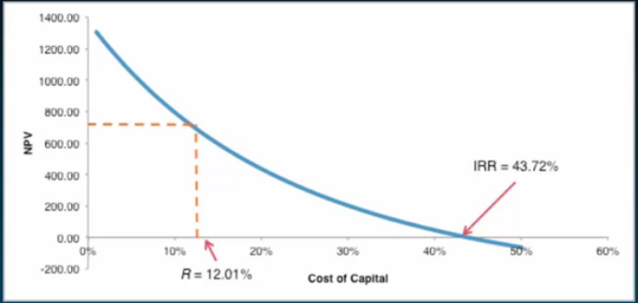

# Week 4: Discounted Cash Flow Analysis and ROI

## Discounted Cash Flow (DCF): Decision Criteria

Last Time

Discounted Cash Flow (DCF)

- Forecasting free cash flows

This Time

Discounted Cash Flow (DCF)

- Decision Criteria

What do we do with our cash flows from last time?

1. Compute the NPV (assume discount rate of 12%)
   $$
   \begin{equation}
   \begin{split}
   NPV &= \frac{-\$376.8}{(1+0.12)^0} + \frac{-\$133.6}{(1+0.12)^1} + \frac{\$111.6}{(1+0.12)^2} + \frac{\$505.7}{(1+0.12)^3} + \frac{\$542.1}{(1+0.12)^4} + \frac{\$725.5}{(1+0.12)^5} \\
   &= \$708.42
   \end{split}
   \end{equation}
   $$
   This means that Firm value (i.e., debt plus equity) increases by \$708.42 million, in expectation, if the project is undertaken $ \Rightarrow $ undertake the project.

**Lesson**: The **NPV Rule** says accept all projects with positive NPV, reject all projects with negative NPV.

2. Compute internal rate of return

   The **internal rate of return (IRR)** of a project is the one discount rate such that the net present value of the project's free cash flows equals zero.

   - yields
   - $ NPV = P - PV(CF's) $

   $$
   \begin{equation}
   \begin{split}
   NPV &= \frac{-\$376.8}{(1+IRR)^0} + \frac{-\$133.6}{(1+IRR)^1} + \frac{\$111.6}{(1+IRR)^2} + \frac{\$505.7}{(1+IRR)^3} + \frac{\$542.1}{(1+IRR)^4} + \frac{\$725.5}{(1+IRR)^5} \\
   IRR &= 43.7\%
   \end{split}
   \end{equation}
   $$

   - typically need to solve using Excel, or trial and error.

   The promised return on investing in the project is 43.7% > 12% (**hurdle rate**) $ \Rightarrow $ undertake the project

**Lesson**: The **IRR Rule** says accept all projects whose IRR > R (hurdle rate, cost of capital rate, a particularly noisy estimate), reject all projects whose IRR < R.

- this has several shortcomings that we explore in Topic 4 (Return on Investment)

### NPV vs. IRR

3. Compute payback period

   The **payback period**, $ pp $, of a project is the duration until the cumulative free cash flows turn positive.

**Lesson**: The **Payback Period Rule** says accept all projects with $ pp < pp* $ and reject all projects with $ pp > pp* $.

- several shortcomings:
  - Ignores time value of money and risk of cash flows
    - Remedy is to compute the discounted payback period:
      - The **discounted payback period**, $ dpp $, of a project is the duration until the cumulative **discounted** free cash flows turn positive.
  - does not tell us value implications of our decisions
  - Does not help in choosing among projects with similar payback periods

### Lessons

- Several decision criteria
  - NPV unambiguously the best but
  - Others are informative. Understand their shortcomings and use judiciously

### Coming up next

- Discounted Cash Flow (DCF)
  - Sensitivity Analysis

## Sensitivity Analysis

### Break Even Analysis

**Break Even Analysis** finds the parameter value that sets the NPV of the project equal to zero holding fixed all other parameters.

**Lesson: Break Even Analysis** is a **partial equilibrium** analyses that assume parameters are independent of one another.

### Comparative Statics

**Comparative statics** quantifies the sensitivity of the valuation to variation in a parameter holding fixed all other parameters.

How does valuation change parameter variation from worst to best case?

