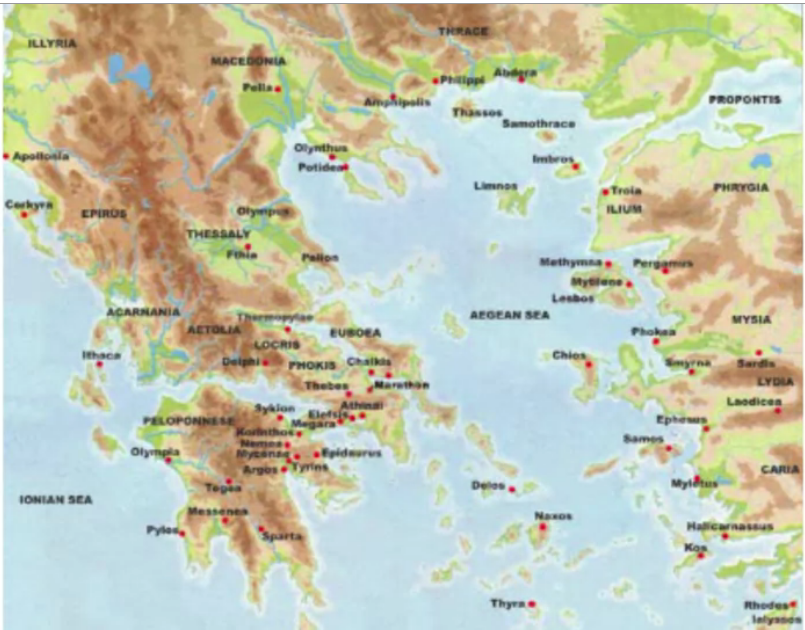
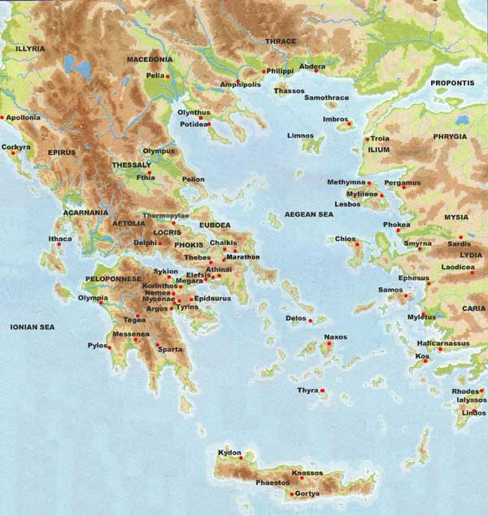
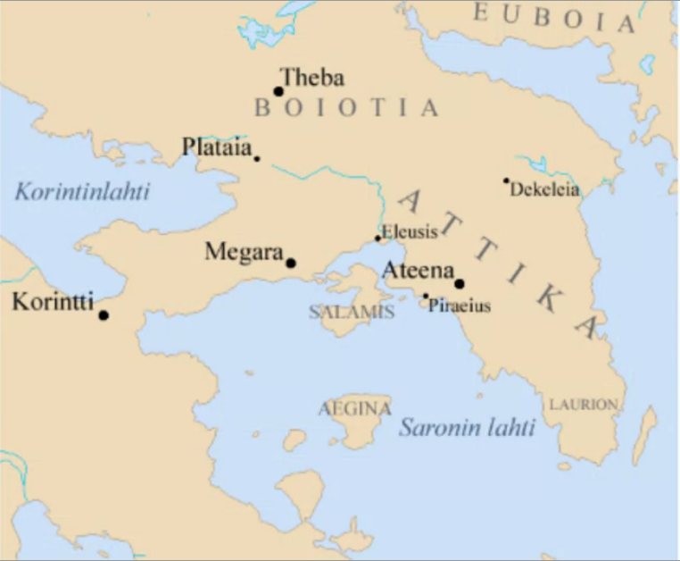

# Week 2

## The Polis and Greeks Overseas

### Video 1

### Week 2 / Lecture 1: The *Polis*

Moving from the 3 century period, the Dark Ages, after Mycenae collapsed.

Now, we move to the Archaic Age, also a 3 century period (800 - 500 BC)

- for a very long time, it was eclipsed by the glory of the classical period in the 5th century with its temple and its plays, etc.
- Now, the Archaic Age is realized to be one of the most important formative periods in Greek history.
- So much going on with the economy, military practice, agriculture, social values, law, etc.

We see a uniquely Greek cultural identity.

- date to start looking: 776 BCE, the date of the first Olympic games
- one of the few genuine dating methods that spanned across the entire Greek world
- this is the time that Greek identity became distinct from the other Eastern Mediterranean communities

What were some of the elements?

- Homer is a defining cultural entity

- The Polis, the sort of community the Greeks adopted

  - in the Odyssey, Odysseus saw the towns and learned the minds of many different men.

    - all different communities, but all have a sort of three part division: king, council, and assembly
      - king is the leader in battle, can be the high priest and chief judge
      - the Council, often made up of elders, advisers to the King
      - the assembly is generally made up of the army

  - this is sort of the base for the development of the polis

  - The Polis:

    

    - both on the mainland, the islands, on the coast of Asia Minor.

- Aristotle lived and wrote in the 4th Century BCE, in a time when the polis was already, as an institution, in decline.

  - we can start with his analysis

- Some Key Terms:

  - `Polis`: clumsily translated in English to "City-State"
    - two principle features: an internal unity, and an independence from communities nearby
    - **essential fact of it is that it included both the urban center and the farmland around it**
      - citizens from the farmland were had the same status of citizenry as those in downtown Athens
  - `Politeia`: incredibly complicated to describe:
    - Constitution, Citizen Body, Citizenship
  - `Polites`: someone who participates, who is an actor in the Polis, a citizen
    - No matter the Polis, the Polites were always and only native-born, free, adult male
      - women, foreigners, children, slaves were excluded from full participation in political life
  - 
  - 
    - the Polis varied greatly in size:
      - Attika, very large for a Polis, about 1,000 square miles
      - Sparta, in the south, with its possession of Mycenae (3,300 square miles)
      - Korintti, enormously important Polis for the entire period we will be studying, 340 square miles, some of the island communities were smaller yet

- Aristotle defines the first association of human beings as the **Household**, then they agglomerate into **Villages**, then by a process called by the great historian, an **urban implosion**, called **Synoecism**, the villages come together to form a polis.

