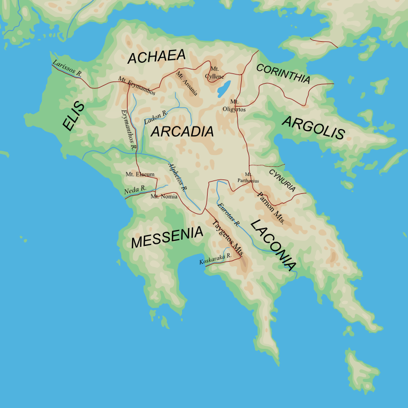

# Week 3

## Week 3 / Lecture 1: Sparta - Conquest

Moving to the southern Greece to the Peloponnese to one of the most important polis of the day: **Sparta**

Sparta comes with a warning label: it was unique



- Sparta was located roughly where Arcadia and Laconia meet

The way it defined itself was very different.

Sparta was not totally separated from the rest of the Greek world.

The aspect of equality was more honored in the breech rather than the observance of equality.

Tyrtareus, a poet, spokesman for a kind of Spartan value.

- like Homer, Tyrtereus, was applied to a number of different poems that were attributed to one

Originally, Sparta was four straggling unwalled villages: "Our men are our walls."

- took advantage of their location, which is on the Eurotas River, a swift flowing cold stream that begins in the mountains of Arcadia and flows down to the sea.
  - Sparta had access to clean water
- also, Sparta located between two mountain ranges
  - a beautifully defensible location
  - controlled access to the entire region in the Southern Peloponnese


- in Homer, Sparta is the home of Menelaus and Helen
- in the Trojan war, the Spartans contribute a large contingent, but by no means the largest
  - part of the generalized Achaean community
- Sparta in the Dark Ages and in the early Archaic Age was really no different from the other Greek communities of the time.


- Sparta's remains are fairly meager:
  
  - Thucydides, the historian said, that if people found the ruins of Athens, they would think that the Athenians were much more powerful than they actually had been and Spartans much less powerful than they actually were.
  
- where things start to change is in the eighth century with the so called First Messenian War (740-720 BCE)

- these dates are very approximate

- First Messenian War CA. 740-720 BCE

- foundation of Taras CA. 710

- Defeat of Spartan invading force by argives at Hysiae CA. 670

- Second Messenian War CA. 670-650 (?)

  - Tyrtaeus 11 ...Feel no fear before the multitude of men, do not run in panic,

    But let each man bear his shield straight toward the fore-fighters,

    Regarding his own life as hateful and holding the dark

    Spirits of death as dear as the radiance of the sun.

    ...Those who dare to remain in place at one another's die

    And advance together toward hand-to-hand combat and the

    Fore-fighters,

    They die in lesser numbers, and they save the army behind them;

    But when men flee in terror, all soldierly excellence is lost.

    (Translated by Andrew M. Miller, *Greek Lyric* [Hackett: 1996])

- Spartans ended up winning and took over the western land of Messenia, a massive agriculture area

  - a historic 3,000 square miles, the Spartan polis, 3 times as big as Attaca, that is the territory of the Athenian polis

- Spartans also acquired a subject population, the Messenians

  - became state-owned serfs, called Helots

- Spartans had to control the Helots who outnumbered them

- they developed an extremely rigid militarily based system of life, society, education, the whole thing, to respond to this.

- at this time, almost certainly, Sparta underwent a change that separated itself from other archaic Polis

- that turned it into the Sparta of Spartan legend that gives us the adjectives, in English, of Spartan, meaning spare or bare, austere, or laconic, this area is called Laconia, and laconic is short speech, because the Spartans came to be famoused for speaking in clipped, little sentences: just the facts, just what you needed to do.

- Lycurgus, stood over this entire development, a shadowy figure, his name etimologized as something like wolf-worker

  - we will never know if he actually existed
  - the reforms of Sparta could not have been done by just one man
  - nonetheless, he became the founding hero of the spartan system
  - his name is attached to the reforms

## Week 3 / Lecture 2: Sparta 2 - Consolidation and the Spartan Way of Life

- what happened after Lycurgus

- The Spartan government:

  ```
  Lycurgus / Lykourgos
  Rhetra
  Dyarchy
  Gerousia
  Damos / Apella
  Ephors
  
  Perioeci
  Helots
  
  Agoge
    Age Classes
  Syssitia
  
  Krypteia
  
  Creation of a society of homoioi: The "alike ones" or "peers"
  ```

- Lycurgus was given the `rhetra` from Delphi, the kernel of the polis

- kingship was becoming vestigal in almost all of Greece

- offices of the kingship are given to magistrates of the city

- in Sparta, kingship was retained, except with two kings, members of two hereditary clans, sons serve together as kings

  - retained some of the powers of primitive kingship
  - executive in chief of battles
  - special place at banquets

- counsel now as well, as we said in Homer, it tended to be of other lords, older men of traditional wisdom, like Nestor

  - called the group of the old, the `gerousia`
  - had to be old
  - elected by acclaimation of the assembly
  - the assembly, the `damos`
    - together, they were called `apella`
    - they received proposals by the elders to vote on

- close connection with the primitive role of the army

- the `ephors`, 5 of them, elected by the assembly

  - in charge of enacting discipline in the state
  - as long as the kings performed their duties in accordance of the law, upholding their oaths, they would support them
  - a clear sign of tremendous political and social upheaval

- The `perioeci`, those who had their dwellings around the perimeter of the city

  - they were free, but certainly not citizens
  - handled commercial affairs, trade relations
  - know very little about them, remarkably undocumented group

- the `helots`

  - descendants of the original Messenians
  - conquered by the Spartans and forced to serve the Spartans
  - they could be abused by any Spartan
  - had to provide agricultural labor
  - kept in line by some kind of state terrorism

- this community delighted political theorists

  - it's partly an oligarchy, a kingship, a radical democracy
  - hard to say what it is

- `Agoge`, the upbringing, the Spartan way of life

  - began at birth
  - scrutinized by one of the `Ephors`
  - if any sign of deficiency, the child could be left to die
  - child was raised at home until the age of 7
  - then, there were age classes
  - Spartan girls were raised with boys until adolescence
  - Spartan women had a certain degree of freedom that was rare at the time
  - from ages 7-13, a kind of elementary education:
    - exercise, dance (both rhythmic and requires you to follow directions)
  - from 13-20, boys and girls were separated
    - for boys, physical toughening and training
      - restricted to one garment, summer and winter
      - had to go barefoot
      - had to take daily baths in icy waters of Eurotus
      - taught obedience, disobedience was punished very harshly
      - fed on grul, pig's blood
      - taught to supplement this diet by stealing, but if you get caught, you will suffer
      - the story of the fox
      - at the age of 20, full scale, hoplite training, day in and day out

- Sparta, a hoplite republic

  - everything revolved around this

- those that made it through at the age of 30, applied for admission to a `syssitian`, a common eating club

- upon acceptance, they were given an allotment of land worked by Helots who they had to control since they had to contribute food to the community mass

- `Krypteia`: the secret mission

  - the elite Spartan youths were sent out on secret missions to kill Helots
    - especially if the Helot was big, or charismatic, would be killed with impunity
  - the Helots had an ethnic identity

- this community had a goal of creating "like" people, a `homoioi`: the alike ones or peers

- hoplite warefare was the primary excellence

- Spartans didn't lose a hoplite battle until 371

- Spartans had a unique relationship with the goddess Artemis

  - the combination of devotion and brutality can be seen as a metaphor for Spartan life

- for some people, Sparta is seen as a utopia

  - pure population
  - utter devotion of citizen to community
  - marshal valor
  - resistance to change

- makes it a kind of "never-neverland"

- also shows the stresses of the Archaic age

  - economic inequality?
    - make it ideologically outlawed
    - make hoplite warfare the basis of your state

- Spartans had characteristically long hair

  - they would comb out their long hair when they were preparing to die

- in Plato's final work, *The Laws*, as he talks to an anonymous Athenian, he says, "Spartans must without question accept that they are excellent. If they do not, they will not be acknowledged."

## Week 3 / Lecture 3: Tyrants and Sages

- poet Archilocus

  - one of the poems that survives is in the character of a blacksmith named Charon, he says, **"I don't care about Giges and his enormous wealth in gold. I want no pride of tyranny, it lies far off from where I am looking."**
  - first time the term tyranny is used

- tyrants are greedy, seize power in an unconstitutional way and held it personally

- one of the ironies is that in many communities is that tyranny was a necessary prelude to democracy

- one case study: the famous and important city of **Corinth**

  - its location is very strategic and important
  - it controls both the North/South route in Greece from the upper part to the Pelopennese and the East/West route
  - very popular for sailors to offload from the Saronic Gulf and cross the isthmus to reload on the Gulf of Corinth
  - much better than taking the very long voyage all the way around the Pelopennese

- from a very early time, Corinth was very prosperous

  - participated in the colonizing movement from very early on with the island off the west coast of Greece, the city their Corsira (modern-day Corphu) and Sicily, in particular the great polis of Syracuse

- canal was dug across the isthmus in late eighteenth century, until that time, travel was over land

- Corinth had an aristocracy, with a very exclusive clan of the **Bacchiades**

  - their exclusivity of marriage only in the clan was eventually their downfall

  - prior to that, they might be responsible for a stone pathway, Dialcos

  - under the Bacchiades, Corinth became very prosperous

  - artistic and cultural advancement took place

    ![sphinx]

    - sphinx had a half smile, absolutely characteristic of portrait sculpture at this time

  - in particular, Corinthian pottery

    - produced enormous amounts of highly decorated pottery
    - highly prized, and widely distributed
    - had east Asian notes

- one of their daughters, Labda, was lame and nobody wanted to marry

- an outsider named Aetion came in and they married

- a prophecy from Delphi said the offspring from this marriage would bring ruin to the Bacchiades

- a son was born, this is the legend part, he was so cute the Bacchiades couldn't bring themselves to kill him

- the second time, Labda, hid the infant in a chest, called a Kipselee, so he was called Kipseles, "box boy"

- he became tyrant, he overthrew the Bacchiade clan

  - he must have had enough popular support to do this

- rule passed to his son, Pariendar

  - one feature of tyranny, it passes from father to son rather than succession through elected office

- with Kipselos, we have one story where the overlooked child who becomes a ruler, one of the most famous examples in myth and literature is Oedipus who is cast aside and becomes King through difficulty

- we can see through this story some discontent among the ruling class with the exclusive rule of the Bacchiades

- with Pariendar, we have another kind of legendary pattern working itself out because we are told that he was a very harsh ruler

  - when assuming office, he wanted to figure out what to do so he sent a slave to consult with another tyrant of the time, Threslydulus
  - the tyrant just lopped off the heads of grain
  - Pariendar knew instantly what that meant, eliminate the leaders of the opposition
  - pattern we are seeing here: a not too bad father and a much more ruthless son
  - he was an extremely gifted ruler
    - could have built the Delcus road
    - largely ruled without incident
  - he died by commissioning his own assassination

- Pariendar was a member of a group we have come to call the **Seven Sages**

  - some scholars, one in particular, has claimed there was no group called this, but was invented by Plato with his Protagoras
  - our professor does not ascribe to this, and believes they were real

- The Seven Sages:

  - Thales of Miletus (Asia Minor)
  - Solon of Athens
  - Pittacus of Mytilene (Lesbos)
  - Bias of Priene (Asia Minor)
  - Chilon of Sparta
  - Cleobulus of Lindos (Rhodes)
  - Periander of Corinth

- one of the things you can see from this list is the wide geographical distribution

- they likely did not know each other, meet with each other

- Plutarch, much later, composed something called *The Banquet of the Seven Sages*, where they share witty and wise comments to one another

  - clearly a fiction

- but their stories do share common traits because each of them, despite their different areas of expertise: law, politics, tyranny

  - they are credited with writing poetry of one kind or another, engaging in some kind of political activity, and doing some kind of performance (example with lopping the heads off the grains)

- these seven men can be identified as culture heroes

  - they sort of embody this combination of practical experience, some sort of theoretical wisdom, some aspect of wit, and the ability to impress people

- remember, they identified themselves specifically: Milesian, Athenian, Corinthian

- pan-Hellenism: all of Greece

- in a much later biography of the philospher/politician/geometrician/etc. Thales, when Diogenes Laertius says "Thales everyday says a prayer to the gods thanking them that he was born human, not an animal, man not a woman, and a Greek, not a foreigner."

  - we can see how powerfully this expresses the ideology that bound together the seemingly disparate communities we have discussed while taking issue with the content

## Week 3 / Lecture 4: Athens 1


