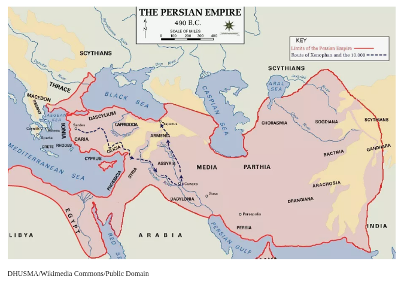

# Week 4

## Week 4 / Lecture 1: The End of Athenian Tyranny and the Democratic Revolution

- Pisistratus was such a good ruler that Aristotle had to give him his own category
  - Aristotle established him as "half-bad" as he was a tyrant but generally a good tyrant
- Pisistratus died in 528
- His two sons ruled after him: Hipparchus and Hippias
  - at least initially, this tandem rule seemed to have succeeded
  - then things went bad
- Harmodius and Aristogeiton killed the tyrant Hipparchus at a festival in 514 BCE
  - this becomes famous as the tyrannicide
- Thucydides thought this came from a personal insult
  - Harmodius rejected Hipparchus' advances
  - Hipparchus forbayed Harmodius sister from participating in the procession, suggesting she was not a virgin
- tyranny does not end after Hipparchus is killed
- both Harmodius and Aristogeiton were killed
- Hippias was much more strict and paranoid
- In 511, he was expelled
- Spartan king Kleomenes and helped an Athenian politician Isagoras, and Kleomenes manages to capture some of Hippias' family, leveraging him to leave Athens
- The Athenian Revolution [J. Ober]

1. Isagoras & Kleomenes attempt to dissolve the Boule
2. The Boule resists
3. Kleomenes and Isagoras occupy the Acropolis, with Spartan help
4. The rest of the Athenians unite. [Aristotle: "The crowd gathered itself together."]
5. They besiege the Spartan occupiers
6. Kleomenes surrenders on the 3rd day of the siege, and the Spartans withdraw.

**Important theme: without a leader, a people overthrow to establish a democracy.**

## Week 4 / Lecture 2: The Reforms of Kleisthenes

- Kleisthenes was the man the people of Athens wanted to put into power
  - he was part of the Alcmeinedes
- after the departure of the Spartans, the people chose Kleisthenes
- undertook a wholesale reconstruction of the Athenian constitution
- Kleisthenes' Reforms 1:
  - 3 regions: city, coast, inland
  - each divided into ten artificial trittyes - "thirds" (so thirty in all)
  - each trittys includes a variable number of demes, pre-existing "neighborhoods" (some 170 in all)
  - ten new tribes (phylai), each consisting of 3 trittyes, one from each region
  - new council, boule, of 500 men, serving for one year; 50 from each tribe, selected by lot
  - prytany system: council year is divided into tenths, with each tribe's council members serving as executive committee (prytaneis) for that allotted period
  - **he dealt a death blow to the previously existing clans who had power**
  - he split up the wealth geographically
  - being in a Deme was the most important for identification, once inducted into a Deme, you became a citizen
    - principal function was determining who belonged to the politeia
- the new civic heart is now the **Boule**
  - a citizen could serve in the Boule twice in his lifetime
  - the Boule created legislation to send to the assembly, also declared war
  - scrutinized magistrates after their time in office
  - a group of 500 is a little too large to get anything done
  - Kleisthenes split up the civic year into 10 parts
  - one citizen in the Boule, for 24 hours, was an overseer
  - this must have required some type of accounting/census

- Kleisthenes' Reforms 2:
  - Ekklesia - Assembly, including all citizens, who were guaranteed freedom of speech, meaning if you wanted to accomplish a lot, you had to be a great persuader
  - Magistrates:
    - 9 Archons - served one year, examined by Boule, and passed into the...
    - 10 Strategoi (Generals) -- elected annually, one from each tribe (Peracles) was a general over and over, no limit where Archon has limit, elected annually, one from each tribe
    - Popular courts
    - Ostracism: official process, early in the year, assembly was asked if they wanted an ostracism, later on in the year, they would hold a vote among 6,000, one individual's name would be inscribed and the citizen who got the most votes had to leave Athens for 10 years, could not be appealed
      - **one of the most democratic mechanism according to Aristotle**
      - could be used as a political weapon against their opponents
      - no evidence to how it was conducted, around 508-507 BCE
    - Isonomia: condition of "equal law" and equality under the law
- Kleisthenes laid the foundation for the democracy in Athens, that would lead to much democracy in the West

## Week 4 / Lecture 3: Herodotus and the Creation of Historical Writing

Herodotus came from Halicarnassus.

- born around 484 BCE
- from southern part of Ionia, western portion of Turkey

The Ionian city-states were a site of constant exchange.

**The Ionian School of Philosophy**

- centered in the town of Miletus

Earliest member of this school was Thales (one of the seven sages)

Thales

- a natural philosopher, speculated about the nature of the cosmos
- speculated that the prime substance of the cosmos was water

One of Thales students, Anaxamander, said that the basic substance was not water, but something called the immeasurable or the infinite, a much more abstract entity.

Third member of the Milesian school, Anaximenes, said the basis substance is not water or aperon, Greek for the infinite or the immeasurable, but rather, something called *aer*, a rarefied, purified form of the air, that we breathe.

These proposals are not significant, their rational approach to explain the phenomena of our world is significant.

The Gods are absent. **The underlying cause was not the divinities.**

Xenophanes, who came from another of the Ionian cities, Colophon, somewhat north of Miletus, wrote **beautiful accounts of the pleasures of the symposium, of the drinking party**.

**Xenophanes was also a ferocious religious skeptic.**

**Herodotus had influence from these people as well as Hecataeus.**

Hecataeus wrote something that he called, *A Trip Around the World* (around the Mediterranean).

Herodotus first words of his great work:

`Here displays his inquiry`: `inquiry` means the word `histories`, the first use of the term. History, here, is equated with looking into things.

**Not only of the Greeks, but of the foreigners as well.**

Important: Herodotus says, `"I know who first injured the Greeks, and that was King Croesus."`

We know that Croesus ruled from roughly 560 to 547-546, so about 13 or 14 years.

Croesus is the fifth generation after Gyges, who was persuaded by King Candaules to see his wife naked, whereupon she spots him and orders him either to kill the king and take his place, or kill himself. He kills the king.

**Croesus**:

- spectacularly wealthy
- has interacted with Solon
  - this is **paradigmatic**, as Solon is Greek, a law-giver, who emphasizes quality. Croesus, is Asian, a monarch, whose attention is focused on quantity.
  - Croesus asks Solon, "Who is the happiest man in the world?"
- he loses his son and Solon presumes this as punishment for having considered himself happiest of men.
- gets an idea to attack Persia.
- Croesus was very fond of Delphi, revered the God at Delphi.
- he asks the oracle, "What will happen if I attack Persia?" The oracle replies, "You will destroy a great empire." He does not ask the follow-up question to which empire.
- he crosses his own river, Hollis, to attack the Persians, and is eventually captured in his own palace, by the Persian king Cyrus
- about to be burned alive by Cyrus, prays to Apollo, a rain-shower puts out the fire, establishes a rapport with Cyrus
  - Cyrus admires Croesus' wisdom and his pattern as a ruler:
    - begins with having enough
    - suddenly, eventually, wants to have much more
    - commits some rash act
    - suffers disastrous consequences
  - **Herodotus sees this four-part sequence play out over and over again throughout history**

## Week 4 / Lecture 4: Persian Wars 1 - From the Ionian Revolt to the Battle of Marathon

- This map of the Persian Empire shows the direction of Xenophon and the 10,000. Also known as the Achaemenid Empire, the Persian Empire was the largest empire ever to be established. The Xenophon of Athens was a Greek philosopher, historian, and soldier who authored many practical treatises on topics like horsemanship and taxation.

Cyrus, who had conquered Croetus and taken over Lydia, was killed in battle.

Magi tried to take over and were quickly expelled.

Then, Darius (Doe-Ri-Us) the First became for a very long time, from 522 BCE to the mid 480s, around 486.

King of a massive empire (Persian Empire).

- massive size, massive wealth
- extremely well developed bureaucracy
- local governors, well established procedures for collecting revenues
- Persians amassed an enormous amount of treasure

Athenian hoplite armies pushed back the Boeotians and the Calcidians from their attempts to overthrow their young democracy.

Athenian ambassadors asked a Persian governor, Satrap, for help. He complied, asking for the Athenians to give earth and water in exchange for financial payments.

- we may be seeing here a intercultural misunderstanding

The Persians saw the Athenians giving themselves over as subjects to the Persian King. For Athenians, this could have been a ritual of exchange, a token of good will.

It began with a revolt. The Ionian cities had to begin paying taxes.

The Athenians agree to help the Ionian revolt.

Around 497, they move across the coast of Asia Minor. They move inland and burn Croesus' ancient capital of Sardis which had become a Persian outpost, Persian capital.

- **this was a tremendously bitter affair**, the Persians thought an alliance had been betrayed, an alliance of earth and water
- King Darius was so furious, he had a servant remind him throughout the day, "Master, remember the Athenians."

In 494, the Ionian revolt was crushed and the city of Miletus was sacked an burned as revenge for the destruction of Sardis.

Wasn't enough for Darius. Began an incursion across the island, demanding earth and water.

Greek states gave in because they thought the Persian empire was so huge and so powerful. This is called **medizing**, to go over to the Meed, to surrender your own autonomy so to speak.

Herodotus says a real sacrilege occurred. When the Persians went to the Athenians, they were killed. When they went to Sparta, they were thrown into a well and told them to get their own earth and water.

- **this is a fantastic breach of protocol**

Ambassadors have special protection, otherwise you couldn't conduct any sort of negotiation.

In 491, the Persians invade. By 490, they make their way over to the mainland.

First target is Eritrea, and they destroy it. They are just off the coast of Attica.

The Greeks become panicked.

Herodotus tells us Hippias was along with the Persian invading forces, **as a dream.**

Dreams, portents, and oracles are very important for Herodotus.

Hippias' dream is that he makes love with his mother, influencing him to think he will regain power in Athens, even as an old man.

When the Persians arrive on the shore at Marathon, Northeast of Athens, he has a coughing fit and coughs up a tooth and can't find it. He dejectedly acknowledges that that is the only part of Athens that he is destined to retake, or to reclaim.

The Athenians mount a hoplite defense, a small group, led by Miltiades, a member of a great old family.

He brilliantly puts his best troops off to the side, to attack the Persian flanks.

The battle works just as he had planned.

Herodotus tells us that the final casualties were 192 Greeks, and over 6000 Persians dead. Nobody could quite believe it.

The Greeks versus the Persians now becomes a real, bloody conflict. The Greeks win their first encounter.

Why did they win?

- hoplite tactics
  - fighting in tight formation against the loosely formed Persians
- their heavy armor was much more effective than the Persian armor that was a linen corslet and a shield made of wicker that is tightly bound together. Didn't stand much of a difference against the brown shields and long spears of the Greeks.

Mitiades dedicated a helmet at the temple of Zeus down in Olympia (still exists, a little worn, with his name on the side).

Special aura surrounds the hoplites, the marathonomachoi, as they were called, of **special courage, of establishing freedom against despotism.**

John Stuart Mill, english philosopher, "As an event in English history, the Battle of Marathon is more important than the Battle of Hastings" (Norman conquest in England).

**Nonetheless, Marathon has an unusual status in world battles.**

**The Greeks had gotten together, a few of them, and fended off the many.**

But the Persians were now angered, and determined to get their way.

The Persian wars were by no means over.

## Week 4 / Lecture 5: "Wooden Walls": Themistocles and the Athenian Fleet