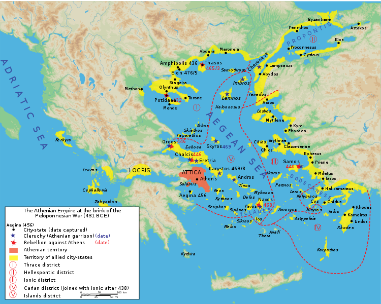

# Week 5

## Week 5 / Lecture 1: The Aftermath of the Persian Wars - The Delian League

- we have seen how the Greek states came together to defeat the Persians
- 3 main outcomes of the war:
  - Persians were utterly defeated
  - there was a sense of Greek unity, briefly
    - a monument still stands in Istanbul, Turkey, on it, it says:
      "These fought the war: the Lacedaimonians. The Athenians. The Corinthians. The Tegeans. The Sicyonians. The Aeginetans...(and 25 more Poleis)"
- Greeks called any non-Greeks barbarians
  - main factor was that they didn't speak Greek
- Athens and Sparta come out as the two hegemonic, dominant polis in this group
- two heroes of the Persian Wars: Pausanias and Themistocles
- both had a checkered past
- Themistocles, an Athenian:
  - Sparta proposed not rebuilding the wall around north of the Pelopennese
  - Athens was not too excited about that
  - Themistocles stalled the Spartans while they completed the wall
  - **he had enormous power and prestige**
    - this caused political antagonism
  - his political enemies finally did get him ostracized in 471-470, 9 years after his victories in the Persian War
  - then, he went to Persia to be a Greek advisor
- **So many of the leaders suffered similar fates**
- so on Delos, Apollo and Artemis reigned. It is sacred because myth says Leto gave birth to them here.
- a league was formed that would meet at Delos, due to its sacred nature
  - each of the states, member states, was guaranteed autonomy
  - annual contribution could be money or ships
  - they had in effect established for themselves the mechanism, or the prelude to Athenian domination
- no longer was this the old war of Hoplites, those middling men, those citizen soldiers, who provided themselves their own armor. Instead, now we have warfare, year-round.
  - the Navy was kept on constant patrol
    - to keep Persians away
    - to collect contributions, whcih came to be called tribute
    - the Athenian sailors received state pay
    - **economically, the Navy is very costly**. It requires constant cash flow.

## Week 5 / Lecture 2: From Delian League to Athenian Empire

- Athens was proposed to lead this new confederation
- main goals:
  - protect against Persia
  - collect contributions
  - equality for states, but Athens comes first
- Athens had a lot of free labor, not slave labor, which gave them an enormous advantage over the other states
- the year-round presence of the fleet was a new way of warfare
- all of the states are either islanders or on the coast
- Athens dominated because of their fleet and the fact that the other states were on the coast and as islands
- the chronology of history of the following decades is difficult, we use Thucydides' Book 1 and other inscriptions
- Chimon, a successful general, takes a fleet to Eurymidon, a place on the southern border in Turkey (not shown in map), because it was rumored the Persians were amassing another fleet
- Naxos announces they will leave the league, Athens says no and surrounds them
- their contributions change from ships to cash
- around 465, the Athenians get into a quarrel with the island of Thasos, up north in the Aegean Sea, over gold mines on the northern coast of the mainland near Thasos
- Thasos appeals to Sparta for help
- Spartans must have observed the growing power of Athens with alarm
- around 464, a huge earthquake hit Sparta and the **Helots rebelled, the native Nycenians who had been forced into state serfhood**
  - remember, they were kept in constant state terrorism
  - they used the disruption of the earthquake to mount a rebellion
- a sign of how serious this was to Sparta, they asked Athens to help them, just after the Spartans told Thasos they would help defend against Athens
- in Athens, Cimon was the leader of the pro-Spartan party, son of Miltiades, the victor at Marathon
  - he persuaded his fellow Athenians to help Sparta by saying they were the two main states that fended off the Persians
- Cimon goes down to Sparta with 4,000 hoplites, but upon arrival, Sparta sent them home
- we aren't too sure why they did this
- Cimon's pro-Spartan policy is discredited
- in 462, Pericles, working with a political ally named Ephialtes, engineered a reform
- in the following year, in 461, Cimon was ostracized
  - the leader of what one might think of as a sort of moderate democratic or pro-Spartan faction was removed from the political scene
- we will begin to see now the continuing transformation of this voluntary confederacy of independent polis into a network of ostensibly free but in fact Athenian-dominated tribute paying allies.
- **one of the great sources of information we have is a magnificent set of inscriptions called the <u>Athenian Tribute Lists</u>**
- in the 450s, the Athenians decided to move the treasury of the Delian League to Athens for "safe-keeping"
- Athenians began keeping meticulous record of how much each state paid every year
- 1 60th of the tribute went to Athena
- these allow us to track internal relations in the league
- Athens controlled the allies with their Naval fleet
- Athenians tended to support democratic factions in states where there was political struggle
- they also controlled trade with their fleet
- eventually, the Athenians forced allied states to use Athenian coins, weight and measures
- in rebelled states, Athens set up Athenian outposts, colonies
- When the polis of **Megara** allied with Athens, it enraged the Corinthians at **Korintti**, so they began forming alliances with their neighbors to the south of them
  - Megara had a very strategic location, as they where in the middle of the land-bridge, or the isthmus of Corinth

## Week 5 / Lecture 3: Pericles: Aristocrat, Orator, and Radical Democrat

- Pericles was born around 490, but are unsure
- his family was as elite as could be, son of Xanthippus, an Athenian
- Xanthippus:
  - member of Alchmaeonid, that old powerful clan
  - had been involved in the exchanges of ostracisms back in the 480s
- in 462, Pericles really comes into the political landscape of Athens
- in that year, along with a political ally named Ephialtes, the ancient council of the Areopagus is reformed
- the Areopagus:
  - the Areopagus, has been around since the beginning of Athenian political history
  - it exists alongside the democratic counsel of 500 that had been established by Clistenese
  - consisted of ex-Archons (serve for a year as archon, then go into this council)
  - tended to be made up of somewhat older, probably more moderate, or even conservative men
- in 462, the reforms of the Areopagus almost completely took its power away
- retained its position as a court for cases of voluntary homicide and other religious related offenses
- any of its real influence it had in Athenian politics was now gone
- Aeschylus' Oresteia addresses a mystical charter for the founding of the Areopagus as a court to hear cases of homicide
- he lived a thoroughgoing, aristocratic lifestyle
- had a beautiful mistress named Aspasia, a courtesan
  - power couple
  - she was very smart, could converse elegantly
  - she was not Athenian, from Miletus
  - she was, one might say, a professional escort
- Pericles acted much differently in domestic relations compared to other members of the elite
- the elites retained a kind of political influence by working through, and in, the democratic process
- they would marry their sons and daughters to establish alliances
- Pericles rejected all of forms of this sort of official friendship
- the main source of his power, as we would say, **is controlling the discourse**.
- he turned to the people
- a late Latin poet source said he had an almost incredible power of speaking
- he was personally incorruptible
- he had a lot of family wealth so he didn't need to be bribed
- his ambition was more for Athens rather than himself
- Thucydides famously says in his estimate of Pericles that during the years of his ascendency Athens was in name a democracy but in fact under the rule of the first citizen
  - though, he was not a tyrant, the people ruled
- he sort of embodied Athens at its most excellent
- with the transfer of the Delian treasury to Athens and with peace with Persia, the Delian League was needed no longer
- **The Athenian Building Program** by Pericles
- major decrees established in the mid-century:
- this view shows Pericles being much more imperialistic, ruthless leader than he had been given credit
- even with fair amount of evidence, theories, interpretations, and narrative continue to be constructed, with varying degrees of plausibility

## Week 5 / Lecture 4: Tragedy and Athenian Civic Life -- Sophocles' *Antigone* (441 BCE)

- in fifth century Athens, tragic theater was central to cultural, political, and civic life
  - involved entire community
- always connected to ritual and to the god Dionysus
- usually took place in the city of Dionysia in the spring
- natural bowl near the Parthenon, just outside Athens
- choruses remain important throughout Greek tragedy
- all the actors were male, total of 3
- 10 citizen judges
- begun in Dionysia with a procession, starting by bringing in a statue of Dionysus
- the young men, the generals would be in the procession
- the actual tribute from the treasury of Delos would be carried in by precious metals
- function of the poet was to be a teacher to the city
- Antigone is loyal to a fault to her dead brother
- Creon gets "wisdom through suffering" after losing his wife to suicide and such

## Week 5 / Lecture 5: Women in Greek Society

- one prominent woman we have heard of already was Saphos
- the law stated that a woman of any age had to have an adult male guardian
- if husband or guardian died, the woman would pass into the care of male relatives
- they couldn't own property
- **had the legal status of a child**
- **marriage was the aim for women**
  - about 14, early teens, to a man much older, in 20s or 30s
- **"marriage is for the woman as war is for the man"**
- men were outside, in the field, assembly, council, etc.
- women were inside, managing the "oikos" or household
  - managing children, slaves
  - each house had at least one slave
- **making cloth was one of the primary jobs of women**
- Euripedes' Medea reflects the lives of women in Greece
- Aspasia, the beautiful courtesan Pericles loved
- Persephone became the goddess of the Underworld when she married Hades
- women played a vital role in religion: Athena, Hera, Demeter, Persephone

## Week 5 / Lecture 6: The Periclean Building Program

- right around 450
- Athenians took 5,000 talents from the profits they had made from tribute and devoted it to the beautification of the city
  - funds extracted from their fellow Greeks
- the Persians sacked the city
- the ruins stayed there for 30 years
- Pericles started to beautify the city
- the Propylaea was the grand entrance to the Acropolis
  - boundary between the secular world of the city and the largely sacred precinct on the top of the Acropolis
  - two waiting rooms:
    - one: a picture gallery
- visitors first destination would have been the Parthenon
  - remarkably refined
  - slight curvature, practically letting rainwater run off
  - had many purposes:
    - first, a Christian church
    - when it was part of the Ottoman Empire, it was a Mosque
  - richly ornamented in sculpture
  - 
  - was brightly painted
    - in extremely bright light of ancient Greece, you needed bright colors for it to show up
  - high point of the sculptural decoration was the **Parthenon Frieze**.
    - had hundreds of figures of the pan-Athenic procession

### "The Great 50 Years" (ca. 480-431 BCE)

