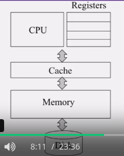

# Introduction

## 1. Basic Data Structures

**Queue**:

- **First In, First Out**
- **Remove** from head, **Insert** at tail
- 

**Stack**:

- **First In, Last Out**
- **Remove (Pop)** from top, **Insert (Push)** at top
- 

## 3. Computer Architecture

## 5. Probabilities

E1 is an event

E2 is an event

Then:
Prob(E1 OR E2) = Prob(E1) + Prob(E2) - Prob(E1 AND E2)

If you don't know Prob(E1 AND E2), then you can write:
Prob(E1 OR E2) $\leq$ Prob(E1) + Prob(E2)

## 6. DNS

- DNS = Domain Name System
- Collection of servers, throughout the world
- Input to DNS: a domain name, e.g., coursera.org
- Output from DNS: IP address of a web server (that hosts that content)

## 7. Graphs

(aka "Network")

- Node or Vertex
- Edge
- Edge Weight

## Lesson 1: Introduction to Clouds

### What is a Cloud?

- Core switch -> Rack switch -> Servers

**Moore's Law**: CPU capacity doubles once every 18 months

### 1.5 Introduction to Clouds: New Aspects of Clouds

HaaS: Hardware as a Service
IaaS: Infrastructure as a Service:

- access to flexible computing and storage infrastructure. Virtualization is one way of achieving this (Linux is another way)
- Amazon Web Services, (AWS: EC2 and S3), Eucalyptus, Azure

SaaS: Software as a Service:

- Google docs, etc.

#### III. Data-Intensive Computing

- In Data-Intensive computing, the focus shifts from computation to the data: CPU utilization no longer the most important resource metric, instead I/O is (disk and/or network)

#### IV. New Cloud Programming Paradigms

- Easy to write and run highly parallel programs in new cloud programming paradigms:
  - Google: MapReduce and Sawzall
    - to crawl internet for its search engine
    - indexing a chain of 24 MapReduce jobs
  - Amazon: Elastic MapReduce service (pay-as-you-go)
  - Facebook (Hadoop + Hive)
  - NoSQL: MySQL is an industry standard, but Cassandra is 2400 times faster!

### 1.6 Introduction to Clouds: Economics of Clouds

2 types of clouds: public and private

Breakeven points:

- *M* > 5.55 months (storage)
- *M* > 12 months (overall)

It is preferable to buy your own cluster rather than use on-demand cloud resources:

- when you are a large organization with a lot of money to invest
- when you are confident of your service lasting for several years
- when you are running a service that legally requires you to store the data in a building under your control.
- NOT when you are a small startup that wants to use a few tens of VMs to run the service on.

#### Summary

- Need to identify unique aspects of a problem to classify it as a new cloud computing problem.
  - Scale, On-demand access, data-intensive, new programming
- Otherwise, the solutions to your problem may already exist!

