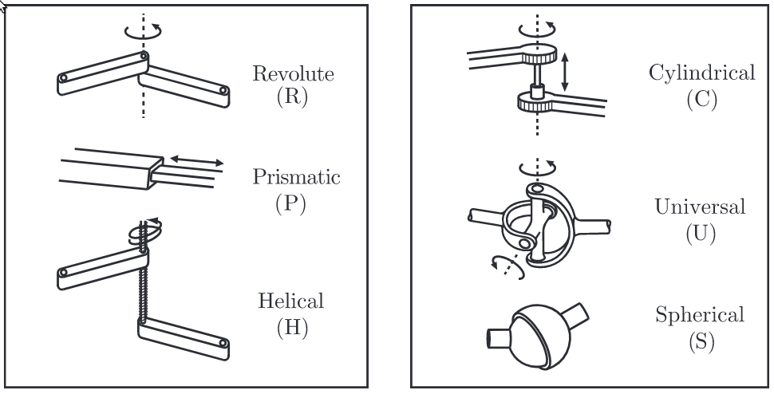

### Chapter 2: Configuration Space
**Configuration**: a specification of the positions of all points of the robot.

**Degrees of freedom (dof)**:
- the smallest number of real-valued coordinates needed to represent its configuration.
- = (sum of freedoms of the points) - (number of independent constraints)
- = (number of variables) - (number of independent equations)

Example: A coin laying on a plane has 3 degrees of freedom:  
1. x coordinate
2. y coordinate
3. orientation of coin (angle of its rotation)

A fourth variable is one of a discrete set, {heads, tails}, and not over a continuous range of values like the other three coordinates.

The *n*-dimensional space containing all possible configurations of the robot is called the **configuration space (C-space)**.

The configuration of a robot is represented by a point in its C-space.

#### 2.1 Degrees of Freedom of a Rigid Body
**Redundant**: provides no new information.

Example of Coin in 3-D:
- Point *A* can be placed freely (three degrees of freedom).
- Point *B* is subject to the constraint $d(A, B) = d_{AB}$, meaning it must lie on the sphere of radius $d_{AB}$ centered at *A*. Thus we have $3-1=2$ freedoms to specify, which can be expressed as the latitude and longitude for the point on the sphere.
- The location of point *C* must lie at the intersection of spheres centered at *A* and *B* of radius $d_{AC}$ and $d_{BC}$, respectively.
- The intersection of two spheres is a circle.
- The location of point *C* can be described by an angle that parametrizes this circle.
- Point *C* therefore adds $3-2=1$ freedom.
- Once the position of point *C* is chosen, the coin is fixed in space.

In summary, **a rigid body in three-dimensional space has six freedoms** described by:

- three coordinates parametrizing point *A*
- the two angles parametrizing point *B*
- one angle parametrizing point *C*, provided *A*, *B*, and *C* are noncollinear.

This is for a **spatial rigid body**, which is a rigid body moving in three-dimensional space.

A **planar rigid body** is a rigid body moving in a two-dimensional plane. It has:

- three degrees of freedom
- can think of it as a spatial rigid body with six degrees of freedom but with the three independent constraints $z_A=z_B=z_C=0$.

The degrees of freedom equation can be expressed as follows since our robots consist of rigid bodies:
$$
\text{degrees of freedom} = \text{(sum of freedoms of the bodies)} - \text{(number of independent constraints)}
$$
This equation forms the basis for determining the degrees of freedom of general robots.

#### 2.2 Degrees of Freedom of a Robot

The door example, can be viewed from above and regarded as a planar body, which has three degrees of freedom. The hinge joint then imposes two independent constraints, again leaving only of independent coordinate $(\theta)$.

The door's C-space is represented by some range in the interval $[0,2\pi)$ over which $\theta$ is allowed to vary.

We can use a formula for determining the number of degrees of freedom of a robot, simply by counting the number of rigid bodies and joints. This is called **Grubler's formula**.

**Grubler's formula**: determine the number of degrees of freedom of a robot, simply by counting the number of rigid bodies and joints.

##### 2.2.1 Robot Joints

Every joint connects exactly two links.

Joints that simultaneously connect three or more links <u>are not allowed</u>.

| Joint type      | dof *f* | Constraints *c* between two planar rigid bodies | Constraints *c* between two spatial rigid bodies |
| --------------- | ------- | ----------------------------------------------- | ------------------------------------------------ |
| Revolute (R)    | 1       | 2                                               | 5                                                |
| Prismatic (P)   | 1       | 2                                               | 5                                                |
| Helical (H)     | 1       | N/A                                             | 5                                                |
| Cylindrical (C) | 2       | N/A                                             | 4                                                |
| Universal (U)   | 2       | N/A                                             | 4                                                |
| Spherical (S)   | 3       | N/A                                             | 3                                                |

Joints on left all have **one degree of freedom**.

Cylindrical Joint: **two degrees of freedom**.

Universal Joint: **two degrees of freedom.**

Spherical Joint: **three degrees of freedom**.

###### 2.2.2 Grubler's Formula

$N = \text{number of links}$

$J = \text{number of joints}$
$m = \text{number of degrees of freedom of a rigid body (m = 3 for planar mechanisms and m = 6 for spatial mechanisms)}$
$f_i = \text{number of freedoms provided by joint i}$
$c_i = \text{number of constraints provided by joint i}$
where $f_i + c_i = m$ for all *i*
$\text{dof} = m(N-1) - \sum_{i=1}^{J}c_i$
$ \text{dof} = m(N-1) - \sum_{i=1}^{J}(m-f_i)$
$\text{dof} = m(N-1-J)+\sum_{i=1}^{J}f_i$

1. 10 y
2. 6 y
3. 3 n
4. 4 n
5. n n
6. 2n n
7. 2 n

1. 10 y
2. 6 y

3. 5 y

4. 6(4 - 1 - 3) + 3 + 1 + 3 = 7*4 = 28
5. 7n
6. 8n

7. 3(12 - 1 - 14) + 12 + 2 + 2 = 3(-3) + 16 = -6 + 16 = 10

1. 10 y

2. 6 y

3. 5 y

4. SRS arms

   1. N = 10, J = 12, $\sum f_i = 28$
      1. $ 6(10 - 1 - 12) + 28 = 6(-3) + 28 = -24 + 28 = 4 $
   2. N = 10, J = 12, $\sum f_i = 4(3) + 4(1) + 4(1) = 12 + 4 + 4 = 20 $
      1. $6(10 - 1 - 12) + 20 = 6(-3) + 20 = -18 + 20 = 2 $
      2. For each arm: $6(3 - 1 - 3) + 3 + 1 + 1 = 6(-1) + 5 = $
   3. $ N = 10 $, $ J = 9 $, $ \sum f_i = 4(3) + 4(1) + 3 = 12 + 4 + 3 = 19 $
      $ dof = 6(10 - 1 - 9) + 19 = 19 $

5.  Find expression with *n* arms:

   $ N = 2 + 2n $, $ J = 2n + 1 $, $ n \sum f_i + 3 = n(3 + 1) + 3 = 4n + 3$
   $ dof = 6(2 + 2n - 1 - 2n - 1) + 4n + 3 = 6(0) + 4n + 3= 4n + 3 $

6. Replace revolute joint with universal joint and find expression for each arm:
   $ N = 2 + 2n $, $ J = 2n + 1 $, $ n \sum f_i + 3 = n(3 + 2) + 3 = 5n + 3$

7. $ N = 1 + 3 + 3 + 1 + 3 + 1 = 12 $, $ J = 2 + 2 + 2 + 3 + 1 + 2 + 2 + 1 = 15 $, $ \sum f_i = 1 + 1 2 + 2 + 3 + 1 + 2 + 2 + 1 = 15 $

   1. $ dof = 3(12 - 1 - 15) + 15 = 3(-4) + 15 = -12 + 15 = 3 $

Third Try:

1. 10 y
2. 6 y
3. 5 y
4. 19 n
5. 4n + 3 n
6. 5n + 3 n
7. 3 y

Fourth Try:

1. 10 y
2. 6 y
3. 5 y
4. 17 n
5. 4n + 1 n
6. 5n + 1 n
7. 3 y

Fifth Try:

1. 10 y
2. 6 y
3. 5 y
4. 16 n
5. 4n 
6. 5n
7. 3 y

Sixth Try:

1. 10 y

2. 6 y

3. 5 y

4. $ 6(10 - 1 - 11)  + 4(3) + 4(1) + 3 $
   $ 6(-2) + 12 + 4 + 3 = -12 + 19 = 7 $
   
5. | n    | dof                                               |
   | ---- | ------------------------------------------------- |
   | 1    | $ 6(4 - 1 - 3) + 3 + 1 + 3 = 7 $                  |
   | 2    | $ 6(2 -1 - 2) + 3 + 1 + 7 = -2 + 7 = 5 $          |
   | 3    | $ 6(2 - 1 - 2) + 3 + 1 + 5 = -2 - 2 + 7 = 3 $     |
   | 4    | $ 6(2 - 1 - 2) + 3 + 1 + 3 = -2 - 2 - 2 + 7 = 1 $ |

   $ 9 - 2(n) $

6. | n    | dof                                           |
   | ---- | --------------------------------------------- |
   | 1    | 6(4 - 1 - 3) + 3 + 2 + 3 = 8                  |
   | 2    | 6(2 -1 - 2) + 3 + 2 + 8 = -1 + 8 = 7          |
   | 3    | 6(2 - 1 - 2) + 3 + 2 + 7 = -1 - 1 + 8 = 6     |
   | 4    | 6(2 - 1 - 2) + 3 + 1 + 6 = -1 - 1 - 1 + 8 = 5 |

7. 3 y

There are two types of spatial and planar mechanisms:

- **open-chain mechanisms**: any mechanism without a closed loop
  - Example: Your arm when your hand is allowed to move freely in space.
- **closed-chain mechanisms**: any mechanism that has a closed loop
  - Example: A person standing with both feet on the ground, since a closed loop can be traced from the ground, through the right leg, through the waist, through the left leg, and back to ground (recall that the <u>ground itself is a link</u>).

**the number of degrees of freedom** = 

- the dimension of its configuration space
- the number of real numbers needed to specify its configuration
- the number of freedoms of the bodies minus the number of independent constraints between the bodies

