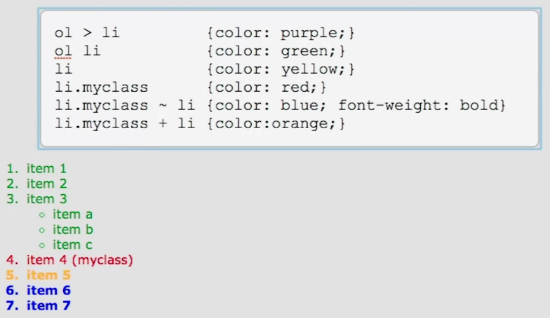

## Table of Contents
- [Part 1](#part-1)
  * [Basic selectors, relational selectors](#basic-selectors-relational-selectors)
  * [Attribute selectors](#attribute-selectors)
  * [UI Pseudo-classes](#ui-pseudo-classes)
  * [Structural UI Pseudo-classes](#structural-ui-pseudo-classes)
  * [Demonstration of Structural UI Pseudo-classes](#demonstration-of-structural-ui-pseudo-classes)
  * [Negation and empty pseudo-classes](#negation-and-empty-pseudo-classes)
  * [Other Pseudo-classes](#other-pseudo-classes)
  * [Pseudo-elements](#pseudo-elements)

## Part 1
### Basic Selectors, Relational Selectors

- `ul li`:
  - descendant selector
  - matches nested `<li>`s
- `ol > li`:
  - direct child selector
  - matches `<li>`'s in `<ol>` but not nested `<ul>`
- `li.myclass ~ li`
  - grabs `<li>` after the `myclass`
  
  ### Attribute Selectors
  - `element[attribute]`
    - global selector: `*[attribute]`
    - implicit global selector: `[attribute]`
    - don't use global selectors, bad performance
    - `img[alt]`
      - matches all `img`s on page that have an `alt` attribute
  - `E[attr="val"]`:
    - Element `E` has the attribute `attr` with the exact value `val`
  - `E[attr|=val]`:
    - `E` whose attribute `attr` has a value `val` or begins with `val-` (dash, hyphen)
  
