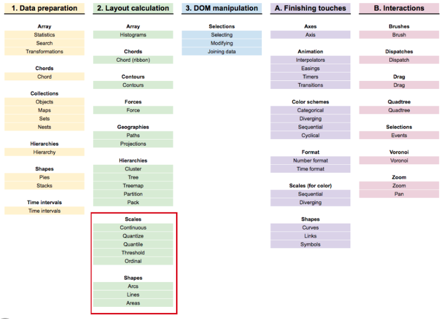
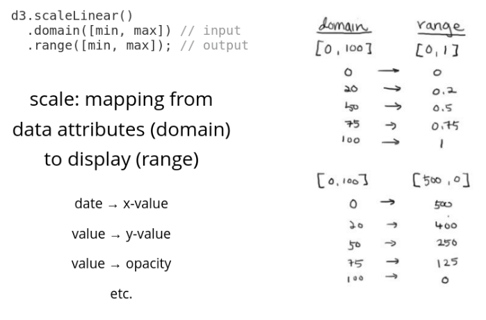
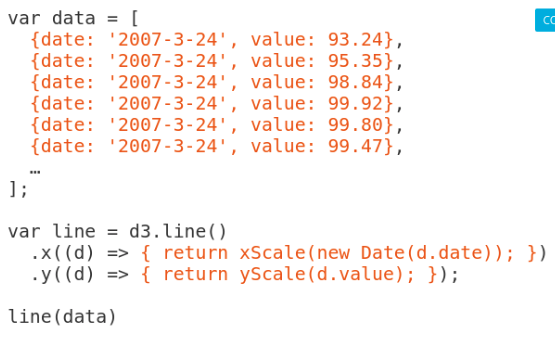

# Data Visualization for React Developers

## Introduction

D3's learning curve:
**Enter-update-exit** is basically what the React virtual DOM is doing under the hood.

## The Basic Chart Types

#### Data Types

- Categorical (genres)
  - **Bar chart**
    - Domain: categorical
    - Range: quantitative
  - **Histogram**
    - Domain: quantitative bins
    - Range: frequency of quantitative bin
- Ordinal (t-shirt sizes, like categorical but there is an order)
- Quantitative (temperatures, movie metascores from 0-100)
- Temporal (dates)
- Spatial (cities, countries, regions)

#### Basic Charts and when to use them

- **Scatter plot**
- **Line chart**
- **Tree**
  - for one-directional relationships
- **Node-link diagram** (her personal favorite)
  - shows connections between multiple entities
- **Chloropleth** (spatial):
  - like showing candidate donor distribution across the U.S.
- Datawrapper Academy

## The Making of a Chart

### Introduction to SVG


With a **path**, you can draw *literally any shape you want*. Examples:

- bl.ocks.org/sxywu
- sxywu.com/filmflowers


### Weather Data Chart Examples

### Going from Data to SVG Shapes

One of the (many) things D3 is good for!



#### Data to SVG: Scales

- **scale**: mapping from data attributes (domain) to display (range)

  - ```js
    d3.scaleLinear()
      .domain([min, max]) // input
      .range([min, max]);  // output
    ```



- scales map so we don't have to

#### JavaScript Example

```js
// get min/max
var width = 800;
var height = 600;
var data = [
    { data: New Date('01-01-2015'), temp: 0 },
    { data: New Date('01-01-2017'), temp: 3 },
];

var min = d3.min(data, d => d.date);
var max = d3.max(data, d => d.date);

// or use extent, which gives back [min, max]
var extent = d3.extent(data, d => d.temp);

var xScale = d3.scaleTime()
  .domain([min, max])
  .range([0, width]);
var yScale = d3.scaleLinear()
  .domain(extent)
  .range([height, 0]);
```

#### Data to SVG: Scales I Use Often

**Quantitative** data:

- | Domain & Range                      | D3 function                            |
  | ----------------------------------- | -------------------------------------- |
  | Continuous domain, Continuous range | `scaleLinear`, `scaleLog`, `scaleTime` |
  | Continuous domain, Discrete range   | `scaleQuantize`                        |

**Categorical** data:

- | Domain & Range                       | D3 function    |
  | ------------------------------------ | -------------- |
  | Discrete domain and range            | `scaleOrdinal` |
  | Discrete domain and Continuous range | `scaleBand`    |

### Going from Data to SVG Exercise

### Going from Data to SVG Exercise Solution, Part 1

```js
barChartData = {
 // 1. map date to x-position
 // get min and max of date
 const extent = d3.extent(data, d => d.date)
 const xScale = d3.scaleTime()
   .domain(extent)
   .range([0, width]);
 
 // 2. map high temp to y-position
 // get min/max of high temp
 const yExtent = d3.extent(data, d => d.high)
 const yScale = d3.scaleLinear()
   .domain(yExtent)
   .range([height, 0])
 
 // array of objects: x, y, height
 return data.map(d => {
   return {
     x: xScale(d.date),
     y: yScale(d.high),
     height: yScale(d.low) - yScale(d.high)
   }
 })
}

{
  const svg = d3.select(DOM.svg(width, height))
  
  const bars = svg.selectAll('rect')
    .data(barChartData).enter().append('rect')
    .attr('x', d => d.x)
    .attr('y', d => d.y)
    .attr('width', 2)
    .attr('height', d => d.height)
    .attr('fill', d => d.fill)
  
  return svg.node()
}
```

### Going from Data to SVG Exercise Solution, Part 2

- adding color

```js
// 3. map avg temp to color
 // get min/max of avg
 const colorExtent = d3.extent(data, d => d.avg)
 const colorScale = d3.scaleSequential()
   .domain(colorExtent)
   .interpolator(d3.interpolateRdYlBu)
 console.log(colorScale(50))
 
 // array of objects: x, y, height
 return data.map(d => {
   return {
     x: xScale(d.date),
     y: yScale(d.high),
     height: yScale(d.low) - yScale(d.high),
     fill: colorScale(d.avg)
   }
 })
```

### Creating Line Charts

3 components:

- **path**
- **d**: path to follow
- `Moveto`, `Lineto`, `Curveto`, `Arcto`




## Rendering with React


## The Finishing Touches

