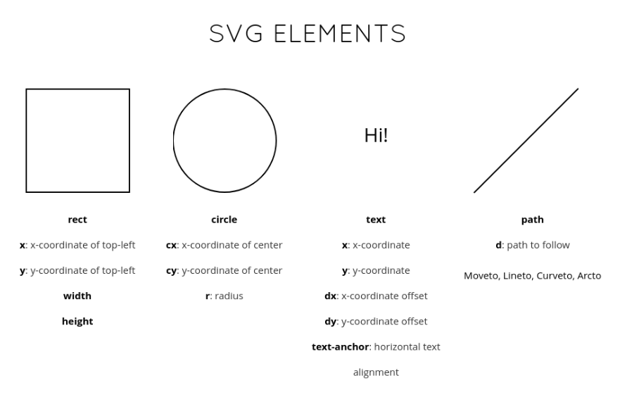
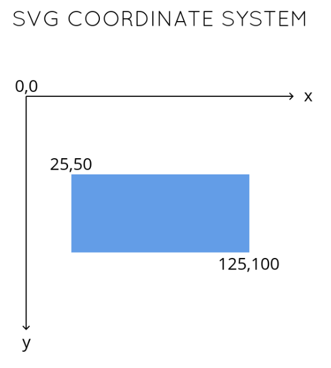

# Data Visualization for React Developers

## Introduction

D3's learning curve:
**Enter-update-exit** is basically what the React virtual DOM is doing under the hood.

## The Basic Chart Types

#### Data Types

- Categorical (genres)
  - **Bar chart**
    - Domain: categorical
    - Range: quantitative
  - **Histogram**
    - Domain: quantitative bins
    - Range: frequency of quantitative bin
- Ordinal (t-shirt sizes, like categorical but there is an order)
- Quantitative (temperatures, movie metascores from 0-100)
- Temporal (dates)
- Spatial (cities, countries, regions)

#### Basic Charts and when to use them

- **Scatter plot**
- **Line chart**
- **Tree**
  - for one-directional relationships
- **Node-link diagram** (her personal favorite)
  - shows connections between multiple entities
- **Chloropleth** (spatial):
  - like showing candidate donor distribution across the U.S.
- Datawrapper Academy

## The Making of a Chart

### Introduction to SVG

With a **path**, you can draw *literally any shape you want*. Examples:

- bl.ocks.org/sxywu
- sxywu.com/filmflowers

### Weather Data Chart Examples

## Rendering with React

## The Finishing Touches

