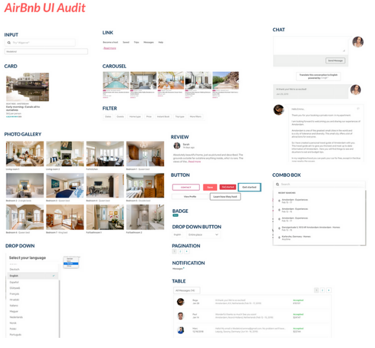
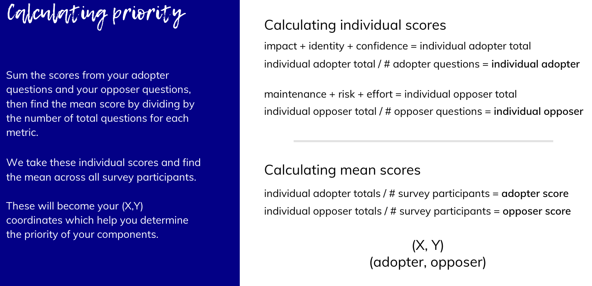
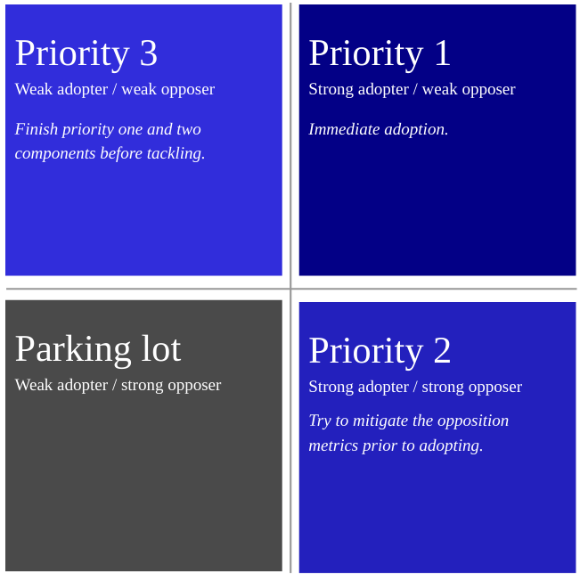

# Design Systems with React & Storybook

### What is a design system?

- UI Kit
- Color
- Typography
- Grid
- Iconography

To an engineer:

- component library
- style guide

**_A design system is <u>all</u> of these things._**

**Design systems matter because everyone, regardless of circumstance, should be able to achieve the same results from your application**.

They also help with onboarding new team members.

### A Practical Example

#### How many buttons is that?

3 default buttons (primary, secondary, tertiary)

3 status buttons (error, warning, status)

4 status icon buttons

4 default icon buttons

14 buttons x 5 states (i.e. hover) x 2 sizes = **140 button combinations _per theme_**

### Drawbacks of Design Systems

#### Time

- Design systems take awhile to build

### The Three Pillars of Design Systems

#### How much does that cost...?

\$300 per hour $ \times $ 200 hours = \$20,000

50 teams $ \times $ \$20,000 = \$1 million... **_on buttons_**

- **Design Language**: the personality of a brand and its corresponding design assets.
- **Component Library**: can be built with many different frameworks and libraries
  - Vue, React, Angular, Ember, etc.
- **Style Guide**: the documentation for the design language, UI Kit, and component library.

### Building a Design System

1. Define your design principles
   1. How do you want customers to feel?
   2. Example: **"Bold, optimistic, and practical."**
2. Conduct a UI audit
   1. Compile all components, in every variation and state, in one place.
   2. Group these components by functionality.
   3. 
   4. Prioritize the components which have the highest impact on unification of your products and are easily achievable.
3. Create your checklists
4. Define your workflows

| Adoption metrics                                           | Opposition metrics                                          |
| ---------------------------------------------------------- | ----------------------------------------------------------- |
| Metrics which indicate that a component has high priority. | Metrics which indicate that a component has lower priority. |
| **Impace, Identity, Confidence**                           | **Maintenance, Risk, Effort**                               |

#### Calculating priority





### Design System Checklist

- **Accessibility**: Can all users, regardless of circumstance, use this component?
- **Interaction**: How should a component respond when a user interacts with it?
- **Context**: How and where should this component be used?
- **Completion**: Are all states, including neutral, hover, focus, and disabled, defined?
- **Content**: What type of content does this component rely upon?
- **Customization**: Are aspects of this component customizable? If so, how?
- **Screen Resolution**: How does this component look on varying screen resolutions?

### Common mistakes

- **Only scale when needed**: While the ability to scale is good, building your components for scale can be a detriment.
- **Educating before building**: Educating your teams about your design system can negatively impact your rapport if there's nothing to use.
- **Not discussing workflow**: If you are going to be collaborating on a design system, it's important to come to terms on a working model.
- **Not documenting decisions**: Documenting decisions will save you and your team the headache of having to explain to each stakeholder why you're doing something a certain way.

## Foundations of Design

### Color Overview

#### Additive color mixing

- Colors start black and become white as more red, blue, or green are added.
- TVs and computer monitors use additive color mixing.

#### Subtractive color mixing

- Subtractive colors start as white and as filters are added takes on the appearance of color.
- Photos and magazines use subtractive colors.

#### Color Types

#### Primary colors

- Colors which cannot be created by combining other colors.

#### Secondary colors

- Secondary colors result from mixing two primary colors.

#### Tertiary colors

- Tertiary colors are created by combining a secondary color with a primary color. There are six teritary colors.

### The color wheel

#### Monochromatic

- created by establishing variations on a shade of a single color.

#### Complementary

- created by selecting two colors directly opposite of each other on the color wheel.

#### Analogous

- created by selecting three colors which are side by side on the color wheel.

#### Triadic

- created by selecting three evenly-spaced colors from around the color wheel.

### Color Terminology

#### Hue

- any color on the color wheel.

#### Saturation

- the intensity or purity of a color.

#### Luminance

- The amount of brightness or light, in a color.

#### Shade

- created by incorporating black to a base hue, which darkens the color.

#### Tint

- created by adding white to a base hue, which lightens the color.

#### Tone

- created by combining black or white (gray) with a base hue.
- Tones are subtle variations of the original color.

### Color Semantics

- psychology of colors

#### Red

- Fire, Violence, War, Love, Passion

#### Orange

- Vibrant, Earth, Autumn, Change, Movement, Creativity

#### Yellow

- Happiness, Sunshine, Deceit, Cowardice, Cheer

#### Green

- Growth, Renewal, Abundance, Envy, Jealousy

#### Blue

- Sadness, Calmness, Responsibility, Reliability, Peace

#### Purple

- Luxury, Royalty, Wealth

#### Black

- Power, Elegance, Formality, Evil, Death, Mystery

#### White

- Purity, Cleanliness, Virtue, Goodness

#### Gray

- Moodiness, Depression, Conservative, Formal, Modern

#### Brown

- Dependability, Reliability, Earthiness

### Color Values

#### Hex

- the base-16 representation of a color where each value can range from 0-9 and A-F.

#### RGB

- The additive color mixing model which allows you to create colors by mixing red, green, and blue light sources.

#### RGBA

- The additive color mixing model which allows you to create colors by mixing red, green, and blue light sources, but incorporates a fourth value, alpha which represents opacity.

#### CYMK

- The subtractive color mixing model used in print design.

### Fonts

- **Rem**: multiply base pixel for fonts by factor:
  - example: `1.2 rem` on base `16 px` font would multiply 1.2 by 16
  - 

### Buttons

**Horizontal padding**: keep your buttons responsive by adding horizontal padding.

undraw website

thenounproject.com

## Animating Components

### Micro-interactions

- small animations whose purpose is to delight the user by providing feedback in regards to a task or inform the user about the status of a process or task.
- examples:
  - progress bar, task status, state change, draw attention, create habits, delight users, make mundane tasks fun

#### Tips for building animations

- they must be accessible
- be intentional with the placement of your animations.
- make your animations feel as though they're part of the real world
- never make your users wait for an animation

#### react-spring

- `useSpring`:

  ```javascript
  import React, { useState } from "react";
  import { animated, useSpring } from "react-spring";
  
  const FadeIn = () => {
    const [showText, setShowText] = useState(true);
    const animation = useSpring({
      opacity: showText ? 1 : 0,
      transform: showText ? `translateY(0)` : `translateY(-30%)`
    });
    return (
      <div>
        <button onClick={() => setShowText(!showText)}>Toggle animation</button>
        <animated.p style={animation}>Animate me on click!</animated.p>
      </div>
    );
  };
  
  export default FadeIn;
  ```

  

### `useTransition`

