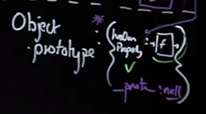

# JavaScript the Hard Parts

Presenter: Will Sentance

## JavaScript Principles

**Thread of Execution**: JavaScript goes line-by-line and runs/'executes' each line

Data is saved, like strings and arrays, so we can use that data later in its memory

### Functions

**Execution context**: created to run the code of a function -- has 2 parts (we've already seen them!)

- Thread of execution
- Memory

```javascript
const num = 3;
function multiplyBy2 (inputNumber) {
    const result = inputNumber*2;
    return result;
}

const output = multiplyBy2(num);
const newOutput = multiplyBy2(10);
```


`output = multiplyBy2(3)`

|                 | *Local* Memory      |
| --------------- | ------------------- |
|                 | `inputNumber` : `3` |
|                 | `result`: `6`       |
| `return result` |                     |

The `return` returns the *value* stored in `result`.

### Call Stack

- JavaScript keeps track of what function is currently running (where's the thread of execution)
- Run a function - add to call stack
- Finish running the function - JS removes it from call stack
- Whatever is top of the call stack - that's the function we're currently running

The key word `return` tells JavaScript to move on from the currently running function to the next function in the call stack. Everything else stored in memory inside the function is deleted.

`global()` is always at the bottom of the call stack in JavaScript

**3 core concepts of JavaScript:**

- Memory
- Thread of Execution
- Call stack


## Functions and Callbacks

### Generalized Functions

```javascript
function tenSquared() {
    return 10*10;
}

tenSquared() // 100
```

What about `nineSquared()`? `eightSquared()`?

We are breaking the DRY principle.

**We can generalize the function to make it reusable**

```javascript
function squareNum(num) {
    return num*num;
}
squareNum(10); // 100
squareNum(9); // 81
squareNum(8); // 64
```

Higher order functions allow use to leave some of our functionality unstated.

### Repeating Functionality

```javascript
function copyArrayAndMultiplyBy2(array) {
    const output = [];
    for (let i = 0; i < array.length; i++) {
        output.push(array[i] * 2);
    }
    return output;
}

const myArray = [1,2,3];
const result = copyArrayAndMultiplyBy2(myArray);
```

| Global Memory                                            |
| -------------------------------------------------------- |
| `copyArrayAndMultiplyBy2` : `| function |` (placeholder) |
| `myArray` : `[1,2,3]`                                    |
| `result` :                                               |

New Execution context:
`result = copyArrayAndMultiplyBy2([1,2,3])`

|      | Local Memory         |
| ---- | -------------------- |
|      | `array` : `[1,2,3]`  |
|      | `output` : `[2,4,6]` |

Back in **Global Memory**:

| Global Memory        |
| -------------------- |
| `result` : `[2,4,6]` |


| Call Stack                  |
| --------------------------- |
|                             |
| `copyArrayAndMultiplyBy2()` |
| `global()`                  |

### Higher Order Functions

We could generalize our function - So we pass in our specific instruction only when we run `copyArrayAndManipulate`!

We achieve this by passing in a function to `copyArrayAndManipulate()` as a parameter.

```javascript
function copyArrayAndManipulate(array, instructions) {
    const output = [];
    for (let = 0; i < array.length; i++) {
        output.push(instructions(array[i]));
    }
    return output;
}
function multiplyBy2(input) { return input * 2; }
const result = copyArrayAndManipulate([1,2,3], multiplyBy2);
```

- we are passing in a link, or reference, to the data/function from global memory

### Callbacks & Higher Order Functions

**How was this possible?**

Functions in JavaScript = first class objects (have all the features of an object in JS)

They can co-exist with and can be treated like any other JS object

1. Assigned to variables and properties of other objects
2. Passed as arguments into functions
3. Returned as values from functions

Closure, which will be discussed later: the ability to declare data/functions inside a function to be used/accessed outside the function, outside its scope

**Higher-order functions**: Takes in a function or passes out a function

#### Callbacks and Higher order functions simplify our code and keep it DRY

**Declarative readable code**: Map, filter, reduce - the most readable way to write code to work with data

**Codesmith & pro interview prep**: One of the most popular topics to test in interview both for Codesmith and mid/senior level job interviews

**Asynchronous JavaScript**: Callbacks are a core aspect of `async` JavaScript, and are under-the-hood of promises, `async`/`await`

### Arrow Functions

## Closure

### Closure Introduction

**Closure**

- Closure is the most esoteric of JavaScript concepts
- Enables powerful pro-level functions like 'once' and 'memoize'
- Many JavaScript design patterns including the module pattern use closure
- Build iterators, handle partial application and maintain state in an asynchronous world

**Functions get a new memory every run/invocation**

Suppose we want data to persist inside functions between executions.

It all starts with us **<u>returning a function from another function</u>**

**State**: live data that is being stored in a function at a particular moment in time

State and all data inside a function is deleted after execution, **except for the return value**

This can enable only allowing a function to run once and disallowing a function from running more than once.

### Returning Functions

#### Functions can be returned from other functions in JavaScript

```javascript
function createFunction() {
    function multiplyBy2(num) {
        return num*2;
    }
    return multiplyBy2;
}

const generatedFunc = createFunction();
const result = generatedFunc(3);
```

A function's definition is a value stored in memory.

Our code returns the function definition of `multiplyBy2` and stores it in global memory inside a `const` of `generatedFunc`

Then, it defines a `const` of `result` and stores the value of the **execution** of `generatedFunc(3)`.

**<u>Remember, parentheses distinguish a function from a label</u>**

After JavaScript runs the line `const generatedFunc = createFunction();`, `generatedFunc` has **zero** relationship with `createFunction()`.

`generatedFunc` is the result of the one-time running of `createFunction()` that turned out to be the definition of the function `multiplyBy2`.

So `generatedFunc` is now equal to the definition of `multiplyBy2` function.

**This is the <u>mission-critical</u> part of closure**.

### Nested Function Scope

#### Calling a function outside of the function call in which it was defined

```javascript
function outer() {
    let counter = 0;
    function incrementCounter() { counter ++; }
    return incrementCounter;
}

const myNewFunction = outer();
myNewFunction();
myNewFunction();
```

- `incrementCounter()` returns all of the local data surrounding it, so `counter` is accessible
  - like it is wearing a backpack with local data inside

### Function Closure

Call stack starts with `global()` and `outer()` above it. Then, `outer()` is removed. Then, `myNewFunction()` is pushed onto the stack, then removed. Finally, once again `myNewFunction()` is pushed onto the call stack and removed.

How does a function grab surrounding data for it to be accessed later?

It gets a **hidden property** (connoted with double brackets `[[]]`) called `[[scope]]`.

- **this is what the "backpack" is**

We cannot access it this way:

- `myNewFunction.scope`

**This is the most elegant feature of JavaScript**

- it gives us permanent and private data

### Closure Technical Definition & Review

Book he highly recommends: *If Hemingway Wrote JavaScript* by Angus Croll

He calls the **Local Memory** the **Closed Over Variable Environment (C.O.V.E.)**

JavaScript is a **lexically-scoped language**, as opposed to a *dynamically-scoped* language.

- the data available to a declaration depends on **where the declaration was saved**

- it is Persistent, Lexically or Static, Scoped, Referenced, Data (**P.L.S.R.D.**)
  - the **Backpack**
  - commonly known as **Closure**, but is not entirely accurate as it defines imprecisely

#### What can we call this 'backpack'?

- Closed over 'Variable Environment' (C.O.V.E.)
- Persistent Lexical Scope Referenced Data (P.L.S.R.D.)
- 'Backpack'
- 'Closure'

The 'backpack' (or 'closure') of live data is attached `incrementCounter` (then to `myNewFunction`) through a hidden property known as `[[scope]]` which persists when the inner function is returned out.

### Multiple Closure Instances

#### Individual backpacks

If we run `outer` again and store the returned `incrementCounter` function definition in `anotherFunction`, this new `incrementCounter` function was created in a new execution context and therefore has a brand new independent backpack.

### Practical Applications

#### Closure gives our functions persistent memories and entirely new toolkit for writing professional code

**Helper functions**: Everyday professional helper functions like `once` and `memoize`

- **memoization**: say you have a task to find the n<sup>th</sup> prime number, if your application has already run it, we want the function to have a backpack with a key of the original input with a value of its answer
  - next time we run the function, we check if it was run in the backpack, and if it was run, we just retrieve it from the backpack

**Iterators and generators**: Which use lexical scoping and closure to achieve the most contemporary patterns for handling data in JavaScript

- a very elegant way of accessing data, not like a `for` loop
- **iterators**: each run gives you the next item, tracked inside the backpack on the underlying data
- **generators**: you can come back to running a function, continuing it, using the data stored in the backpack

**Module pattern**: Preserve state for the life of an application without polluting the global namespace

- it protects state inside a backpack

**Asynchronous JavaScript**: Callbacks and Promises rely on closure to persist state in an asynchronous environment

## Asynchronous JavaScript

### Single Threaded Execution Review

#### Promises, Async & the Event Loop

- Promises - the most significant ES6 feature
- Asynchronicity - the feature that makes dynamic web applications possible
- The event loop - JavaScript's triage
  - JS' way of teeing up what is running and what will run next
- Microtask queue, Callback queue and Web Browser features (APIs)

#### A reminder of how JavaScript executes code

```javascript
const num = 3;
function multiplyBy2 (inputNumber) {
    const result = inputNumber*2;
    return result;
}

const output = multiplyBy2(num);
const newOutput = multiplyBy2(10);
```

### Asynchronicity in JavaScript

#### Asynchronicity is the backbone of modern web development in JavaScript yet...

JavaScript is:

- Single threaded (one command runs at a time)
- Synchronously executed (each line is run in order the code appears)

So what if we have a task:

- Accessing Twitter's server to get new tweets that takes a long time
- Code we want to run using those tweets

**Challenge**: We want to wait for the tweets to be stored in tweets so that they're there to run displayTweets on - but no code can run in the meantime

#### Slow function blocks further code running

```javascript
const tweets = getTweets("http://twitter.com/will/1")

displayTweets(tweets)

console.log("I want to runnnn!")
```

#### JavaScript is not enough - We need new pieces (some of which aren't JavaScript at all)

Our core JavaScript engine has 3 main parts:

- **Thread of execution**
- **Memory/variable environment**
- **Call stack**

We need to add some new components:

- Web Browser APIs/Node background APIs
- Promises
- Event loop, Callback/Task queue and micro task queue

### Asynchronous Browser Features

We typically run JavaScript exclusively in a browser

The JavaScript engine is part of the Web Browser

Other features of Web Browser that JavaScript does not have:

- dev tools
- web sockets 
- console (`console`)
- make network requests (`fetch()`, previously known as `XHR`)
- HTML DOM (`document`)
- Timer (`SetTimeout()`)

The Web Browser is a composite application that includes the JavaScript engine along with many important and useful features

JavaScript is the programming language we can use to interact with the features of the Web Browser.

Will's **facade functions**: they look like JavaScript functions, but they are not and are instead Web Browser functions being called in JavaScript.

**A big part of what we are doing in JavaScript is not JavaScript at all. They are features of the Web Browser being called using JavaScript**.

### Web API Example

```javascript
function printHello() { console.log("Hello"); }

setTimeout(printHello, 1000);

console.log("Me first!");
```


| JavaScript Features | Web Browser Features |
| ------------------- | -------------------- |
|                     |                      |

### Web API Rules

#### We're interacting with a world outside of JavaScript now - so we need rules

```javascript
function printHello() { console.log("Hello"); }
function blockFor1Sec() { // blocks in the JavaScript thread for 1 sec
}

setTimeout(printHello,0);

blockFor1Sec();
console.log("Me first!");
```

We could block JavaScript code from running by using a `for` loop among others.

### Callback Queue & Event Loop

You could console log a million times and the queue would never dequeue `printHello`, it would never even grab it and put it on the call stack.

**Event loop**: check constantly if the call stack is empty (including `global()`), and if it is empty, if there is anything in the callback queue, run whatever is in the queue

## Promises

### Promises Introduction

#### ES6+ Solution (Promises)

Using two-pronged 'facade' functions that both:

- Initiate background web browser work and
- Return a placeholder object (promise) immediately in JavaScript

Promises help with being able to keep track of memory in JavaScript, like retrieving data in the background, and keeping track of it.

`fetch` is the new school style of handling network requests in JS, rather than the old school method of `xhr`.

`fetch` calls the web browser features while simultaneously returning a promise that populates data we need, it is dual-pronged.

### Promises Example: fetch

```javascript
function display(data) {
    console.log(data)
}

const futureData = fetch('https://twitter.com/will/tweets/1')
futureData.then(display);

console.log("Me first!");
```

### Promises Example: then

The empty array `onFulfilled` that is returned by `fetch` can have a function or code to run immediately after data is returned from the fetch call.

- it is a hidden property, but JS gives us an option to add to it: `then`

### Web APIs & Promises Example: fetch

#### But we need to know how our promise-deferred functionality gets back into JavaScript to be run

#### *then* method and functionality to call on completion

- Any code we want to run on the returned data must also be saved on the promise object
- Added using .then method to the hidden property 'onFulfilment'
- Promise objects will automatically trigger the attached function to run (with its input) being the returned data

### Web APIs & Promises Example: Microtask Queue

There is also another array in the promise object to handles errors called `onRejection`. You pass in a function to handle the rejection as a second argument inside `.then`.

#### We have rules for the execution of our asynchronously delayed code

- Hold promise-deferred functions in a microtask queue and callback function in a task queue (Callback queue) when the Web Browser Feature (API) finishes
- add the function to the Call stack (i.e. run the function) when:
  - call stack is empty & all global code run (Have the Event Loop check this condition)
- Prioritize functions in the microtask queue over the Callback queue

## Classes & Prototypes

### Class & OOP Introduction

#### Classes, Prototypes - Object Oriented JavaScript

- An enormously popular paradigm for structuring our complex code
- Prototype chain - the feature behind-the-scenes that enables emulation of OOP but is a compelling tool in itself
- Understanding the difference between `__proto__` and prototype
- The `new` and `class` keywords as tools to automate our object & method creation

#### Core of development (and running code)

1. Save data (e.g. in a quiz game the scores of user1 and user2)
2. Run code (functions) using that data (e.g. increase user 2's score)

Easy! So why is development hard?

In a quiz game I need to save lots of users, but also admins, quiz questions, quiz outcomes, league tables - all have data and associated functionality

In 100,000 lines of code

- Where is the functionality when I need it?
- How do I make sure the functionality is only used on the right data!

#### That is, I want my code to be:

1. Easy to reason about

But also

2. Easy to add features to (new functionality)
3. Nevertheless efficient and performant

The Object-oriented paradigm aims is to let us achieve these three goals

### Object Dot Notation

### Factory Functions

#### Creating user3 using `Object.create`

`Object.create` is going to give us fine-grained control over our object later on

```javascript
const user3 = Object.create(null);

user3.name = "Eva";
user3.score = 9;
user3.increment = function() {
  user3.score++;
};
```

Our code is getting repetitive, we're breaking our DRY principle. And suppose we have millions of users! What could we do? **Generalize into a function**.

### Factory Functions Example

#### Solution 1. Generate objects using a function

```javascript
function userCreator(name, score) {
    const newUser = {};
    newUser.name = name;
    newUser.score = score;
    newUser.increment = function() {
        newUser.score++;
    }
    return newUser;
}

const user1 = userCreator("Will", 3);
const user2 = userCreator("Tim", 5);
user1.increment();
```


**Problems**: Each time we create a new user we make space in our computer's memory for all our data and functions. But our functions are just copies.

Is there a better way?

**Benefits**: It's simple and easy to reason about!

### Prototype Chain

#### Solution 2: Using the prototype chain

Store the increment function in just one object and have the interpreter, if it doesn't find the function on `user1`, look up to that object to check if it's there.

Link `user1` and `functionStore` so the interpreter, on not finding `.increment`, makes sure to check up in `functionStore` where it would find it.

Make the link with `Object.create()` technique.

```javascript
function userCreator(name, score) {
    const newUser = Object.create(userFunctionStore);
    newUser.name = name;
    newUser.score = score;
    return newUser;
};

const userFunctionStore = {
    increment: function() { this.score++; },
    login: function() { console.log("Logged in"); }
};

const user1 = userCreator("Will", 3);
const user2 = userCreator("Tim", 5);
user1.increment();
```

**This is the absolute core**.

### Prototype Chain Example: Prototypal Link

`const newUser = Object.create(userFunctionStore)`:

- inside the execution context of `userCreator`, this line creates a `const newUser` equal to an empty object, *without any properties*, although it does have an intimate link to them in `userFunctionStore`
- there is a hidden property that enables the link: `__proto__` that has stored in it a link to `userFunctionStore`
  - JS has a **prototypal feature**, which means it does not panic when it does not find a property on an object, it goes up the prototype chain until it finds it

### Prototype Chain Example: Implicit Parameters

- the argument passed into `Object.create()` is stored in the hidden `__proto__` property
- you can see this in dev tools, while you cannot see `onFulfilled` from Promises

### hasOwnProperty Method



### `this` Keyword

### Arrow Function Scope & `this`

### Prototype Chain Review

#### Solution 2: Using the prototype chain

**Problems**: No problems! It's beautiful. Maybe a little long-winded.

Write this every single time - but it's 6 words!

```javascript
const newUser = Object.create(userFunctionStore);
...
return newUser;
```

**Benefits**: Super sophisticated but not standard.

### `new` Keyword

- the `new` keyword will create an object automatically and return it
- it will also link the `__proto__` hidden property to

#### Solution 3 - Introducing the keyword that automates the hard work: `new`

When we call the function that returns an object with `new` in front we automate 2 things:

1. Create a new user object
2. Return the new user object

```javascript
const user1 = new userCreator("Eva", 9)
const user2 = new userCreator("Tim", 5)
```

But now we need to adjust how we write the body of `userCreator` - how can we:

- Refer to the auto-created object?
- Know where to put our single copies of functions?

The object created is called `this` (as opposed to how we did it before `newUser`).

#### Interlude - functions are both objects and functions

```javascript
function multiplyBy2(num) {
    return num*2;
}

multiplyBy2.stored = 5
multiplyBy2(3) // 6

multiplyBy2.stored // 5
multiplyBy2.prototype // {}
```

We could use the fact that all functions have a default property `prototype` (not a hidden property, and its default value is `{}`) on their object version, (itself an object) - to replace our `functionStore` object.

#### The `new` keyword automates a lot of our manual work

```javascript
function userCreator(name, score) {
    this.name = name;
    this.score = score;
}

userCreator.prototype.increment = function() { this.score++; };
userCreator.prototype.login = function() { console.log("login"); };

const user1 = new userCreator("Eva", 9)

user1.increment()
```

`userCreator` is declared with a value of a function definition, and also an object with a property `prototype` inside with the value of an empty object `{}`.

#### Solution 4: The class 'syntactic sugar'

```javascript
class UserCreator {
    constructor (name, score) {
        this.name = name;
        this.score = score;
    }
    increment(){ this.score++; }
    login() { console.log("login"); }
}

const user1 = new UserCreator("Eva", 9);
user1.increment();
```

**Benefits**:

Emerging as a new standard

Feels more like style of other languages (e.g. Python)

**Problems**:

99% of developers have no idea how it works and therefore fail interviews

But you will not be one of them!