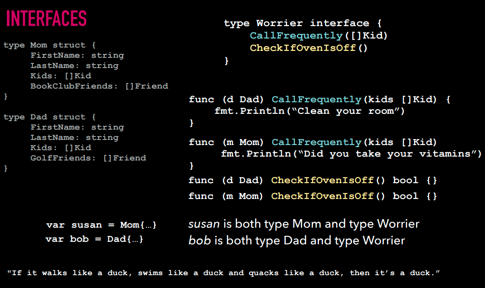

# Go for JavaScript Developers

By Brenna Martenson

https://github.com/martensonbj/fem-intro-to-go

**Go** was built in 2007 at Google

1. Fast compile times
2. Ease of development
3. Fast execution

#### Enter: Go

- Fast compile time
- Lots in common with C
- Reduces complexity of C
- Wicked fast build time

It does this:

- Lightweight type system
- Concurrency
- Automatic garbage collection
- Strict dependencies
- Convention

## Table of Contents

### Go Documentation Practice

#### Exercise 1A: Find Stuff

Answer the following questions

1. Read about `for loops` in the _Effective Go_ document

   1. What kind of loop doesn't exist in Go? **There is no `do-while` loop in Go. Go unifies `for` and `while`.**

      ```go
      sum := 0
      for i:= 0; i < 10; i++ {
          sum += i
      }
      ```

2. Read about the `fmt` *package*

   1. What does `fmt.Println()` return? **Returns a integer of the number of bytes written and any write-error encountered. <u>It does not print out a string, but bytes and any write-errors</u>.**

3. Find a *blog post* about the recent release of Go 1.13

   1. What are some of the new features?
      - The `go` command now downloads and authenticates modules using the Go module mirror and Go checksum database by default
      - Improvements to number literals
      - Error wrapping
      - TLS 1.3 on by default
      - Improved modules support

### Go vs JavaScript Comparison

| Go                                                  | JavaScript                           |
| --------------------------------------------------- | ------------------------------------ |
| Strongly Typed: String, Float, Int, Byte, Struct... | Dynamically typed (think Typescript) |
|                                                     |                                      |
|                                                     |                                      |
|                                                     |                                      |

<table>
    <tr>
        <th colspan="2" style="text-align:center;">Typing</th>
    </tr>
    <tr>
        <td>Go</td>
        <td>JavaScript</td>
    </tr>
    <tr>
        <td>
            Strongly Typed
            <ul>
                <li>String, Float, Int, Byte, Struct...</li>
            </ul>
        </td>
        <td>
            Dynamically typed
            <ul>
                <li>(Typescript)</li>
            </ul>
        </td>
    </tr>
    <tr>
        <th colspan="2" style="text-align:center;">Structures</th>
    </tr>
     <tr>
        <td>
            Structs, Pointers, Methods, Interfaces
            <ul>
                <li>Define behavior and attributes</li>
            </ul>
        </td>
         <td>
            ES6 Classes (kind of)
             <ul>
                <li>Define behavior and attributes</li>
            </ul>
        </td>
    </tr>
    <tr>
        <th colspan="2" style="text-align:center;">Error handling</th>
    </tr>
    <tr>
        <td>
            Explicit
            <ul>
                <li>Sad path won't handle itself</li>
            </ul>
        </td>
        <td>
            Built in
            <ul>
                <li>You'll get yelled at regardless</li>
            </ul>
        </td>
    </tr>
    <tr>
        <th colspan="2" style="text-align:center;">Multi-tasking</th>
    </tr>
    <tr>
        <td>
            Multi-threaded
            <ul>
                <li>Concurrency, Goroutines, Sync</li>
            </ul>
        </td>
        <td>
            Single-Threaded
            <ul>
                <li>Callbacks, async await, sagas, sadness</li>
            </ul>
        </td>
    </tr>
    <tr>
        <th colspan="2" style="text-align:center;">Opinionated-ness</th>
    </tr>
    <tr>
        <td>
            Strong Opinions
            <ul>
                <li>Convention, built in, tooling and linters</li>
                <li>Looking another person's <code>go</code> code should be similar to yours.</li>
            </ul>
        </td>
        <td>
            Fluid Opinions
            <ul>
                <li>Subjective to the mood that day</li>
            </ul>
        </td>
    </tr>
    <tr>
        <th colspan="2" style="text-align:center;"></th>
    </tr>
    <tr>
        <td>
            <ul>
                <li></li>
            </ul>
        </td>
        <td>
            <ul>
                <li></li>
            </ul>
        </td>
    </tr>
</table>

### Anatomy of a Go File

Every `go` program needs both a package `main` and a `main` function.

To run program: `go run <FILENAME>.go`

## Printing

### Printing with `fmt`

`go` playground: https://play.golang.org

`fmt.Printf("Hello, my name is %s", "Austin")`

### Printing Exercise

To find info on a package: `go doc fmt`

To get info on what a function does: `go doc fmt.Println`

## Basic Go Syntax

### Types

| Type    | Syntax                                                  | Examples              |
| ------- | ------------------------------------------------------- | --------------------- |
| Integer | `var age int = 21`                                      | `1`, `2`, `44`        |
| Float   | `var gpa float64 = 4.0`                                 | `1.5`, `3.14`, `2100` |
| String  | `var plant string = "ficus"` (always double quotes)     | `"ficus"`             |
| Boolean | `var canBrink bool = age > 21`, `&& || ! < <= >= == !=` | `true`, `false`       |

#### `Typeof()`

To determine the type of a variable:

```go
import "fmt"
import "reflect"

func main() {
    var x = "What am I"
    fmt.Println(reflect.TypeOf(x))
}
```

Also, `%v` is a generic verb for "value", `%T` is a verb for Type:

```go
var x = "What am I"
fmt.Printf("The type of `%v` is %T", x, x)
```

### Variables

```go
package main

import "fmt"

func main() {
    var name string = "Beyonce"
    fmt.Println(name)
}
```

- you can leave out the type definition if it is easy for the `go` compiler to determine the type

We can leave it unassigned, but we **must specify the type**: `var name string`

Can do multiple assignments: `var name, name2 = "Beyonce", "Lizzo"`

Has to be within functions: `name := "Beyonce"`

- the `:` assigns the value and the type

### Control Structures

#### If Statements

`if someVar > 10 { }`

- parantheses are not required

#### Switch

```go
  var city string

  switch city {
  case "Des Moines":
      fmt.Println("You live in Iowa")
  case "Minneapolis,", "St Paul":
      fmt.Println("You live in Minnesota")
  case "Madison":
      fmt.Println("You live in Wisconsin")
  default:
      fmt.Println("You're not from around here.")
  }
```

#### For loops

```go
func main() {
    
    for i := 1; i <= 100; i++ {
        fmt.Println(i)
    }
    
    var mySentence = "This is a sentence."
    
    for index, letter := range mySentence {
        fmt.Println("Index:", index, "Letter:", letter)
    }
}
```

- can use `_` if you do not need to use a value in `go`

## Complex Structures

### Functions & Variadic Functions

```go
func printAge(age int) int {
    fmt.Println(age)
    return age
}
```

Multiple return values:

```go
func printAge(age int) (int, int) {
    fmt.Println(age)
    return 0, age
}
```

Named returned values:

```go
func printAge(age int) (ageOfSally int, ageOfBob int) {
    ageOfBob = 21
    ageOfSally = 16
    return
}
```

- `go` instantiates placeholders so we do not need to instantiate variables like `ageOfBob` and `ageOfSally`

Collection of integers as argument:

```go
func printAge(ages ...int) int {
    ...
}
```

Also:

```go
func printAge(age1, age2, age3 int) int {
    ...
}
```

### Functions exercise

Exercise 4a: return average of 3 numbers

```go
package main

import "fmt"

func main() {
	fmt.Println(average(3, 6, 9)
}

func average(nums ...float32) (averageVal float32) {

	for _, num := range nums {
		averageVal += num
	}
	return averageVal / 3
}
```

Exercise 4b: use variadic function that takes in an unknown number of arguments

Same as above

### Arrays

In `go`:

```go
// initialize an empty array
var scores = [5]float64

// Eventually this array can ONLY contain floats and a length of 5:
[float64, float64, float64, float64, float64]
```

Whereas in `JavaScript`:

```javascript
// Initialize an empty array
const grabBag = []

// Eventually this array could have values that represent these types:
const grabBag = [string, int, boolean, float64]

// or
const grabBag = [string, string, string, string, integer, boolean, float64]
```

#### Arrays: Defining Values

```go
var scores [5]float64 = [5]float64{9, 1.5, 4.5, 7, 8}
scores := [5]float64{9, 1.5, 4.5, 7, 8}
scores := [...][5]float64{9, 1.5, 4.5, 7, 8}
```

### Make

- having to know the length of the array when you instantiate it seems problematic:
  - **enter: the slice**
  - **slice**: segments of an underlying array
  - **(+ Make)**: must be associated with space in memory
    - "initializes and allocates space in memory for a slice, map, or channel"

```go
var mySlice []int = make([]int, 5)
```

Set 5 elements, with the capacity (`cap` method in `go`):

```go
var mySlice []int = make([]int, 5, 10)
fmt.Println(len(mySlice)) // outputs 5
fmt.Println(cap(mySlice)) // outputs 10
```

Can also do with an array of strings:

```go
fruitArray := [5]string{"banana", "pear", "apple", "kumquat", "peach"}
splicedFruit := fruitArray[1:3]
fmt.Println(splicedFruit) // outputs [pear, apple]
```

### Slices

- if you append to an array past its capacity, `go` doubles the original array's capacity before appending

### Maps

- key, value pairs

```go
var userEmails map[int]string = make(map[int]string)
```

- unlike slices, we do not have to tell `make` the length

Also:

```go
userEmails := map[int]string{
    1: "user1@gmail.com",
    2: "user2@gmail.com"
}
```

To mutate, like JS:

```go
userEmails[1] = "user3@gmail.com"
```

`go` also provides a second return value of a boolean indicating whether there was something with that key:

```go
firstEmail, ok := userEmails[4]
fmt.Println(firstEmail, ok)
```

```go
if email, ok := userEmails[4]; ok {
    fmt.Println("email exists")
} else {
    fmt.Println("email doesn't exist")
}
```

- if `ok` is true, execute what is inside curly braces, if false, don't

**The method `delete()`**:

```go
delete(userEmails, 2)
```

### Complex Structures Exercise

### Complex Structures Solution

#### Part 1

1. Instantiate an array of scores
   - The array should have at least 5 elements of type `float64`
2. Write a function that calculates and returns the average score (also a float)
   - Use the `range` keyword

```go
package main

import (
	"fmt"
)

func average(numbers ...float64) float64 {
	total := 0.0
	for _, number := range numbers {
		total += number
	}
	return total / float64(len(numbers))
}

func main() {
	fmt.Println(average(10, 5, 7))
}
```

#### Part 2

1. Define a map that contains a set of pet names, and their corresponding animal type. i.e.: `"fido": "dog"`.
2. Write a function that takes a string argument and returns a boolean  indicating whether or not that key exists in your map of pets.

```go
package main

import "fmt"

var initialPets map[string]string = map[string]string {
    "fido": "dog",
    "penelope": "horse",
    "nancy": "cat",
}

func doesPetExist(petName string) bool {
    _, ok := initialPets[petName]
    return ok
}

func main() {
    pet := "spot"
	petExists := doesPetExist(pet)
	fmt.Println(petExists)
}
```

#### Part 3

1. Instantiate a slice that has an initial value of a collection of groceries.
2. Write a function that takes one or more groceries as strings and  appends them to the slice, printing out the resulting list of groceries.

```go
package main

import "fmt"

var initialGroceries = []string{"beans", "lemons", "chicken", "fruit"}

func addGroceryToList(newGroceries ...string) []string {
    foods := initialGroceries
    for _, g := range newGroceries {
        foods = append(foods, g)
    }
    
    return foods
}

func main() {
    groceryList := addGroceryToList("beets", "chocolate", "lime")
    fmt.Println(groceryList)
}
```

## Go Toolkit

### Tools & Commands

```
go run main.go

go install

go build

go fmt main.go

go list

go vet

go doc fmt.Println

go get golang.org/x/lint/golint

golint
```

`go list`: list out any packages we have established in our codebase

### Packages

- importing local packages:

  ```go
  package main
  
  import (
      "fmt"
      "fem-intro-to-go/05_toolkit/code/utils"
  )
  ```

- can also use an alias:

  ```go
  package main
  
  import (
      "fmt"
      math "fem-intro-to-go/05_toolkit/code/utils"
  )
  ```

- the only way to export functions is for them to start with a capital letter

### Testing

```go
package utils

import "testing"

func TestAverage(t *testing.T) {
    expected := 4
    actual := utils.average(1, 2, 3)
    
    if actual != expected {
        t.Errorf("Average was incorrect! Expected: %d, Actual: %d", expected, actual)
    }
}
```

### Unit Testing Exercise

## Structs

### Structs

```go
type User struct {
    ID int
    FirstName string
    LastName string
    Email string
}
```

Can also write:

```go
type User struct {
    ID int
    FirstName, LastName, Email string
}
```

Dot notation to access properties:

```go
var u User
u.ID
```

### Custom Types

### Accessing Nested Structs

### Modifying Struct Values Exercise

## Pointers

### Pointers

A **_pointer_** in Go is a variable that holds the **_memory location_** of that variable instead of a copy of its value.

```go
var name string
var namePointer *string

name = "Beyonce"
namePointer = &name
var nameValue = *namePointer
```

### Pass by Reference

```go
func changeName(n *string) {
	*n = strings.ToUpper(*n)
}

func main() {
	name := "Elvis"
	changeName(&name)
	fmt.Println(name)
}
```

- this produces output: `ELVIS`

```go
func changeName(n string) {
	n = strings.ToUpper(n)
}

func main() {
	name := "Elvis"
	changeName(name)
	fmt.Println(name)
}
```

- this fails to produce the output capitalizing all letters so output: `Elvis`

### Pointers Exercise

1. Define an instance of the User struct
2. Write a function called `updateEmail` that takes in a `*User` type
3. Update the user's email to something new
4. Call `updateEmail()` from `main()` and verify the updated email has persisted

```go
package main

import "fmt"

// User represents a user
type User struct {
	ID                         int
	FirstName, LastName, Email string
}

// Your code here

func updateEmail(u *User) {
	u.Email = "newemail@gmail.com"
}

func main() {
	fmt.Println("Pointers!")

	var u = User{
		1,
		"Austin",
		"Sandusky",
		"myaim@aim.com",
	}

	updateEmail(&u)

	fmt.Println(u)
}
```

## Error Handling

### Error Handling

Go treats every error as a **value** rather than an **exception**.

#### Error:

- indicates that something bad happened, but it might be possible to continue running the program
- ie: A function that intentionally returns an error if something goes wrong

#### Panic:

- happens at run time
- something happened that was fatal to your program and program stops execution
- ex: Trying to open a file that doesn't exist

An `error` is just a value in Go:

```go
package main

import (
  "errors"
  "fmt"
)

func isGreaterThanTen(num int) error {
    if num < 10 {
        return errors.New("something bad happened")
    }
    return nil
}

func main() {
    num := 9
    err := isGreaterThan10(num)
    if err != nil {
        fmt.Println(fmt.Errorf("%d is NOT GREATER THAN TEN", num))
    }
}
```

Using a `panic` halts execution:

```go
func main() {
    num := 9
    err := isGreaterThanTen(num)
    if err != nil {
        panic(err)
    }
}
```

The `Log` library:

```go
func main() {
    num := 9
    err := isGreaterThanTen(num)
    if err != nil {
        log.Fatalln(err)
    }
    
    fmt.Println(err)
}
```

This `openFile` method returns an `error` if it returns anything at all:

```go
func openFile() error {
    f, err := os.Open("missingFile.txt")
    if err != nil {
        return err
    }
    defer f.Close()
    return nil
}

func main() {
    num := 9
    if err := isGreaterThanTen(num); err != nil {
        fmt.Println(fmt.Errorf("%d is NOT GREATER THAN TEN", num))
    }
    
    if err := openFile(); err != nil {
        fmt.Println(fmt.Errorf("%v", err))
    }
}
```

### Panic, Defer & Recover

```go
f, err := os.Open(filename)
...
defer f.Close()

panic(err.Error())
```

`defer`:

- Last In, First Out structure
- executes all non-`defer` code, before going back to each `defer` and executing

#### Recover

- **Panic** is called during a run time error and fatally kill the program
- **Recover** tells Go what to do when that happens
  - returns what was passed to *panic*
- Recover must be paired with **defer**, which will fire even after a panic

Recovering from a `panic` example:

```go
package main

import (
	"fmt"
)

func recoverFromPanic() {
    // assigns value if there has been a panic
    if r := recover(); r != nil {
        fmt.Println("We panicked but everyone's fine.")
		fmt.Println(r)
    }
}

func doThings() {
	defer recoverFromPanic()
	for i := 0; i < 5; i++ {
		fmt.Println(i)
		if i == 2 {
			panic("PANIC!")
		}
	}
}

func main() {
	doThings()
}
```

Output:

```
0
1
2
We panicked but everyone's fine.
PANIC!
```

## Methods

### Methods

Difference between a method and a function:

- instead of accepting an argument as a `struct`, you are calling a method on an instance of that `struct`
- think like Object prototype methods in JavaScript
- To refactor into a method, instead of passing a `User` `struct` as an argument, we insert it as a `receiver` between the `func` keyword and the name of our slightly renamed `describe()` function.

```go
func (u *User) describe() string {
    desc := fmt.Sprintf("Name: %s %s, Email: %s, ID: %d", u.FirstName, u.LastName, u.Email, u.ID)
    return desc
}

func describeUser(u *User) string {
    desc := fmt.Sprintf("Name: %s %s, Email: %s, ID: %d", u.FirstName, u.LastName, u.Email, u.ID)
    return desc
}

func main() {
    user := User{ID: 1, FirstName: "Marilyn", LastName: "Monroe", Email: "marilyn.monroe@gmail.com"}
    
    desc := describeUser(user)
    
    desc := user.describe()
    
    fmt.Println(desc)
}
```

Transform `describeUser` function into a method:

Before:

```go
func describeUser(u *User) string {
    desc := fmt.Sprintf("Name: %s %s, Email: %s, ID: %d", u.FirstName, u.LastName, u.Email, u.ID)
    return desc
}

func main() {
    user := User{ID: 1, FirstName: "Marilyn", LastName: "Monroe", Email: "marilyn.monroe@gmail.com"}

	desc := describeUser(user)
	fmt.Println(desc)
}
```

After:

```go
func (u *User) describe() string {
    desc := fmt.Sprintf("Name: %s %s, Email: %s, ID: %d", u.FirstName, u.LastName, u.Email, u.ID)
    return desc
}

func main() {
    user := User{ID: 1, FirstName: "Marilyn", LastName: "Monroe", Email: "marilyn.monroe@gmail.com"}

    desc := user.describe()
	fmt.Println(desc)
}
```

- we are calling this on an **instance** of a `struct`, so nothing needs to be passed to it

Rule of Thumb: if you are concerned with state, use a method

### Methods Exercise

1. Refactor the `describeUser` code to be a method (this should be a repetition of what was just completed in the course).
2. Modify the `describeGroup` function to be a method called `describe()` that receives a `Group` type.
3. Modify the main function to reflect those changes

Before:

```go
package main

import "fmt"

// User is a user type
type User struct {
	ID                         int
	FirstName, LastName, Email string
}

// Group represents a set of users
type Group struct {
	role           string
	users          []User
	newestUser     User
	spaceAvailable bool
}

func describeUser(u User) string {
	desc := fmt.Sprintf("Name: %s %s, Email: %s", u.FirstName, u.LastName, u.Email)
	return desc
}

// func describeGroup
// => "This user group has 19 users. The newest user is Joe Smith. Accepting New Users: true"

func describeGroup(g *Group) string {

	if len(g.users) > 2 {
		g.spaceAvailable = false
	}

	desc := fmt.Sprintf("This user group has %d. The newest user is %s %s. Accepting New Users: %t", len(g.users), g.newestUser.FirstName, g.newestUser.LastName, g.spaceAvailable)
	return desc
}

func main() {
	u := User{ID: 1, FirstName: "Marilyn", LastName: "Monroe", Email: "marilyn.monroe@gmail.com"}

	u2 := User{ID: 2, FirstName: "Humphrey", LastName: "Bogart", Email: "humphrey.bogart@gmail.com"}

	u3 := User{ID: 2, FirstName: "Humphrey", LastName: "Bogart", Email: "humphrey.bogart@gmail.com"}

	g := Group{
		role:           "admin",
		users:          []User{u, u2, u3},
		newestUser:     u2,
		spaceAvailable: true,
	}

    fmt.Println(describeUser(u))
	fmt.Println(describeGroup(g))
	fmt.Println(g)
}

```

After:

```go
package main

import "fmt"

// User is a user type
type User struct {
	ID                         int
	FirstName, LastName, Email string
}

// Group represents a set of users
type Group struct {
	role           string
	users          []User
	newestUser     User
	spaceAvailable bool
}

func describeUser(u User) string {
	desc := fmt.Sprintf("Name: %s %s, Email: %s", u.FirstName, u.LastName, u.Email)
	return desc
}

func (u *User) describe() string {
	desc := fmt.Sprintf("Name: %s %s, Email: %s", u.FirstName, u.LastName, u.Email)
	return desc
}

// func describeGroup
// => "This user group has 19 users. The newest user is Joe Smith. Accepting New Users: true"

func (g *Group) describeGroup() string {

	if len(g.users) > 2 {
		g.spaceAvailable = false
	}

	desc := fmt.Sprintf("This user group has %d. The newest user is %s %s. Accepting New Users: %t", len(g.users), g.newestUser.FirstName, g.newestUser.LastName, g.spaceAvailable)
	return desc
}

func main() {
	u := User{ID: 1, FirstName: "Marilyn", LastName: "Monroe", Email: "marilyn.monroe@gmail.com"}

	u2 := User{ID: 2, FirstName: "Humphrey", LastName: "Bogart", Email: "humphrey.bogart@gmail.com"}

	u3 := User{ID: 2, FirstName: "Humphrey", LastName: "Bogart", Email: "humphrey.bogart@gmail.com"}

	g := Group{
		role:           "admin",
		users:          []User{u, u2, u3},
		newestUser:     u2,
		spaceAvailable: true,
	}

	fmt.Println(u.describe())
	fmt.Println(g.describeGroup())
	fmt.Println(g)
}

```

## Interfaces

### Interfaces

**Interfaces**: a set of behaviors that define a type

- if `struct`s define a set of attributes on a type, interfaces are going to define a set of behaviors that also define a type



Convention is to name an interface with the "job" it is doing - often ending in `er`.

```go
// Describer prints out a entity description
type Describer interface {
    describe() string
}
```

- any type that calls `describe` will also be of the `Describer` type interface

```go
func describeHumans(human Describer) string {
    return human.describe()
}
```

- can use this to create much more generic functions, avoiding repetition

### Refactor for an Interface

```go
// Describer interface describes struct
type Describer interface {
	describe() string
}

// DoTheDescribing describes whatever struct is passed in
func DoTheDescribing(d Describer) string {
	return d.describe()
}

func main() {
	u1 := User{ID: 1, FirstName: "Marilyn", LastName: "Monroe", Email: "marilyn.monroe@gmail.com"}
	u2 := User{ID: 1, FirstName: "Humphrey", LastName: "Bogart", Email: "humphrey.bogart@gmail.com"}
	g := Group{role: "admin", users: []User{u1, u2}, newestUser: u2, spaceAvailable: true}
	//describeUser := u1.describe()
	//describeGroup := g.describe()

	userDescriptionWithInterface := DoTheDescribing(&u1)
	groupDescriptionWithInterface := DoTheDescribing(&g)

	fmt.Println(userDescriptionWithInterface)
	fmt.Println(groupDescriptionWithInterface)
	//fmt.Println(describeUser)
	//fmt.Println(describeGroup)
}
```

### Empty Interfaces

- used when you don't know what is coming in (could be a `User` or a `Group`, etc.)
- `interface{}`
- specifies zero methods
- an empty interface may hold values of any type
  - these can be used by code that expects an unknown type
- Allows you to call methods and functions on types when you aren't entirely sure what will be expected
- Think the *any* type in Typescript

Example:

```go
type User struct {}

type Admin struct {}

type Parent struct {}

interface{}

var people map[string]interface{}

people = map[string]interface{
    "user": User,
    "admin": Admin,
    "parent": Parent,
}
```

## Web Servers

### Web Servers & Routes

#### Routes

```go
package main

import "net/http"

func main() {
    http.HandleFunc("/", home)
}
```

Example:

```go
package main

import (
	"fmt"
	"log"
	"net/http"
)

func home(w http.ResponseWriter, r *http.Request) {
	fmt.Println("Home!")
}

func main() {
	http.HandleFunc("/", home)
	fmt.Println("Server is running on port :8080")
	log.Fatal(http.ListenAndServe(":8080", nil))
}
```

- takes very little code to get a server up and running

### Go Templates

```go
package main

import (
	"fmt"
	"html/template"
	"log"
	"net/http"
)

func home(w http.ResponseWriter, r *http.Request) {
	fmt.Println("Home!")
}

func todos(w http.ResponseWriter, r *http.Request) {
	t, err := template.ParseFiles("todos.html")

	if err != nil {
		http.Error(w, err.Error(), http.StatusBadRequest)
		log.Print("Template parsing error: ", err)
	}

	// if no error, execute what is return by ParseFiles
	err = t.Execute(w, nil)
}

func main() {
	http.HandleFunc("/", home)
	http.HandleFunc("/todos", todos)
	fmt.Println("Server is running on port :8080")
	log.Fatal(http.ListenAndServe(":8080", nil))
}
```

### Template Errors & Data

```go
package main

import (
	"fmt"
	"html/template"
	"log"
	"net/http"
)

func home(w http.ResponseWriter, r *http.Request) {
	fmt.Println("Home!")
}

// Todo is a todo with a title and content
type Todo struct {
	Title   string
	Content string
}

// PageVariables are variables sent to the html template
type PageVariables struct {
	PageTitle string
	PageTodos []Todo
}

var todos []Todo

func getTodos(w http.ResponseWriter, r *http.Request) {
	pageVariables := PageVariables{
		PageTitle: "Get Todos",
		PageTodos: todos,
	}

	t, err := template.ParseFiles("todos.html")

	if err != nil {
		http.Error(w, err.Error(), http.StatusBadRequest)
		log.Print("Template parsing error: ", err)
	}

	// if no error, execute what is return by ParseFiles
	//err = t.Execute(w, nil)
	err = t.Execute(w, pageVariables)
}

func main() {
	http.HandleFunc("/", home)
	http.HandleFunc("/todos", getTodos)
	fmt.Println("Server is running on port :8080")
	log.Fatal(http.ListenAndServe(":8080", nil))
}
```

### Submitting a Form

```go
package main

import (
	"fmt"
	"html/template"
	"log"
	"net/http"
)

func home(w http.ResponseWriter, r *http.Request) {
	fmt.Println("Home!")
}

// Todo is a todo with a title and content
type Todo struct {
	Title   string
	Content string
}

// PageVariables are variables sent to the html template
type PageVariables struct {
	PageTitle string
	PageTodos []Todo
}

var todos []Todo

func getTodos(w http.ResponseWriter, r *http.Request) {
	pageVariables := PageVariables{
		PageTitle: "Get Todos",
		PageTodos: todos,
	}

	t, err := template.ParseFiles("todos.html")

	if err != nil {
		http.Error(w, err.Error(), http.StatusBadRequest)
		log.Print("Template parsing error: ", err)
	}

	// if no error, execute what is return by ParseFiles
	//err = t.Execute(w, nil)
	err = t.Execute(w, pageVariables)
}

func addTodo(w http.ResponseWriter, r *http.Request) {
	err := r.ParseForm()
	if err != nil {
		http.Error(w, err.Error(), http.StatusBadRequest)
		log.Print("Request parsing error: ", err)
	}

	todo := Todo{
		Title:   r.FormValue("title"),
		Content: r.FormValue("content"),
	}

	todos = append(todos, todo)
	log.Print(todos)
	http.Redirect(w, r, "/todos/", http.StatusSeeOther)
}

func main() {
	http.HandleFunc("/", home)
	http.HandleFunc("/todos/", getTodos)
	http.HandleFunc("/add-todo", addTodo)
	fmt.Println("Server is running on port :8080")
	log.Fatal(http.ListenAndServe(":8080", nil))
}
```

## Hitting an External API

### External APIs

- will use some of the JSON parsing libraries that come with Go

### Making an HTTP Request

```go
package main

import (
	"fmt"
	"log"
	"net/http"
)

// BaseURL is the base endpoint for the star wars API
const BaseURL = "https://swapi.co/api/"

func home(w http.ResponseWriter, r *http.Request) {
	fmt.Println("Home!")
}

func getPeople(w http.ResponseWriter, r *http.Request) {

	resp, err := http.Get(BaseURL + "people")

	if err != nil {
		http.Error(w, err.Error(), http.StatusBadRequest)
		log.Print("Failed to request star wars people.")
	}

	fmt.Println(resp)

	defer resp.Body.Close()

}

func main() {
	http.HandleFunc("/", home)
	http.HandleFunc("/people", getPeople)
	fmt.Println("Serving on :8080")
	log.Fatal(http.ListenAndServe(":8080", nil))
}
```

### Parsing an HTTP Response

### Getting Nested JSON Data

```go
package main

import (
	"encoding/json"
	"fmt"
	"io/ioutil"
	"log"
	"net/http"
)

// BaseURL is the base endpoint for the star wars API
const BaseURL = "https://swapi.dev/api/"

// Planet is a planet type
type Planet struct {
	Name       string `json:"name"`
	Population string `json:"population"`
	Terrain    string `json:"terrain"`
}

// Person is a person type
type Person struct {
	Name         string `json:"name"`
	HomeworldURL string `json:"homeworld"`
	Homeworld    Planet
}

// AllPeople is a collection of Person types
type AllPeople struct {
	People []Person `json:"results"`
}

func home(w http.ResponseWriter, r *http.Request) {
	fmt.Println("Home!")
}

func (p *Person) getHomeworld() {
	res, err := http.Get(p.HomeworldURL)
	if err != nil {
		log.Print("Error fetching homeworld", err)
	}

	var bytes []byte
	if bytes, err = ioutil.ReadAll(res.Body); err != nil {
		log.Print("Error reading response body", err)
	}

	json.Unmarshal(bytes, &p.Homeworld)
}

func getPeople(w http.ResponseWriter, r *http.Request) {

	resp, err := http.Get(BaseURL + "people")

	if err != nil {
		http.Error(w, err.Error(), http.StatusBadRequest)
		log.Print("Failed to request star wars people.")
	}

	fmt.Println(resp)

	bytes, err := ioutil.ReadAll(resp.Body)

	if err != nil {
		http.Error(w, err.Error(), http.StatusBadRequest)
		log.Print("Failed to parse request body")
	}

	var people AllPeople

	fmt.Println(string(bytes))

	if err := json.Unmarshal(bytes, &people); err != nil {
		fmt.Println("Error parsing json", err)
	}

	fmt.Println(people)

	for _, pers := range people.People {
		pers.getHomeworld()
		fmt.Println(pers)
	}

	defer resp.Body.Close()

}

func main() {
	http.HandleFunc("/", home)
	http.HandleFunc("/people", getPeople)
	fmt.Println("Serving on :8080")
	log.Fatal(http.ListenAndServe(":8080", nil))
}
```

## Concurrency

### Concurrency Definition & Practice

#### Goroutines

- A **Goroutine** is a lightweight thread managed by the Go runtime

- Implemented by adding the `go` keyword before executing a function:

  - ```go
    func doSomethingSlow() {}
    
    func main() {
        go doSomethingSlow()
    }
    ```

- it is very easy to spin up multiple threads in Go

- **nothing will execute before the `goroutine` finishes execution**

The package `sync` will help us synchronize the threads we spun up.

If we wanted our `goroutines` to communicate with each other, we would use something called a **channel**.

```go
package main

import (
	"fmt"
	"sync"
	"time"
)

// weight group that helps with synchronizing threads
var wg sync.WaitGroup

func handlePanic() {
	if r := recover(); r != nil {
		fmt.Println("PANIC")
	}
}

func printStuff() {
	defer wg.Done()
	defer handlePanic()
	for i := 0; i < 3; i++ {
		fmt.Println(i)
		time.Sleep(time.Millisecond * 300)
	}
}

func main() {
	wg.Add(1)
	go printStuff()
	wg.Wait() // we need a blocker to tell Go to continue execution
}
```

## Wrapping Up

### Wrapping Up

#### Resources Brenna Recommends

- [Official Golang Docs]
  - https://golang.org/doc/
- [How To Use Interfaces In Go]
  - https://jordanorelli.com/post/32665860244/how-to-use-interfaces-in-go
- [Introducing Go]
  - http://shop.oreilly.com/product/0636920046516.do, Caleb Doxsey, O'Reilly Publications
- [Web Applications With Go]
  - https://blog.scottlogic.com/2017/02/28/building-a-web-app-with-go.html
- [Go Language Programming Practical Basic Tutorial]
  - https://www.youtube.com/playlist?list=PLQVvvaa0QuDeF3hP0wQoSxpkqgRcgxMqX
- [Star Wars API]
  - https://swapi.dev
- My colleague Justin Holmes, and former colleagues Mike McCrary and Steven Bogacz for their patience with my endless questions.