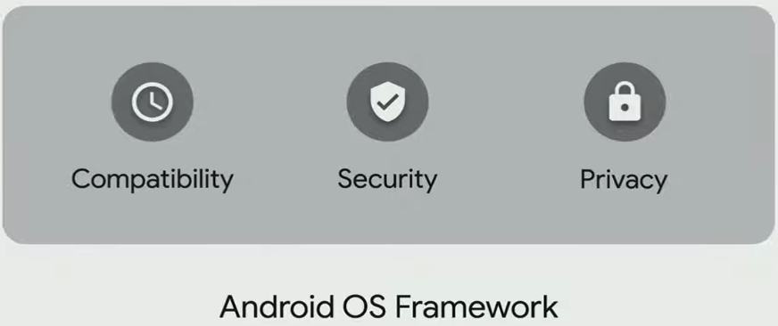

# Google Keynote 2019 Summary

These are the things I found important that were presented at Google's Keynote 2019.

**Sundar Pichai**

## Machine Learning

- Google was able to condense 100 GB into 0.5 GB
- The libraries are now on-device rather than the cloud
  - reduces latency significantly

These following sections were presented by **Stephanie Cuthbertson**.

## Security

#### Faster Security Updates

## Android OEM

- Android is now on version 10, Android Queue
- 2.5+ billion phones currently use Android

#### 2 primary focuses

1. Innovation
2. Security & Privacy

#### Foldables on Android OEMs

- Multiple OEMs will launch foldables this year all running Android

#### 5G

- consistently faster speeds with lower latency
- Android Queue supports 5G natively
- more than 20 carriers are launching 5G networks in 2019

## Speech Recognition Innovation

- neural network is now on-device and is only 80 MB

