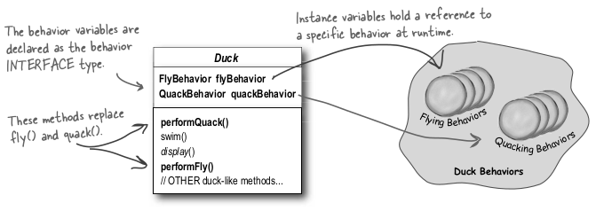
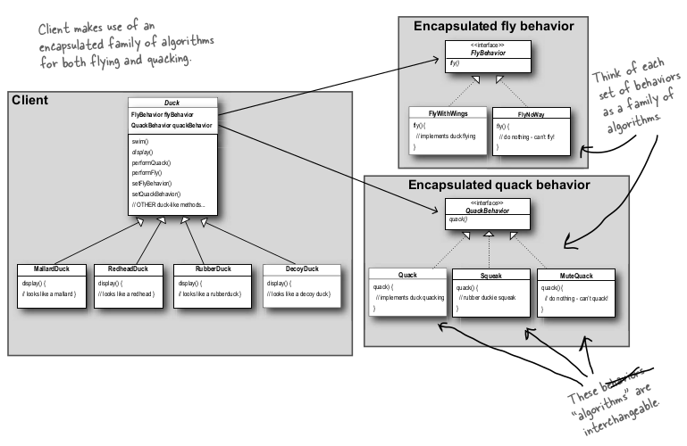

# Head First Design Patterns Notes

## Chapter 1: Introduction

**Design Principle 1**: Identify the aspects of your application that vary and separate them from what stays the same.

- **The Result**: Fewer unintended consequences from code changes and more flexibility in your systems.
- **This forms the basis for almost every design pattern**.
- All patterns provide a way to let *some part of a system vary independently of all other parts*.

Pull out the varying `fly()` and `quack()` methods into there own subclasses.

**Design Principle 2**: Program to an interface, not an implementation.

- From now on, the Duck behaviors (`Fly` and `Quack`) will live in a separate class - a class that implements a particular behavior interface. That way, the Duck classes won't need to know any of the implementation details for their own behaviors:
  - 
    - This means it includes behavior setter methods in the Duck classes so that we can, say, *change* the MallardDuck's flying behavior *at runtime*.
    - `FlyBehavior` is an interface that all flying classes implement. All new flying classes just need to implement the fly method.
  - **With this we get the benefit of REUSE without all the baggage that comes along with inheritance**.

**Questions**:

- **Aren't classes supposed to represent *things*? *Aren't classes supposed to have both state AND behavior?**
  - Answer: **In an OO system, yes, classes represent things that generally have both state (instance variables) and methods. And in this case, the *thing* happens to be a behavior. But even a behavior can still have state and methods; a flying behavior might have instance variables representing the attributes for the flying (wing beats per minute, max altitude and speed, etc.) behavior**.


### Integrating the Duck Behavior

**Delegating** a Duck's flying and quacking behavior, instead of using quacking and flying methods defined in the Duck class (or subclass):

- Create instance variable of behavior interfaces
- 

- 2. **Now we implement `performQuack()`:**

     ```java
     public class Duck {
         // each Duck has a reference to something that implements
         // the Quack Behavior
         QuackBehavior quackBehavior;
         // more
         
         public void performQuack() {
             // Rather than handling the quack behavior itself,
             // the Duck object delegates that behavior to the
             // object referenced by quackBehavior
             quackBehavior.quack();
         }
     }
     ```


### More Integration...

- How the `flyBehavior` and `quackBehavior` interface instance variables are set:

  - ```java
    public class MallardDuck extends Duck {
        
        public MallardDuck() {
        	quackBehavior = new Quack();
        	flyBehavior = new FlyWithWings();
        }
        
        public void display() {
            System.out.println("I'm a real Mallard duck");
        }
    }
    ```

  - Remember, `MallardDuck` inherits the `quackBehavior` and `flyBehavior` instance variables from the class `Duck`.

  - A `MallardDuck` uses the `Quack` class to handle its quack, so when `performQuack` is called, the responsibility for the quack is delegated to the `Quack` object and we get a real quack.

  - And it uses `FlyWithWings` as its `FlyBehavior` type.

**We should NOT program to an implementation**. The only reason we are doing this here is because there are more patterns later in the book to use.


### Testing the Duck code

1. **Type and compile the `Duck` class below:**

   ```java
   public abstract class Duck {
       
       // Declare two reference variables for the behavior interface
       // types. All duck subclasses (in the same package) inherit
       // these.
       Flybehavior flyBehavior;
       QuackBehavior quackBehavior;
       public Duck() {
       }
       
       public void performFly() {
           // Delegate to the behavior class
           flyBehavior.fly();
       }
       
       public void performQuack() {
           quackBehavior
       }
       
       public void swim() {
           System.out.println("All ducks float, even decoys!");
       }
   }
   ```

2. **Type and compile the `FlyBehavior` interface and the two behavior implementation classes:**

   ```java
   public interface FlyBehavior {
       public void fly();
   }
   ```

   ```java
   public class FlyWithWings implements FlyBehavior {
       public void fly() {
           System.out.println("I'm flying!!");
       }
   }
   ```

   ```java
   public class FlyNoWay implements FlyBehavior {
       public void fly() {
           System.out.println("I can't fly");
       }
   }
   ```

3. **Type and compile the test class:**

   ```java
   public class MiniDuckSimulator {
       public static void main(String[] args) {
           Duck mallard = new MallardDuck();
           mallard.performQuack();
           mallard.performFly();
       }
   }
   ```

   

### Setting behavior dynamically

We can `setFlyBehavior` inside the Duck class using a setter method:

```java
public void setFlyBehavior(FlyBehavior fb) {
    flyBehavior = fb;
}
```

In test class `MiniDuckSimulator` add:

```java
Duck model = new ModelDuck();

model.performFly();

// the model now has rocket-powered flying capability
model.setFlyBehavior(new FlyRocketPowered());

model.performFly();
```

**To change a duck's behavior at runtime, just call the duck's setter method for that behavior.**


### The Big Picture on encapsulated behaviors

Zoom out and look at the big picture:



We've started to describe things a little differently. Instead of thinking of the duck behaviors as a *set of behaviors*, we'll start thinking of them as a *family of algorithms*.


### HAS-A can be better than IS-A

**Composition**: putting two classes together like this:

- Each duck has a `FlyBehavior` and a `QuackBehavior` to which it delegates flying and quacking.

Instead of *inheriting* their behavior, the ducks get their behavior by being *composed* with the right behavior object.

**Design Principle 3**: Favor composition over inheritance.

Composition lets you **_change behavior at runtime_** as long as the object you're composing with implements the correct behavior interface.

**Composition is used in many design patterns**.

This is the **STRATEGY** pattern.

*pg. 26*