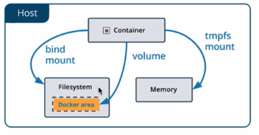

## Persisting data

Concerning state lifecycle, persisting state.

### Mounting data

**Bind mounts**: `—volume` binds local directory

### Shortening the command

`docker container run -v /home/austin.connor/repos/docker_examples/nginx/html:/var/www/html:ro -p 80:80 nginx:latest`

becomes:

`docker container run -v "$(pwd)/html":/var/www/html:ro -p 80:80 nginx:latest`

### The mount option

Bind mount: `docker container run —mount type=bind,src="$(pwd)/html",destination=/usr/share/nginx/html,readonly -p 80:80 nginx:latest`

A bind mount depends on the Filesystem of the host, whereas a volume is controlled by Docker.

### Volumes

`docker container run -it —volume /data alpine:latest`: this assigns a random name to the volume, a.k.a. an **anonymous volume**.

`docker volume ls`

### Naming volumes

You can delete the container, but the volume still persists.

Delete all containers: `docker container rm -f $(docker container ls -aq)`

### Using mount for volumes

`docker container run -it —-mount type-volume,src=my-volume,destination=/data alpine:latest`

**Mount** takes **key-value pairs**: `type=volume,src=my-volume,destination=/data`

Make anonymous volume by omitting the `src`: `docker container run -it —mount destination=/data alpine:latest`

- you can use `dst` as shorthand for `destination`

### Quiz

- Example of a **bind mount**: `docker container run —volume /local/path:/container/path nginx:latest`
- One difference between **volumes** and **bind mounts** is that volumes are completely managed by Docker and do not rely on the file system structure of the Docker host.
- **Named volume**: `docker container run -it -v my-volume:/data alpine:latest`
- A volume is a good place to store data of containers that you care about, such as the data of a database management system.
- **Read-only bind mount**: `docker container run -v /local/path:/container/path:ro nginx:latest`

### Managing volumes

Delete volumes: `docker volume rm <VOLUME NAME>`

- **_will not delete unless volume is unused_**

Inspect: `docker volume inspect <VOLUME NAME>`

Delete all unused volumes: `docker volume prune`

Create volume: `docker volume create <VOLUME NAME>`

### Disappearing volumes

It is not entirely true that Docker does not delete volumes as a default.

Automatically delete **_anonymous_** volumes: `docker container run —rm -v /data alpine:latest echo hello`

- **_This does not delete <u>named</u> volumes_**: `docker container run —rm -v test-volume:/data alpine:latest echo hello`

### The VOLUMES instruction

Another way that a volume is created:

- In Dockerfile: `VOLUME /var/lib/postgresql/data`

### Using volumes from other containers

It is common to backup volumes from one container in another container.

You can simultaneously access volumes from multiple containers. There is even an option to mount all volumes from one container to another container:

- `docker container run -it —rm —name c1 -v test-data:/data alpine sh`

### When to use volumes

- When should you use a bind-mount versus a volume?
  - **Bind-mount**:
    - When you want to access the data from the host and the container.
      - Examples:
        - source code
        - configuration files
  - **Volume**:
    - When you want to persist data from the container.
    - When you want to share data between containers.
      - Examples:
        - backups
        - Configuration files

- When to use **named** versus **anonymous** volumes?
  - **Named**:
    - When you care about the data long-term.
    - Ex:
      - A database
      - Other services that persist data
    - When you need to easily identify the volume
      - Reuse them
      - For backups
      - Migrate them
  - **Anonymous**:
    - When you don't care about the data long-term.
      - Testing
    - When you need to share data between containers.
      - using `—volumes-from`

**Bind-mounts**:

- Rely on the file system structure of the host
  - you need to manage them
  - the container has access to the files on the Docker host

**Volumes**:

- managed by Docker
  - Independent of the file system structure on the host
  - Easy to migrate and backup
    - can be managed via the Docker client
    - Can be pre-populated with data from a container

### Quiz

- Docker will automatically delete anonymous volumes that were created for containers started with the `—rm` flag.
- If you want to persist the data of a database management system that runs inside a container, you should use a **volume** instead of a **bind-mount**.
- If you only want to **_access_** the data that resides on your Docker host from a container, you should use a **bind-mount**, not a **volume**.
- Docker does not remove unused volumes unless explicitly commanded.
- Multiple containers can access the same volume simultaneously.
- When you mount a **_new_** volume to a path that already contains files and directories, the files and directories will be copied into the volume.
- When you mount an **_existing_** volume to a path that already contains files and directories, you will only have access to the data in the volume, not the pre-existing data inside the container.
- Valid ways to create a volume:
  - With the `VOLUME` instruction in a Dockerfile.
  - With the `—volume` flag of the `docker container run` command.
  - With the `—mount` flag of the `docker container run` command.