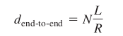

# Internet Protocol Book Notes

## Chapter 1: Computer Networks and the Internet

### Section 1.1: What is the Internet?
There are two main types of <u>packet switches</u>: **routers** and **link-layer switches**.
Both types forward packets to their ultimate destination.
Each ISP (Intertent Service Provider) is in itself a network of packet switches and communication links.
ISPs:
- can connect websites directly to the internet

End systems, packet switches, and other pieces of the Internet run **protocols** that control the sending and receiving of information within the Internet.
**The IP protocol specifies the format of the packets that are sent and received among routers and end systems.**  
The Internet's principal protocols are collectively known as **TCP**.  
**RFCs**: Requests For Comments  
#### 1.1.2 A Services Description
Importantly, Internet applications run on end systems - they do not run in the packet switches in the network core.  
### 1.3 The Network Core
#### 1.3.1 Packet Switching
Packets are transmitted over each communication link at a rate equal to the *full* transmission rate.

So, if a source end system or a packet switch is sending a packet of *L* bits over a link with transmission rate *R* bits/sec, then the time to transmit the packet is *L/R* seconds.

#### Store-and-Forward Transmission
**Store-and-forward transmission**: only after the router has received *all* of the packet's bits can it begin to transmit (i.e., "forward") the packet onto the outbound link.

Routers need to receive, store, and *process* the entire packet before forwarding.

Let's consider the general case of sending one packet from source to destination over a path consisting of *N* links each of rate *R* (thus, there are *N-1* routers between source and destination). We see that the end-to-end delay is:

#### Queuing Delays and Packet Loss
Each packet switch has multiple links attached to it.

For each attached link, the packet switch has an **output buffer** (also called an **output queue**), which stores packets that the router is about to send into that link.

This is where **queuing delays** happen.

Since the amount of buffer space is finite, an arriving packet may find that the buffer is completely full with other packets waiting for transmission. This is when **packet loss** occurs.

#### Forwarding Tables and Routing Protocols
When a packet arrives at a router in the network, the router examines a portion of the packet's destination address and forwards the packet to an adjacent router.

Each router has a **forwarding table** that maps destination addresses (or portions of the destination addresses) to that router's outbound links.

The Internet has a number of special **routing protocols** that are used to automatically set the forwarding tables.

A routing protocol may, for example, determine the shortest path from each router to each destination and use the shortest path results to configure the forwarding tables in the routers.

#### 1.3.2 Circuit Switching
Two fundamental approaches to moving data through a network of links: **circuit switching** and **packet switching**.

Analogy: A reservable restaurant versus a non-reservable restaurant.

As with circuit switching, the packet is transmitted over a series of communication links. But different from circuit switching, the packet is sent into the network without reserving any link resources whatsoever. If one of the links is congested because other packets need to be transmitted over the link at the same time, then the packet will have to wait in a buffer at the sending side of the transmission link and suffer a delay.

#### Multiplexing in Circuit-Switched Networks
A circuit in a link is implemented with either **frequency-division multiplexing (FDM)** or **time-division multiplexing (TDM)**.

FDM:
- telephone networks typically have a frequency band width of 4kHz (that is, 4,000 hertz or 4,000 cycles per second).
- FM radio stations also typically share the frequency spectrum between 88 MHz and 108 MHz, with each station being allocated a specific frequency band.
- each circuit continuously gets a fraction of the bandwidth.

TDM:
- each circuit gets all of the bandwidth periodically during brief intervals of time (that is, during slots)

#### Packet Switching Versus Circuit Switching
Generally speaking, people who do not like to hassle with restaurant reservations prefer packet switching to circuit switching.

Although packet switching and circuit switching are both prevalent in today's telecommunication networks, the trend has certainly been in the direction of packet switching.

Even many of today's circuit-switched telephone networks are slowly migrating toward packet switching.

In particular, telephone networks often use packet switching for the expensive overseas portion of a telephone call.

#### 1.3.3 A Network of Networks
A network of networks is what enables the access ISPs to be interconnected to connect all the end systems that make up the Internet.

A naive approach to getting every end system connected to one another via the Internet is to have each access ISP *directly* connect with every other access ISP. Such a mesh design, of course, much too costly for the access ISPs, as it would require each ISP to have a separate communication link to each of the hundreds of thousands of other access ISPs all over the world.

No ISP has presence in each and every city in the world.

In any given region, there may be a **region ISP** to which the access ISPs in the region connect.

Each regional ISP then connects to **tier-1 ISPs**.

**Tier-1 ISPs** do have a presence in every city in the world.

There are approximately a dozen tier-1 ISPs, including Level 3 Communications, AT&T, Sprint, and NTT.

To build a network that more closely resembles today's Internet, we must add points of presence (PoPs), multi-homing, peering, and Internet exchange points (IXPs) to the hierarchical Network Structure 3.

A **PoP** is simply a group of one or more routers (at the same location) in the provider's network where customer ISPs can connect into the provider ISP. 

For a customer network to connect to a provider's PoP, it can lease a high-speed link from a third-party telecommunications provider to directly connect one of its routers to a router at the PoP.

Any ISP (except for tier-1 ISPs) may choose to **multi-home**, that is, to connect to two regional ISPs, or it may multi-home with two regional ISPs and also with a tier-1 ISP.

Similarly, a regional ISP may mutlti-home with multiple tier-1 ISPs.

Customer ISPs pay their provider ISPs to obtain global Internet interconnectivity.

**Peering**: when two ISPs connect their networks together so that all the traffic between them passes over the direct connection rather than through an upstream intermediary. Neither ISP pays one another, it is settlement-free. Tier-1 ISPs also peer with one another, settlement-free.

**Internet Exchange Point (IXP)**: a third-party company can create a meeting point (typically in a stand-alone building with its own switches) where multiple ISPs can peer together. 

There are roughly 300 IXPs in the Internet today (2009).

This ecosystem consisting of access ISPs, regional ISPs, tier-1 ISPs, PoPs, multi-homing, peering, and IXPs as *Network Structure 4*.

*Network Structure 5* builds on top of *Network Structure 4* by adding **content provider networks** and it describes the Internet of 2012.

Google is currently one of the leading examples of such a content provider network.

Google has an estimated 30 to 50 data centers across North America, Europe, Asia, South America, and Australia.

Some of these data centers house over one hundred thousand servers, while other data centers are smaller, housing only hundreds of servers.

The Google data centers are all interconnected via Goggle's private TCP/IP network, which spans the entire globe but is nevertheless separate from the public Internet.

The Google network only carries traffic to/from Google servers.

As shown in Figure 1.15, the Google private network attempts to "bypass" the upper tiers of the Internet by peering (settlement free) with lower-tier ISPs, either by directly connecting with them or by connecting with them at IXPs.

Google still pays tier-1 ISPs to exchange traffic with them to reach access ISPs.

By creating its own network, a content provider not only reduces its payments to upper-tier ISPs, but also has greater control of how its services are ultimately delivered to end users.

Google's network infrastructure is described in greater detail in Section 7.2.4.

