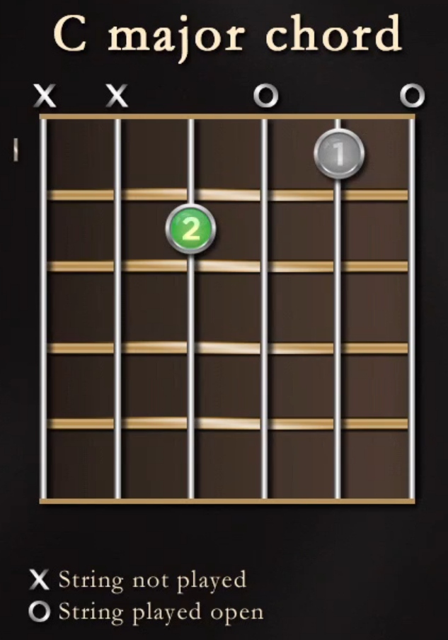
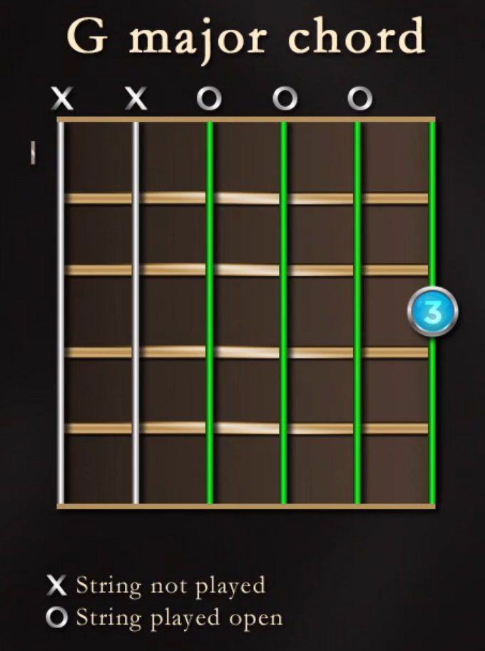

# Lecture 1: Guitar Basics: Play a Song in 60 Seconds

**I-IV-V progressions**: the foundation which much of rock n' roll, the blues, and jazz was built.

Each of the 24 lessons to master the fundamentals of guitar contain 5 components:

- **Technique**
- **Musicianship and note reading**
- **Chords**
- **Scales and melodic patterns**
- **Original songs: putting it all together**

Goal for this course: become an accomplished beginner

**Good Technique**: Learning to play to instrument efficiently and without injury by:

- Optimizing force
- Building flexibility and strength
- Conserving energy
- Expressing our musicality without inhibition

**Thumb should be a point of balance close to the middle of the neck, behind the 1st and 2nd fingers.**

### Musicianship and Note Reading

E-B-G-D-A-E (highest to lowest strings)

Left Hand:

- 1: Index finger
- 2: Middle finger
- 3: Ring finger
- 4: Pinky

### Chords

**Chords**: three or more notes sounded together

C and G chords

#### C major chord

#### G major chord

