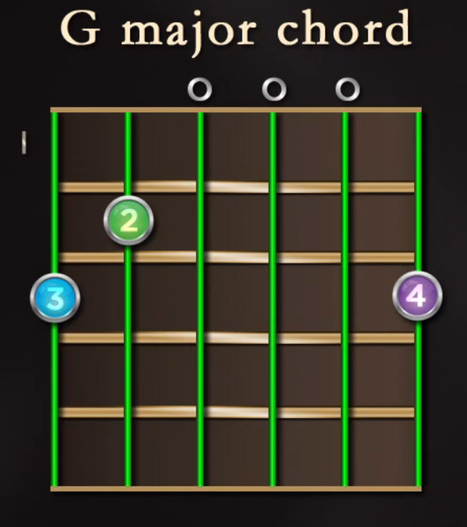
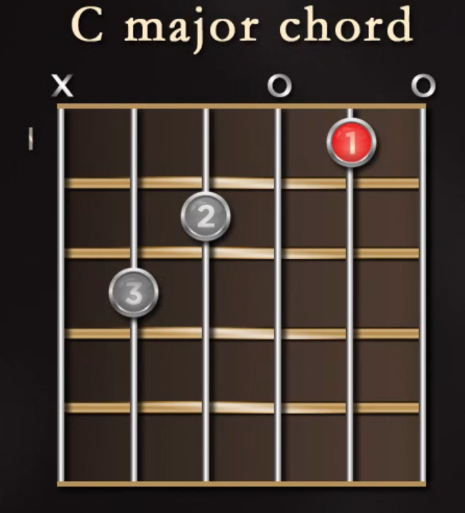

# Lecture 3: Classical Guitar Position and Posture

*The Shadow of the Wind* by Carlos Ruiz Zafon

Glenn Kurtz, pHD in German Studies and Comparative Literature

- *Practicing: A Musician's Return to Music*
  - the soul of a musician is renewed everytime he picks up a guitar

#### Notation Systems

- Staff
- Chord diagrams
- Tablature (TAB)

