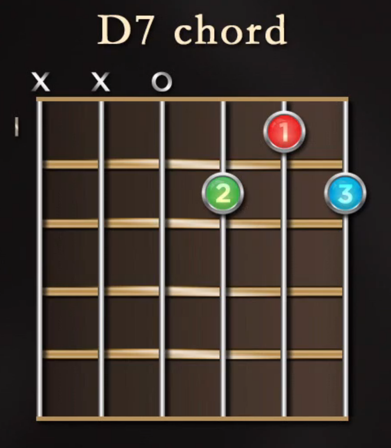

# Lecture 4: How to Practice the Guitar

"Don not overload the foundation,
do not carry the building
higher than the base permits,
or build at all before the base is secure:
otherwise the whole structure is likely to collapse."

"Genius is long patience." - A.G. Sertillanges

**Keep your movement to a minimum.**

**Tip to Practice**:

- Don't pin elbow against your body
- Visualize your left hand moving along the straight line of the neck

**The guitar is a Transposing Instrument**: It sounds an octave below where the note is written on the page.

### Major and Minor Chords

- Major chord: 1st, 3rd, and 5th notes of the major scale
- Minor chord: 1st, 3rd, and 5th notes of the minor scale
- Root (tonic): first note of the scale
- Major chords: "happy" or "light"
- Minor chords: "dark" or "sad"

#### Dominant 7th

- Contains 4 notes instead of 3
- Same 3 notes as the major chord plus a minor 7th

#### Interval Pattern for Major Scales

- Whole (2 frets)
- Whole (2 frets)
- Half (1 fret)
- Whole (2 frets)
- Whole (2 frets)
- Whole (2 frets)
- Half (1 fret)

